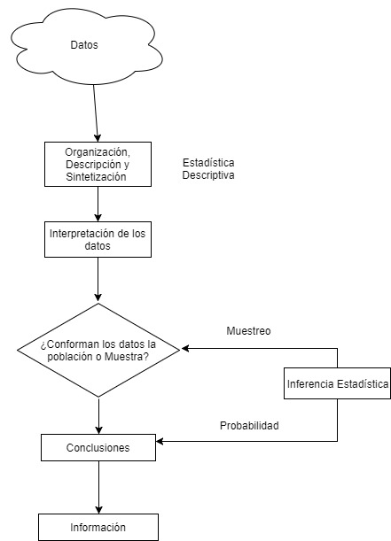
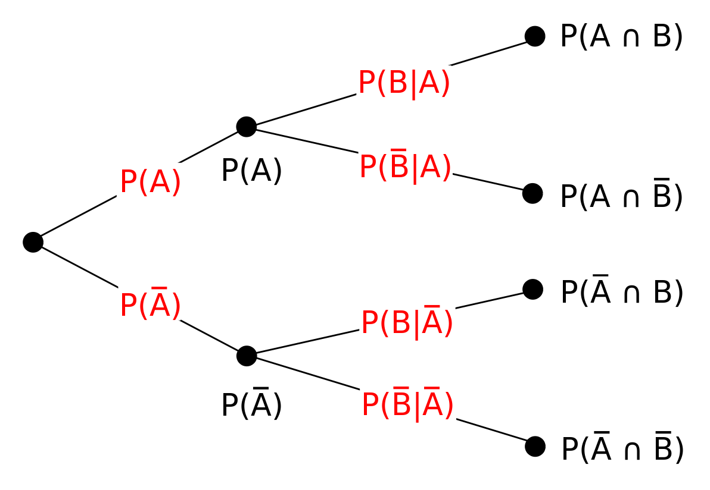
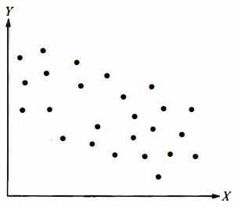
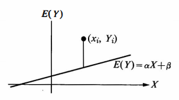
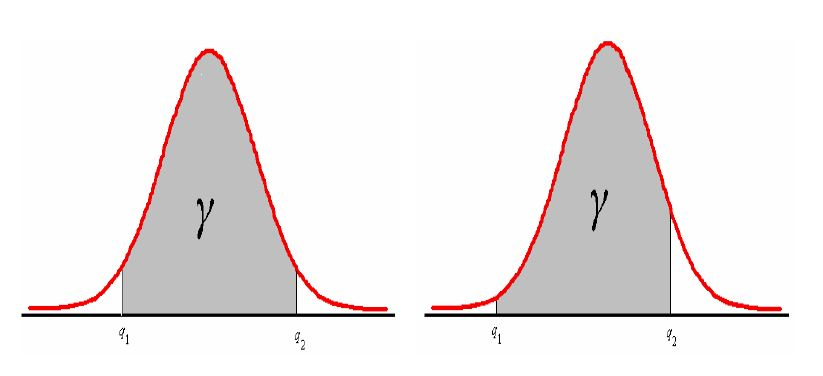
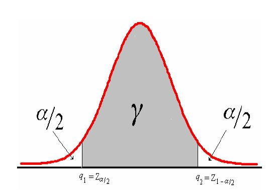
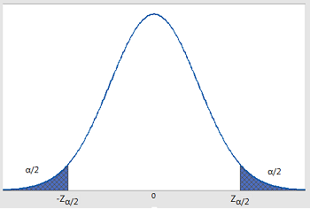

```{r setup, include=FALSE, cache=F, message=F, warning=F, results="hide"}
knitr::opts_chunk$set(cache=TRUE)
knitr::opts_chunk$set(fig.path='figs/')
knitr::opts_chunk$set(cache.path='cache/')

knitr::opts_chunk$set(
                  fig.process = function(x) {
                      x2 = sub('-\\d+([.][a-z]+)$', '\\1', x)
                      if (file.rename(x, x2)) x2 else x
                      }
                  )
library(tidyverse)
#library(stevemisc)
```


# Introducción

## Proceso Estadístico

La estadística es la ciencia encargada de la descripción, organización, presentación de datos y además la obtención de conclusiones basadas en los datos experimentales; a esto le llamamos **inferencia**, la cual es inductiva debido a que se proyecta de lo específico hacia lo general.

Al ser una ciencia, esta se rige al método científico.

---

  

<!-- ## ¿Por qué el uso de la estadística en Física? -->

<!-- * Cuantificación del error: Errores propios y externos, ¿Qué significan? -->
<!-- * ¿Cómo pueden nuestros datos ser utilizados de la mejor manera posible? o ¿Pueden ser usados? -->
<!-- * Correlaciones, test de hipótesis y modelación: ¿Como se procede? -->
<!-- * Muestras incompletas, datos de un experimento que no puede ser replicado ¿Cómo se trabajo con este tipo de datos? -->
<!-- * La presentación de datos y conclusión siempre vienen -inherentemente- en términos estadísticos. -->
<!-- * El proceso de decisión no puede ser realizado sin una metodología, sin importar que tan bueno sea el experimento. -->

<!-- ## Procedimiento de un experimento -->

<!-- 1. **Observar**: Registrar u obtener los datos. -->
<!-- 2. **Reducir**: *Limpiar* los datos para eliminar efectos experimentales: *corrección flat-field*, calibración, etc. -->
<!-- 3. **Analizar**: Obtener los *números* desde una base de datos limpia: intensidades, posiciones, etcétera. A partir de esta información, producir **indicadores** que permitan comparar o modelar. Estos **indicadores** son llamados **estadísticos** y determinan el diseño de experimentos. -->
<!-- 4. **Conclusión**: Llevar a cabo un procedimiento para llegar a una conclusión. Test de hipótesis; correlación, modelos, etc. -->
<!-- 5. **Reflexión**: ¿Qué se aprendió? ¿Es la decisión viable? ¿Fue inesperada? ¿En qué paso del experimiento se debe examinar para verificar? ¿Qué es necesario para confimar un resultado inesperado? ¿Cómo se debe realizar el siguiente experimento? ¿Se extenderá la hipótesis realizada o se sugerirá una nueva hipótesis? -->

# Introducción al Muestreo

El mundo empírico está compuesto por un sin fin de conjuntos de elementos; tales como: personas, animales, objetos, etc., habitualmente de cantidades suficientemente grandes, cuyo trabajo de recopilación y posterior análisis para obtener alguna información de interés de ésta, resulta impracticable en tiempos reales. Estos conjuntos de elementos son llamados **población** o **población objetivo**, que en una investigación, debe quedar claramente acotada, geográficamente o en el tiempo.

Un mecanísmo más apropiado para obtener información es la extracción de un subconjunto de unidades o elementos a la cual realizar el análisis y obtener un diagnóstico de la población. Este subconjunto de unidades o elementos es llamado **muestra**.

---

 
 
## Tipos de Muestreo

* **Muestreo no Probabilístico**: Los resultados obtenidos sólo representan las características de los elementos muestrados y no de la población 
    + Muestreo por conveniencia
    + Muestreo consecutivo
    + Muestreo por cuotas
    + Muestreo de bola de nieve. (Muestreo en cadena).
* **Muestreo Probabilístico**: Cada uno de los elementos de la población de interés, o población objetivo, tiene una probabilidad conocida (frecuentemente igual) de ser elegidos en la muestra.

## Tipos de Muestreo Probabilístico

* **Muestreo Aleatorio Simple**: Los elementos se escogen en forma individual y al azar de la totalidad de la población, es decir, se escogen sin ningún privilegio y cada uno posee la misma probabilidad de formar parte de la muestra en cada una de las posibles muestras.

* **Muestreo Aleatorio Sistemático**: Existe un plan de muestreo al azar, en la cual se eligen los elementos de la población a intervalos uniformes, a partir de un listado (ordenado), tal como elegir cada $k-$ésimo elemento después de un arranque aleatorio.

---

* **Muestreo Aleatorio Estratificado**: La característica que se está midiendo en la población objetivo, presenta mucha dispersión en grupos identificados, por lo tanto, lo primero que se debe hacer es estratificar los elementos de la población en subgrupos y excluyentes de acuerdo al comportamiento que presenta la característica dentro de estos grupos.

{width=200px}

---

Posterior a la clasificación de los elementos de la población en grupos, se obtiene por separado una muestra aleatoria simple o sistemática de cada estrato. Por lo general, el tamaño de la muestra que se requiere para lograr determinado nivel de precisión en el muestro estratificado es menor que con muestreo aleatorio simple, con la consiguiente reducción de costos del muestreo.

---

* **Muestreo aleatorio por conglomerados**: Es un muestreo aleatorio en el cual la unidad de muestreo, que es la unidad de selección, contiene más de un elemento de la población, por lo tanto la unidad de muestreo es un grupo de elementos llamado **conglomerado**. En la aplicación de este tipo de muestreo, lo habitual es que los elementos de la población se agrupen en forma natural en subgrupos de tal manera que forma una masa que es difícil de descomponer o no se puede acceder directamente a ellos.

{width=200px}

---

* **Muestreo Doble**: Involucra decisiones de aceptar, rechazar o tomar una segunda muestra tras los resultados obtenidos desde una primera muestra. La decisión de tomar una segunda muestra se basa en la inferencia realizada a partir de los datos obtenidos primeramente.


## Tipos de Variable

* **Variables Cualitativas**: Cuando los elementos de una población son clasificados en categorías o clases excluyentes, se habla de variables cualitativas. Ejemplos: Estado civil, Lugar
de procedencia, Marca de artículos, etc.

* **Variables Cuantitativas (o Numéricas)**: Si los posibles valores para los elementos de una población, son cantidades o números, se habla de variables cuantitativas. Ejemplos: Kms por litro de gasolina de un auto, temperatura, duración de un exámen, etc.
    + **Discretas**: Se habla de variables discretas, cuando el conjunto de valores posibles es finito o infinito numerable. Ejemplos: Cantidad de crías por camada, número de alumnos por carrera, etc.
    + **Continuas**: Son aquellas que pueden asumir infinitos valores. Ejemplos: Sueldo de una persona, tiempo que tarda un animal en alcanzar un peso previamente determinado, etc.
    
## Escalas de medición

* Escalas de Medición para variables cualitativas:
    + **Nominal**: Es aquella escala en donde las categorías (o los posibles valores de la variable), nopueden ser ordenadas en un sentido de magnitud. Ejemplos: colores, profesión, etc.
    + **Ordinal**: Cuando las categorías admiten una ordenación (no alfabética), se habla de escala ordinal. Ejemplo: Nivel Socio-económico (alto, medio o bajo), sistema de evaluación cualitativa (insuficiente, suficiente, bueno, muy bueno), etc.
    
* Escalas de Medición para variables cuantitativas:
    + **Intervalar**: Son aquellas que poseen un punto de referencia (o cero) relativo – relativo en el sentido de que si se cambia de unidad de medición, el punto de referencia difiere - entre una unidad de medida y otra. Ejemplo: Temperatura (Celcius - Fahrenheit).
    + **Razón:** Son aquellas que poseen un cero absoluto (es decir, único). Incluso permiten hacer comparaciones por cocientes. Ejemplo: Peso de una persona, distancias, etc.
    
    
# Estadística Descriptiva

## Organización de los datos

La organización de los datos trata de acomodar éstos, para que puedan revelar sus características informativas fundamentales y de esta manera simplificar los análisis para la obtención de conclusiones.

El uso de frecuencia es más natural en datos cualitativos o discretos, pues en estos casos es sencillo contar el número de veces que aparece un mismo dato en la población (muestra) de éstos, en este caso se habla de **tabla de frecuencia no agrupadas**. Sin Embargo, cuando se trabaja con datos cuantitativos en escala continua, es muy posible que exista un conjunto de números distintos lo suficientemente grande, como para hacer impracticable lo anterior, en este último caso se procede a crear agrupaciones convenientes para los datos observados, en este caso se habla de **tabla de frecuencia agrupadas**.
    
## Tabla de Frecuencia

En las tablas de frecuencia cada categoría tiene una frecuencia observada, este cálculo es siempre posible en datos cualitativos, sin embargo, si la cantidad de categorías es grande, deja de ser un resumen adecuado para los datos.
Las respuestas observadas en la población (muestra), se denominarán **clases**, y se simbolizan por: $C_1,C_2,\dots, C_k$ donde $k$ es la cantidad de categorías (respuestas) distintas.
    
## Frecuencia Absoluta y Relativa

* **Frecuencia Absoluta**: Se llama frecuencia absoluta de la clase $C_i$, al número de elementos de la población (muestra) que pertenecen a la clase $C_i$. Este número lo denotaremos por $n_i$ y cumplen la propiedad:
$$\sum_{i=1}^{k} n_i =n$$
En donde $n$ es el tamaño de la población o muestra, según sea el caso.
* **Frecuencia Relativa:** Se llama frecuencia relativa de la clase $C_i$, a la cantidad de elementos en la población (muestra) que pertenecen a la clase $C_i$, relativo al total de elementos en la población (muestra). Este número lo denotaremos por $f_i$ y cumplen la propiedad:
$$f_i=\dfrac{n_i}{n} \Rightarrow \sum_{i=1}^{k} f_i = \sum_{i=1}^{k}\dfrac{n_i}{n} = 1$$
    
## Frecuencia Absoluta Acumulada y Relativa Acumulada

* **Frecuencia Absoluta Acumulada**: Se llama frecuencia absoluta acumulada hasta la clase $C_i$, al número total de elementos en la población (muestra) que pertenecen a las clases $C_1,C_2,\dots,C_i$. Este número lo denotaremos por $N_i$ y cumplen la propiedad:
$$N_i=n_1+n_2+\dots+n_i=\sum_{j=1}^{i}n_j, \hspace{10pt} j=1,2,\dots,i, \hspace{10pt} i=1,2,\dots,k$$
y,
$$N_k=n_1+n_2+\dots+n_i+\dots+n_k=n$$

---

* **Frecuencia Relativa Acumulada**: Se llama frecuencia relativa acumulada hasta la clase $C_i$, a la cantidad de elementos en la población (muestra) que pertenecen a las clases $C_1,C_2,\dots,C_i$, con respecto al total de elementos en la población (muestra). Este número lo denotaremos por $F_i$ y cumplen la propiedad:

$$F_i=f_1+f_2+\dots+f_i=\sum_{j=1}^{i}f_j, \hspace{10pt} j=1,2,\dots,i, \hspace{10pt} i=1,2,\dots,k$$

y,
$$F_k=f_1+f_2+\dots+f_i+\dots+f_k=1$$
    
## Ejemplo 

En un conjunto de resultados experimentales, se desea determinar la clasificación de los resultados obtenidos. Estos son clasificados como: Malos (M), Regulares (R), Buenos (B) y Excelentes (E). Los datos son:

\begin{table}[]
\centering
\label{my-label}
\begin{tabular}{llllllllll}
B & R & B & E & E & E & M & B & E & R \\
R & M & M & R & R & M & R & B & B & B \\
B & B & E & B & B & B & E & B & E & R \\
E & M & B & B & E & B & B & B & B & B \\
M & R & M & B & B & B & B & E & M & R
\end{tabular}
\end{table}
\begin{table}[]
\centering
\begin{tabular}{l|l|l|l|l|}
\cline{2-5}
                                    & \multicolumn{2}{c|}{Frecuencias} & \multicolumn{2}{c|}{Frecuencias Acumuladas} \\ \hline
\multicolumn{1}{|l|}{Clasificación} & Absoluta        & Relativa       & Absoluta             & Relativa             \\ \hline
\multicolumn{1}{|l|}{Malo}          & 8               & 16\%           & 8                    & 16\%                 \\ \hline
\multicolumn{1}{|l|}{Regular}       & 9               & 18\%           & 17                   & 34\%                 \\ \hline
\multicolumn{1}{|l|}{Buenos}        & 23              & 46\%           & 40                   & 80\%                 \\ \hline
\multicolumn{1}{|l|}{Excelentes}    & 10              & 20\%           & 50                   & 100\%                \\ \hline
\end{tabular}
\end{table}


## Tablas para Variables Continuas

En variables continuas, la organización de datos es un poco más compleja: se dividen los datos en k grupos o segmentos disjuntos. Estos grupos representan las clases y se determina la frecuencia de datos asociado a cada grupo, conformando una tabla de frecuencia agrupada.

En este tipo de datos las clases están compuestas por intervalos, luego es necesario buscar un representante de la frecuencia asociada a este intervalo , el cual se conoce como **marca de clase**. Es común utilizar como marca de clase al valor medio del segmento (intervalo).


## Construcción de la tabla de frecuencia

En la construcción de una tabla de frecuencia, lo primero que se tiene que
tener claro es la cantidad de segmentos (intervalos) a considerar. Lo más común es
utilizar como una primera aproximación la **regla de Sturges**.

* **Regla de Sturges**: El número de clases $k= 3,3 * \log(n)+1$, donde $n$ es la cantidad de datos que se desea organizar.
* **Amplitud**: Para determinar la amplitud de las clases $a$, se debe calcular el rango $R_D$, que es la diferencia entre el dato mayor ($\max x_i$) y el dato menor ($\min x_i$). También es necesario determinar $u$, la unidad mínima de conteo de los datos. Luego, la amplitud estará dada por:
$$ a=\dfrac{R_D +u}{k}$$


---

* **Rango de la tabla**: Una vez determinada la amplitud $a$, se procede a determinar el rango de la tabla  $R_T$, que es la multiplicación entre la cantidad de clases que se están utilizando y la amplitud. Para determinar los límites teóricos de las clases, se comienza con el límite inferior de la primera clase ($LI_1$),  el cual se calcula como:

$$LI_1=\min x_i - \dfrac{D}{2}$$ 

Donde la diferencia $D=R_T-R_D$, en el caso que el último dígito de $D$ no sea par, se realiza un ajuste conveniente.


{width=200px}

---

Posteriormente, se suma la amplitud a $LI_1$ obteniéndose el limite superior de esta clase ($LS_1$), el que también será el límite inferior de la segunda clase, $LI_2=LS_1$. $LS_1$ se considera abierto para su clase y cerrado para la segunda clase, luego para los siguientes intervalos se realiza el mismo procedimiento anterior. 

\begin{table}[]
\centering
\begin{tabular}{c|c|c|c|c|}
\cline{2-5}
\multicolumn{1}{l|}{}               & \multicolumn{2}{c|}{Frecuencias}                              & \multicolumn{2}{c|}{Frecuencias Acumuladas}                    \\ \hline
\multicolumn{1}{|l|}{Clases}        & \multicolumn{1}{l|}{Absoluta} & \multicolumn{1}{l|}{Relativa} & \multicolumn{1}{l|}{Absoluta} & \multicolumn{1}{l|}{Relativa} \\ \hline
\multicolumn{1}{|c|}{$[LI_1-LS_1[$} & $n_1$                         & $f_1$                         & $N_1$                         & $F_1$                         \\ \hline
\multicolumn{1}{|c|}{$[LI_2-LS_2[$} & $n_2$                         & $f_2$                         & $N_2$                         & $F_2$                         \\ \hline
\multicolumn{1}{|c|}{$[LI_3-LS_3[$} & $n_3$                         & $f_3$                         & $N_4$                         & $F_3$                         \\ \hline
\multicolumn{1}{|c|}{$\vdots$}      & $\vdots$                      & $\vdots$                      & $\vdots$                      & $\vdots$                      \\ \hline
\multicolumn{1}{|c|}{$[LI_k-LS_k[$} & $n_k$                         & $f_k$                         & $N_k$                         & $F_k$                         \\ \hline
\end{tabular}
\end{table}


## Ejemplo

El uso de tablas de frencuencias agrupadas tiene un desventaje bastante obvio, los datos originales se pierden en el proceso de organización:

{width=300px}
Otra forma de presentar tablas de frecuencias agrupadas, es la utilización de un diagrama de tallo y hoja, que ofrece una forma sencilla de exhibir los datos, sin que en éstos se pierda la noción de distancia. En este diagrama, el \textbf{tallo} es la primera parte de los números y por ende presenta menor variación, mientras que la \textbf{hoja}, esta formado por los dígitos restantes. Ejemplo: valor $548$


\begin{align*}
\text{Tallo}  \hspace{20pt}        &\vert \vert \hspace{20pt} \text{Hoja} \\
5 \hspace{20pt} &\vert \vert \hspace{20pt} 48
\end{align*}

## Diagrama de Tallo y Hoja

Datos:

\begin{table}[]
\centering

\begin{tabular}{llllllll}
$7,12$  & $7,89$ & $10,12$ & $8,88$  & $10,02$ & $9,91$  & $9,95$  & $9,90$  \\
$10,23$ & $9,12$ & $9,99$  & $12,40$ & $8,65$  & $10,05$ & $10,50$ & $9,87$  \\
$8,54$  & $9,72$ & $11,09$ & $11,52$ & $12,30$ & $11,53$ & $16,40$ & $13,24$
\end{tabular}
\end{table}
\begin{table}[]
\centering
\begin{tabular}{l|lllllll}
\multicolumn{1}{c|}{Tallo} & \multicolumn{7}{c}{Hoja}         \\ \hline
7                          & 12 & 89 &    &    &    &    &    \\
8                          & 54 & 65 & 88 &    &    &    &    \\
9                          & 12 & 72 & 87 & 90 & 91 & 95 & 99 \\
10                         & 02 & 05 & 12 & 23 & 50 &    &    \\
11                         & 09 & 52 & 53 &    &    &    &    \\
12                         & 03 & 40 &    &    &    &    &    \\
13                         & 24 &    &    &    &    &    &    \\
14                         &    &    &    &    &    &    &    \\
15                         &    &    &    &    &    &    &    \\
16                         & 40 &    &    &    &    &    &   
\end{tabular}
\end{table}

## Gráficos

Un gráfico es otra forma de representar y resumir datos, en el gráfico se pueden hacer evidentes ciertas características que en una tabla de frecuencias pueden pasar inadvertidas. Entre los gráficos más utilizados están:

* **Gráfico de barras**
* **Gráfico de Pastel (o circular)**
* **Histograma**
* **Polígono de Frecuencias**
* **Ojiva**
* **Box - plot (o diagrama de cajas) **

---

{width=450px}

---

{width=450px}

---

Las medidas de desempeño son otro medio con el cual se resumen los datos,
ya que a través de ellos se establece una medida resumen de alguna particularidad en
los datos. Estos indicadores se dividen en tres tipos:

* **Medidas de posición**
* **Medidas de variabilidad (o riesgo)**
* **Medidas de forma**

## Medidas de Posición

Una medida de posición es un valor simple que se calcula para un grupo de
datos y que se utiliza como una manera de resumir a estos un valor dentro del rango
de los datos.

Normalmente se desea que el valor sea representativo de todos los
valores incluidos en el grupo, estos valores pueden estar relacionados con posiciones
de particular interés como los extremos, los cuales se asocian a **cuantiles**, o valores
del centro, llamados de **tendencia central**.

---

* **Media aritmética**:
Se define como el cociente de la suma de todos los valores entre el número total de valores.
Las expresiones para cálculo de la media de una población y de una muestra son, respectivamente:

$$\mu = \dfrac{\sum_{i=1}^{N}X_i}{N}, \hspace{20pt} \overline{x} = \dfrac{\sum_{i=1}^{n} X_i}{n}$$

Cuando se tiene a disposición sólo los datos agrupados, se utiliza el punto medio de cada clase como aproximación de todos los valores contenidos en ella. El punto medio	o marca de clase se representa por $m_i$, en donde el subíndice $i$ indica la clase $i-$ésima, y se utiliza $n_i$ para representar la frecuencia absoluta observada en la clase respectiva. En tal caso, las expresiones son:

$$\mu = \dfrac{\sum_{i=1}^{k} n_i m_i}{N}, \hspace{20pt} \overline{x} = \dfrac{\sum_{i=1}^{k} n_i m_i}{n}$$

---

* **Mediana**: Es el valor que ocupa el lugar central de estos cuando se ordenan en orden de magnitud. Para conjunto de datos, con
un número par de elementos, la mediana se calcula como el promedio de los valores centrales. En caso de trabajar con datos dispersos, la expresión para determinar la posición de la mediana en el conjunto (ordenado) es:

$$Me=\begin{cases}
X_{\left(\dfrac{n+1}{2}\right)}, \hspace{20pt} \text{Si }n\text{ es impar} \\
\dfrac{1}{2}\left(X_{\left(\dfrac{n}{2}\right)} + X_{\left(\dfrac{n}{2}+1\right)}\right), \hspace{20pt} \text{Si }n\text{ es par}
\end{cases}$$

---

Para datos agrupados, en primer lugar es necesario determinar la clase que
contiene el valor de la mediana, para después determinar la posición de la mediana
dentro de la clase mediante interpolación. La clase que contiene la mediana es la
primera clase cuya frecuencia acumulada es mayor o igual a la mitad de los datos.
Una vez que se identifica esta clase, se determina el valor interpolado de la mediana,
empleando la siguiente expresión:

$$Me=LI_i+ \left( \dfrac{\dfrac{n}{2}-N_{i-1}}{n_i}\right)a_i$$

* $LI_i$: límite inferior de la clase que contiene a la mediana

* $n$:número total de observaciones, 

* $a_i$: amplitud de clase, 

* $N_{i-1}$: frecuencia acumulada anterior a la clase que contiene la mediana.

* $n_i$: número de observaciones de la clase que contiene la mediana.

---

* **Moda**: Se define como el valor o clase que se presenta con mayor frecuencia. Para datos agrupados, se utiliza interpolación dentro de la clase modal, de acuerdo a la siguiente expresión:

$$Mo=LI_i+ \left(\dfrac{d_1}{d_1+d_2} \right)a_i$$
en donde,

* $LI_i$ es el límite inferior de la clase que contiene la moda.

* $d_1$ es la diferencia entre la frecuencia de la clase modal y la frecuencia de la clase que le precede.

* $d_2$ es la diferencia entre la frecuencia de la clase modal y la frecuencia de la clase que le sigue.

* $a_i$ es la amplitud de clase.

---

* **Cuantiles**: Son medidas de posición que dividen los datos en grupos
bajo los cuales se encuentra una determinada proporción de éstos, por lo se requiere
que los datos se encuentren en al menos escala *ordinal*.

    + **Cuartil**: $Q_{i}=X_{\left(\dfrac{i(n+1)}{4}\right)}, \hspace{20pt} i:1,2,\dots,4$

    + **Quintil**: $K_{i}=X_{\left(\dfrac{i(n+1)}{5}\right)}, \hspace{20pt} i:1,2,\dots,5$

    + **Decil**: $D_{i}=X_{\left(\dfrac{i(n+1)}{10}\right)}, \hspace{20pt} i:1,2,\dots,10$

    + **Percentil**: $P_{i}=X_{\left(\dfrac{i(n+1)}{100}\right)}, \hspace{20pt} i:1,2,\dots,100$

---

Para datos agrupados, la fórmula se modifica de acuerdo con el punto
fraccionario de interés. Para utilizar esta expresión modificada, en primer lugar se
determina la clase que contiene el punto de interés, de acuerdo con las frecuencias
acumuladas, y después se lleva a cabo una interpolación como en el caso anterior de
la mediana.

---

{width=450px}

---

En este caso se observa que:

* $y=\mathbf{y}$

* $x=P_{78}$             

* $x_2 - x_1= LS-LI=a$         

* $y_2 - y_1 = N_i - N_{i-1}=n_i$ 

Luego despejando $x=P_{78}$, se obtiene una expresión para el cálculo de percentiles en datos agrupados:
$$x=P_{78}=x_1+\left( \dfrac{y-y_1}{y_2 - y_1} \right)(x_2 - x_1)=LI+\left(\dfrac{y- N_{i-1}}{n_i}\right)a$$
pero $y$ no es otra cosa que $\dfrac{n \times j}{100}$, donde $j$ es el percentil $j-$ésimo. Por lo que podemos generalizar la ecuación anterior como:
$$P_j=LI+\left(\dfrac{\dfrac{n\times j}{100}-N_{i-1}}{n_i}\right)a=LI+\left(\dfrac{\dfrac{j}{100}-F_{i-1}}{f_i}\right)a$$

## Ejemplo

La siguente tabla resume los tiempos de espera antes de obtener ciertos resultados experimentales.

{width=450px}
* Calcular el percentil 80

## Medidas de Variabilidad

Las medidas de *tendencia central* son útiles
para identificar un valor “típico” ó “particular” de un conjunto de datos, las **medidas de variabilidad** se ocupan de describir la dispersión (riesgo, precisión) de los datos con respecto a una medida del centro o un valor particular. Existen varios indicadores para medir la magnitud de la variabilidad en conjuntos de datos, entre ellos:

* Rango                    
* Desviación media         
* Varianza                 
* Desviación estándar      
* Coeficiente de Variación 

---

* **Rango (R)**: Es la diferencia entre el mayor y menor valor del conjunto
de datos. 

$$R= \begin{cases}
 \max x_i - \min x_i, \hspace{20pt} \text{datos dispersos} \\ 
 LS_k -LI_1, \hspace{20pt} \text{datos agrupados}
 \end{cases}$$
 
* **Desviación media (DM)**: Es la media (promedio) del valor
absoluto de la diferencia entre cada uno de los datos y el promedio del grupo.

$$DM= \begin{cases}
\sum_{i=1}^{n}\dfrac{|x_i- \overline{x}|}{n}, \hspace{20pt} \text{datos dispersos}\\
\sum_{i=1}^{k} f_i |m_i - \overline{x}|, \hspace{20pt} \text{datos agrupados}
\end{cases}$$

---

* **Varianza**: $(V[X],\sigma^2)$ La varianza es similar a la desviación
media porque se basa en la diferencia entre cada uno de los valores del conjunto de
datos y la media del grupo. Su fórmula es, para su cálculo poblacional y muestral, respectivamente:

$$V[X]=\sigma^2=\sum_{i=1}^{N} \dfrac{(x_i-\mu)^2}{N}$$

$$S^2=\sum_{i=1}^{n} \dfrac{(x_i-\overline{x})^2}{n-1}$$

* **Desviación Estándar**: Se utiliza con mayor frecuencia la raíz cuadrada de la varianza, representada mediante la letra griega $\sigma$ para el caso poblacional y $S$ para una muestra:

$$\sigma=\sqrt{V[X]}$$

$$S=\sqrt{S^2}$$

--- 

* **Coeficiente de Variación**: Relación entre la desviación estándar y su media. Tiene por fórmula, para su cálculo poblacional y muestral, respectivamente:

$$CV=\dfrac{\sigma}{\mu}$$

$$CV=\dfrac{S}{\overline{x}}$$

Representa la desviación estándar como proporción (o porcentaje) de la media, por lo que es de gran utilidad al comparar dos poblaciones o muestras, pues no posee unidades lo que elimina el efecto de la magnitud de las variables medidas.

* **Rango Intercuartil**: Es la diferencia entre los percentiles 75 y 25, esto es RIQ (IQR)$= Q_3 - Q_1$.

## Diagrama de Caja / Box-Plot

{width=450px}

---

* Outliers:

Pasos para construir un diagrama de cajas:


1. Calcular: Mediana, Cuartil 1 y 3 $(Q_{1},Q_{3})$
2. Calcular Rango Intercuartil (RIQ/IQR): $RIQ=Q_{3}-Q_{1}$
3. Calcular bigotes interiores (superiores e inferiores):
    + Bigote inferior: $\max (Q_{1}-1,5* RIQ, x_{1})$
    + Bigote superior: $\min (Q_{3}+1,5* RIQ, x_{n})$

4. Calcular bigotes exteriores (superiores e inferiores):
    + Bigote inferior: $Q_{1}-3* RIQ$
    + Bigote superior: $Q_{3}+3* RIQ$
5. Marcar datos *outliers*:
    + Observaciones entre bigote interior y exterior, se consideran sospechosos de ser outliers.
    + Observaciones pasados los bigotes exteriores son outliers.

## Ejercicio

Datos:

\begin{table}[]
\centering

\begin{tabular}{llllllll}
$7,12$  & $7,89$ & $10,12$ & $8,88$  & $10,02$ & $9,91$  & $9,95$  & $9,90$  \\
$10,23$ & $9,12$ & $9,99$  & $12,40$ & $8,65$  & $10,05$ & $10,50$ & $9,87$  \\
$8,54$  & $9,72$ & $11,09$ & $11,52$ & $12,30$ & $11,53$ & $16,40$ & $13,24$
\end{tabular}
\end{table}

* Realice un diagrama de caja

# Probabilidades Básicas 

En la investigación científica, por lo general, se requiere de modelos que
ayuden a comprender el fenómeno bajo estudio. En un amplio campo, no es posible
contar con modelos exactos, también conocidos como modelos determinísticos. En
tales situaciones, las mediciones obtenidas presentan perturbaciones no controlables,
lo que lleva a que la observación presente variabilidad en los resultados, para
experimentos en condiciones supuestamente idénticas, por ende, existe una especie
de azar o aleatoriedad en el resultado de la medición, lo que termina por dificultar la
posibilidad de predecir el resultado con certeza.

## Enfoques

* Enfoque Frecuentista *(enfoque empírico)*
* Enfoque Bayesiano

## Técnicas de conteo

* **Principio de Multiplicación:** Supongamos que un procedimiento $1$, puede hacerse de $n_1$ maneras. Supongamos que un segundo procedimiento $2$, se puede hacer de $n_2$ maneras. También supongamos que cada una de las maneras de efectuar 1 puede ser seguida por cualquiera de las $n_2$ de efectuar 2.
Entonces el procedimiento que consta de $1$ seguido por $2$ se puede hacer de $n_1 \times n_2$ maneras.

De igual manera podemos generalizar lo anterior a cualquier número de procedimientos.

---

* **Principio de Adición:** Supongamos que un procedimiento $1$, se puede hacerse de $n_1$ maneras, y que un segundo procedimiento $2$, se puede hacer de $n_2$ maneras. Supongamos además que no es posible que ambos procedimientos, 1 y 2, se realicen. Entonces el número de maneras como se puede hacer el procedimiento 1 ó 2 es de $n_1 + n_2$.

---

* **Factorial:** Sea $n \in \mathbb{N}$, entonces se define $n$ factorial como $n \times (n-1) \times (n-2) \times \dots \times 1$, y se simboliza por $n!$
Empleado en situaciones donde una vez seleccionado un elemento, éste puede ser nuevamente seleccionado.

* **Ejemplo:** Considere un grupo de personas conformado por 15 hombres y 10 mujeres. Se eligen 3 personas al azar, la primera será la presidente de la comisión, la segunda vicepresidente y la tercera secretario.¿De cuantas formas se puede conformar la comisión?

---

* **Permutación:** Se define la permutación de $r$ elementos sobre $n$ como el número de arreglos distintos que se pueden hacer con $r$ elementos de un total de $n$, **importando el orden** en el que salen los elementos, se simboliza por:

$$P_{r}^{n}=\dfrac{n!}{(n-r)!}$$

* **Ejemplo:** Un directorio compuesto por: Presidente, Secretario y Tesorero se debe elegir de un total de 10 candidatos. ¿Cuántos directorios diferentes se pueden conformar?

$$P_{3}^{10}=\dfrac{10!}{(10-3)!}=\dfrac{10!}{7!}=720$$

---


* **Combinatoria:** Se define la combinatoria de $r$ elementos sobre $n$ como el número de arreglos distintos que se pueden hacer con $r$ elementos de un total de $n$ **sin importar el orden** en que son asignados. Esta expresión se anota por:

$$C_{r}^{n}={{n}\choose{r}}=\dfrac{n!}{r!(n-r)!}$$

* **Ejemplo:** Para formar un comité se van a elegir a tres personas de un total de 10. El número de grupos diferentes de tres personas que podrían elegirse, sin importar el orden en el que cada uno de los grupos está dado por:

$$C_{3}^{10}=\dfrac{10!}{3!(10-3)!}=\dfrac{10!}{3!7!}=\dfrac{720}{6}=120$$

## Conceptos básicos de probabilidad

* **Espacio Muestral:** Se define como el conjunto de todos los posibles resultados del experimento, lo anotamos por $\Omega$
* **Suceso o Evento:** Es cualquier subconjunto de $\Omega$, usualmente lo anotamos con letras mayúsculas. $(A,B,C,\dots)$
* **Espacio de sucesos:** Es el conjunto de todos los subconjuntos de $\Omega$. Lo anotamos por $2^{\Omega}$.
* **Sigma Algebra:** Es el conjunto de sucesos, $\Gamma \subset 2^{\Omega}$, y que cumple con *ciertas propiedades*.

## Clasificación del espacio muestral

* **Discreto**
    + **Numerable:** Finito o Infinito.
* **Continuo**
    + **No numerable:** Acotado o No acotado.
    

## Definición formal de probabilidad

El par $(\Omega,\Gamma)$ se dice *espacio medible*, y la función $\mathbb{P}:\Gamma \rightarrow \mathbb{R}^{+}$, es una **medida de probabilidad** si satisface:


1. $0\leq \mathbb{P}[A] \leq 1, \forall A \in \Gamma$
2. $\mathbb{P}[\Omega]=1$
3. Dados $\displaystyle A_1,A_2,\dots \in \Gamma \Rightarrow \mathbb{P}\left[ \bigcup_{i=1}^{n} A_n \right] = \sum_{i=1}^{n} \mathbb{P}[A_i], \hspace{5pt} \forall i$

## Propiedades

* $\mathbb{P}[A]+\mathbb{P}[A^c]=\mathbb{P}[\Omega]$
* $\mathbb{P}[\phi]=1-\mathbb{P}[\phi^c]=1-\mathbb{P}[\Omega]=0$
* $\mathbb{P}[A \cup B]=\mathbb{P}[A]+\mathbb{P}[B] - \mathbb{P}[A\cap B]$ . Si este último  término $(\mathbb{P}[A\cap B])$ es cero, se dice que  $A$ y $B$ son eventos mutuamente excluyentes.
* $\mathbb{P}[A-B]=\mathbb{P}[A\cap B^c]$
* $\mathbb{P}[A \cap B]=\mathbb{P}[A]\mathbb{P}[B]$. Si $A$ y $B$ son independientes.

## Ejemplo

Sea A el evento en el cual un hombre vivirá 10 años más y sea B el evento en el cual su esposa viva 10 años más. Supongamos que $\mathbb{P}(A)=\frac{1}{4}$ y $\mathbb{P}(B)=\frac{1}{3}$. Supongamos que A y B son eventos independientes, encuentre la probabilidad de que en 10 años:

1. Ambos estén vivos.
2. Al menos uno esté vivo.
3. Ninguno esté vivo.
4. Solamente la esposa esté viva

## Probabilidades Clásicas 

Este planteamiento probabilista, lleva a que los eventos del espacio muestral sean expresados de la forma más elemental posible, con el fin de poder aceptar la posibilidad de que cada posible resultado sea igualmente posible.

$$\mathbb{P}[A]=\dfrac{\#A}{\#\Omega}$$

## Ejemplo

Considere que se tienen 10 sacos de semillas. Se sabe que 4 son de una variedad y el resto de otra. Un cliente compra 3 sacos. ¿Cuál es la probabilidad de que los sacos sean de las dos variedades?

$A:{ \text{Los sacos comprados son de las dos variedades} }$

$$\mathbb{P}[A]=\dfrac{\#A}{\#\Omega}=\dfrac{ C_{1}^{4} \times C_{2}^{6} +C_{2}^{4} \times C_{1}^{6} }{C_{3}^{10}}$$

## Probabilidades condicionales

El concepto de probabilidad condicional se emplea para redefinir el cálculo de probabilidad de ocurrencia de un evento dada cierta condición (o información). Lo anotamos por:

$$\mathbb{P}[B | A]=\dfrac{\mathbb{P}[B \cap A]}{\mathbb{P}[A]}$$
Lo anterior, mide la probabilidad de que el evento $B$ ocurra dado que el evento $A$ ocurrió. Notar que si los eventos $A$ y $B$ son independientes se tiene:

$$\mathbb{P}[B|A]=\dfrac{\mathbb{P}[B]\mathbb{P}[A]}{\mathbb{P}[A]}=\mathbb{P}[B]$$

Por lo que, en palabras, si los eventos son independientes, la probabilidad condicional se reduce a la probabilidad simple.


## Regla multiplicativa

Se refiere a la determinación de la probabilidad de ocurrencia conjunta de dos o más eventos. Para el caso de dos eventos, se tiene:

$$\mathbb{P}[A\cap B]=\mathbb{P}[A]\mathbb{P}[B|A]$$

En el caso de tres eventos, se tiene:

$$\mathbb{P}[A \cap B \cap C]=\mathbb{P}[A] \mathbb{P}[B|A] \mathbb{P}[C| (A \cap B)]$$

## Diagrama de árbol

Los diagramas de árbol son particularmente útiles para ilustrar los posibles
eventos asociados con observaciones o ensayos secuenciales.

{width=300px}

## Regla de Bayes


La regla de Bayes permite actualizar ciertas probabilidades *a priori* para transformarse en probabilidades *posteriori* de un evento (experimento). La importancia de la regla de Bayes consiste en que se aplica en contexto de
eventos secuenciales y además, de que proporciona la base para determinar la probabilidad condicional de un evento a la luz de un evento especifico que ha ocurrido.

$$\mathbb{P}[A|B]=\dfrac{\mathbb{P}[A\cap B]}{\mathbb{P}[B]}=\dfrac{\mathbb{P}[A]\mathbb{P}[B|A]}{\mathbb{P}[A]\mathbb{P}[B|A]+\mathbb{P}[A^c]\mathbb{P}[B|A^c]}$$


## Ejemplo

Un fabricante posee dos máquinas que producen el mismo artículo. Se sabe que una de ella (A) produce un $5\%$ de defectuosos y la otra (B) un $3\%$. Por otra parte el $60\%$ de las unidades es producido por la máquina A.

* Defina sucesos e identifique las probabilidades.
* Si el artículo es no defectuoso. ¿Cuál es la probabilidad que el artículo provenga de la máquina A?

---

Un grupo de estudiantes se inscribió en dos asignaturas, A y B. De los resultados se observa que el 40% aprobó A. El 45% aprobó al menos una asignatura. De los que aprobaron A, el 37.5% aprobó B. Se elige un alumno al azar, calcule la probabilidad que:

* Haya aprobado ambas asignaturas.
* Haya aprobado B.
* No haya aprobado ni A ni B

---

Definiendo los eventos:

A: El alumno aprobó la asignatura A
B: El alumno aprobó la asignatura B

por enunciado sabemos que:

$$\mathbb{P}(A) = 0.4 \hspace{15pt} \mathbb{P}(A\cup B)=0.45 \hspace{15pt} \mathbb{P}(B\vert A)=0.375$$

Por lo que:

* Haya aprobado ambas asignaturas = $\mathbb{P}(A \cap B)= \mathbb{P}(B\vert A)* \mathbb{P}(A)=0.375 * 0.4=0.15$
* Haya aprobado B. = $\mathbb{P}(B)=\mathbb{P}(A\cup B)-\mathbb{P}(A)+\mathbb{P}(A\cap B)=0.45-0.4+0.15= 0.2$
* No haya aprobado ni A ni B = $\mathbb{P}(A^c \cap B^c)=\mathbb{P}((A \cup B)^c)=1-\mathbb{P}(A \cup B)=1-0.45$

## Pregunta tipo prueba

Una persona esta interesada en invertir su dinero en acciones en el mercado bursátil nacional. Estudios estadísticos indican que las preferencias por las distintas acciones están representadas por las del tipo A y tipo B. Además, el 45\% de preferencias son por las acciones del tipo A. Si la acción es de tipo A, la probabilidad de tener una rentabilidad positiva es de 0.7. Si la acción es de tipo B, la probabilidad de tener una rentabilidad positiva es de 0.6.

* Defina sucesos e identique las probabilidades.
* ¿Cuál es la probabilidad de tener una rentabilidad positiva?
* Si la rentabilidad es negativa, ¿Cuál es la probabilidad que no se haya invertido en acciones del tipo A?


---


Definiendo eventos como:

* A = La persona invierte en acciones de tipo A
* B = La persona invierte en acciones de tipo B
* R = Se obtiene rentabilidad positiva tras invertir

Así, 

$$\mathbb{P}(A)=0.45 \hspace{15pt} \mathbb{P}(R\vert A)=0.7 \hspace{15pt} \mathbb{P}(R\vert B)=0.6$$

* **¿Cuál es la probabilidad de tener una rentabilidad positiva?**

Por regla multiplicativa se tiene que:

$$\mathbb{P}(R)=\mathbb{P}(A)*\mathbb{P}(R\vert A)+\mathbb{P}(B)*\mathbb{P}(R\vert B)$$
reemplazando, tenemos que:
$$\mathbb{P}(R)=0.45*0.7+0.55*0.6=0.645$$

---

* **Si la rentabilidad es negativa, ¿Cuál es la probabilidad que no se haya invertido en acciones del tipo A?**


Por enunciado se sabe que $\displaystyle \mathbb{P}(R\vert B)=0.6 \Rightarrow \mathbb{P}(R^{c}\vert B)=0.4= \dfrac{\mathbb{P}(R^{c}\cap B)}{\mathbb{P}(B)}$, pero $\mathbb{P}(B)=0.55 \Rightarrow \mathbb{P}(R^{c}\cap B)= 0.4 * 0.55 = 0.22$. 

Nos piden $\mathbb{P}(B\vert R^{c})=\dfrac{\mathbb{P}(B\cap R^{c})}{\mathbb{P}(R^{c})}=\dfrac{0.22}{(1-\mathbb{P}(R))}$. Por item anterior sabemos que $\mathbb{P}(R)=0.645 \Rightarrow \mathbb{P}(R^{c})=1-0.645$. Reemplazando, $\dfrac{\mathbb{P}(B\cap R^{c})}{\mathbb{P}(R^{c})}=\dfrac{0.22}{0.355}\approx 0.62$

# Variables aleatorias

Una **Variable aleatoria**, es una función que permite trabajar cualquier espacio muestral de manera cuantitativa.

**Definición:** Se dice que $X$ es una variable aleatoria si es una función que toma los elementos de $\Omega$ y los transforma en puntos sobre la recta de los reales. Esto es:
\begin{align*}
  X:\Omega \longrightarrow \mathbb{R}_x\\
  \omega \longrightarrow X(\omega)
\end{align*}

## Tipos de variables aleatorias

Se dice que $X$ es una Variable Aleatoria si es una función que toma valores en probabilidad, es decir, no se puede predecir con certeza sus resultados.

**Una variable aleatoria es siempre cuantitativa** y se puede clasificar en los siguientes grupos:

\begin{center}
$X(\omega)
\begin{cases}
\text{Discreto}
\begin{cases}
\text{Finito}\\
\text{Infinito}
\end{cases}\\
\text{Continuo}
\begin{cases}
\text{Acotados}\\
\text{No Acotados}
\end{cases}

\end{cases}
$
\end{center}

---

**Variable Aleatoria Discreta Finita**

\begin{center}
$\varepsilon$: Experimento Aleatorio: Lanzamiento de un dado cinco veces.
$$\downarrow$$
$\Omega$: Espacio Muestral: Resultados (par o impar) del primer hasta el quinto lanzamiento.$\left\lbrace (I,I,I,I,I);(P,I,I,P,P);\cdots\right\rbrace$
$$\downarrow$$
$X:$ Número de pares en 5 lanzamientos.
$$\downarrow$$
$\mathbb{R}_{X}:\left\lbrace 0,1,2,3,4,5\right\rbrace $
\end{center}

---

**Variable Aleatoria Discreta Infinita**

\begin{center}
$\varepsilon$: Experimento Aleatorio: Lanzamiento de un dado hasta que ocurra el primer par.
$$\downarrow$$
$\Omega$: Espacio Muestral: Resultados (par o impar) del lanzamiento hasta que ocurra el primer par. $ \left\lbrace (P);(I,P);(I,I,P)\cdots\right\rbrace$
$$\downarrow $$
$X:$ Número lanzamientos hasta que ocurra el primer par
$$\downarrow$$
$\mathbb{R}_{X}:\left\lbrace 1,2,3,4,5,\cdots\right\rbrace $
\end{center}

---

**Variable Aleatoria Continua No Acotada**

\begin{center}

$\varepsilon$: Experimento Aleatorio: Lanzamiento de un dado hasta que se obtenga un número par.
$$\downarrow$$
$\Omega$: Espacio Muestral: Tiempo necesario hasta que el resultado del lanzamiento del dado sea par. $\mathbb{R}^{+}:[0,\infty[ $
$$\downarrow$$
$X:$ Tiempo hasta la ocurrencia del primer resultado par.
$$\downarrow$$
$\mathbb{R}_{X}:\mathbb{R}^{+}:[0,\infty[ $
\end{center}

## Función de distribución

* Si $X$ es una variable aleatoria discreta, donde los valores que toma son:
$x_1,x_2,x_3,...,x_k,$ entonces se tiene que en $\mathbb{R}$, se representan por:

\begin{center}
\begin{tikzpicture}
\draw[latex-latex] (-3.5,0) -- (3.5,0) ; 
\foreach \x in  {-3,-2,-1,0,1,2,3}
\draw[shift={(\x,0)},color=black] (0pt,3pt) -- (0pt,-3pt);
\foreach \x in {-3,-2,-1,0,1,2,3} 
\draw[shift={(-3,0)},color=black] (0pt,0pt) -- (0pt,-3pt) node[below] 
{$x_1$};
\draw[shift={(-1,0)},color=black] (0pt,0pt) -- (0pt,-3pt) node[below] 
{$x_2$};
\draw[shift={(0,0)},color=black] (0pt,0pt) -- (0pt,-3pt) node[below] 
{$\cdots$};
\draw[shift={(2,0)},color=black] (0pt,0pt) -- (0pt,-3pt) node[below] 
{$x_k$};
\end{tikzpicture}
\end{center}

* Sobre la base de esta variable aleatoria discreta, cuyo concepto puede extender a variables continuas, se puede contruir la función de probabilidad acumulada, como la probabilidad de que la variable aleatoria $X$ sea menor o igual a $x \in \mathbb{R}$

---

**Definición Función de Distribución**

Sea $X$ una variable aleatoria, se define la *función de distribución de probabilidad*, como la probabilidad de que la variable aleatoria $X$ tome algún valor menor o igual que $x \in \mathbb{R}$, y se simboliza por $F_{X}(x)=P[X \leq x]$.

La función de distribución cumple con las siguientes propiedades:

* $\displaystyle \lim_{x\rightarrow -\infty} F_{X}(x)= \lim_{x\rightarrow -\infty}P[X \leq x] = 0$
* $\displaystyle \lim_{x\rightarrow +\infty} F_{X}(x)= \lim_{x\rightarrow +\infty}P[X \leq x] = 1$ 

---

En el caso que una variable sea cuantitativa, existe un continuo de valores que puede tomar $x$, razón por la cual la función de distribución está dada por:

$$\displaystyle F_{X}(x)=P[X \leq x]=\int_{-\infty}^{x} f_{T}(t)dt$$

{width=300px}

## Función de cuantía

Sea $X$ una variable aleatoria discreta, entonces se define la *función de cuantía o masa de probabilidad* , como la probabilidad de que la variable aleatoria $X$ tome un valor específico $x$, se simboliza por $f_X(x)=P[X=x]$, y cumple con las siguientes propiedades:

* $f_X(x)=P[X=x] \geq 0 \hspace{10pt} \forall x \in \mathbb{R}$
* $\displaystyle \sum_{x\in\mathbb{R}} P[X=x] =1$
* $f_{X}(x)=P[X\leq x] - P[X \leq x-1]=F_{X}(x)-F_{X}(x-1)$

## Función de densidad

Sea $X$ una variable aleatoria continua, entonces $f_{X}(x)$ es una función de densidad de probabilidad para $X$, si $f_{X}(x)$ satisface las siguientes condiciones:

* $f_{X}(x) \geq 0$ para casi todo $x \in \mathbb{R}$
* $\displaystyle \int_{x\in \mathbb{R}} f_{X}(x)dx =1$

En el caso de que una variable sea absolutamente continua, existe un continuo de valores que puede tomar $x$, razón por la cual la función de densidad está dada por: 

$$F_{X}(x)=P[X\leq x]=\int_{-\infty}^{x}f_T(t)dt \Leftrightarrow \dfrac{dF_{X}(x)}{dx}=f_{X}(x)$$

## Valores esperados

Sea $X$ una variable aleatoria, entonces se define el valor esparado de una función real $g(X)$, como:
\begin{align*}
E[g(X)]=
\begin{cases}
\displaystyle \sum_{x\in \mathbb{R}} g(X)P[X=x]\\
\displaystyle \int_{x\in \mathbb{R}} g(X)f(x)dx
\end{cases}
\end{align*}
Si $g(X)=X$, diremos que el valor esperado o esperanza matemática de $X$ es:
\begin{align*}
E[X]=
\begin{cases}
\displaystyle \sum_{x\in \mathbb{R}} x P[X=x]\\
\displaystyle \int_{x\in \mathbb{R}} x f(x)dx
\end{cases}
\end{align*}
Para variables de tipo discreta y continua, respectivamente.

---

**Propiedades Valores Esperados**

Sean $a$ y $b$ constantes, $X$ una variable aleatoria entonces se cumple que:

* $E[a]=a$
* $E[X]=\mu=$ constante
* $E[aX]=aE[X]$
* $E[aX+b]=E[aX]+E[b]=aE[X]+b$

## Varianza

Sea $X$ una variable aleatoria, se define el la \textit{varianza} de $X$ como el valor esperado del cuadrado de la diferencia entre la variable aleatoria y su valor esperado, esto es:
\begin{align*}
E[(X-E[X])^2]=V[X]=
\begin{cases}
\displaystyle\sum_{x\in\mathbb{R}} (X-E[X])^2P[X=x]\\
\displaystyle \int_{x\in\mathbb{R}} (X-E[X])^2f_{X}(x)dx
\end{cases}
\end{align*}

Para variables de tipo discreta y continua, respectivamente.

---

**Propiedades de la Varianza**

Sea $a$ y $b$ constantes, $X$ una variable aleatoria, entonces se cumple:


* $V[a]=0$
* $V[X]=\sigma^2=$ constante
* $V[aX]=a^2 V[X]$
* $V[aX+b]=V[aX]+V[b]=a^2V[X]+0=a^2V[X]$
* $V[X]=E[X^2]-(E[X])^2$

## Esperanza y varianza condicional

Sea $X$ e $Y$ variables aleatorias discretas. La esperanza condicional de $X$ dado que $Y=y$, donde $f_{Y}(y)>0$, se define por:

$$E[X|Y=y]=\sum_{x\in\mathbb{R}}x\mathbb{P}(X=x|Y=y)= \sum_{x\in\mathbb{R}} x \dfrac{\mathbb{P}(X=x,Y=y)}{\mathbb{P}(Y=y)}$$

Notar que y toma todos los valores del recorrido de $Y$.

## Ejemplos

Sea $X$ una variable aleatoria discreta que tiene la siguiente función de cuantía:

$$P_{X}(1)=\dfrac{1}{2} \hspace{30pt} P_{X}(2)=\dfrac{1}{4} \hspace{30pt} P_{X}(3)=\dfrac{1}{8} \hspace{30pt} P_{X}(4)=\dfrac{1}{8}$$

* Encontrar y graficar la función de distribución acumulada $F_{X}(x)$ de la variable aleatoria $X$.
* Encontrar $\mathbb{P}(X\leq1)$, $\mathbb{P}(1<X\leq3)$, $\mathbb{P}(1\leq X \leq 3)$.

---

*Resolución ejemplo*

La función de distribución acumulado está dada por:
\begin{align*}
F_{X}(x)
\begin{cases}
0 \hspace{20pt} \text{si } X< 1\\
\dfrac{1}{2} \hspace{20pt} \text{si } 1 \leq X < 2\vspace{5pt} \\
\dfrac{1}{2}+\dfrac{1}{4}=\dfrac{3}{4} \hspace{20pt} \text{si } 2\leq X < 3 \vspace{5pt}\\
\dfrac{3}{4}+\dfrac{1}{8}=\dfrac{7}{8} \hspace{20pt} \text{si } 3\leq X < 4 \vspace{5pt}\\
1 \hspace{20pt} \text{si } X \geq  4\\
\end{cases}
\end{align*}
El gráfico de esta función es igual que graficar una función escalonada.

---

Luego, usando la información dada por la función de distribución.

* $\mathbb{P}(X\leq 1)=F_{X}(1)=\dfrac{1}{2}$
* $\mathbb{P}(1<X\leq 3)=\mathbb{P}(X \leq 3)-\mathbb{P}(X \leq 1)=F_{X}(3)-F_{X}(1)=\dfrac{7}{8}-\dfrac{1}{2}=\dfrac{3}{8}$
* $\mathbb{P}(1 \leq X \leq 3)=\mathbb{P}(X\leq 3)=\dfrac{7}{8}$

---

**Ejemplo 2**

Considerar la variable aleatoria discreta $X$ cuya función de cuantía está dada por:

\begin{align*}
p_{X}(x)=\begin{cases}
\dfrac{1}{3} \hspace{20pt} x=-1,0,1\\
0 \hspace{20pt} e.o.c.
\end{cases}
\end{align*}

* Graficar $p_{X}(x)$ y encontrar la esperanza y varianza de X.
* Respetir lo anterior considerando la función de cuantía como:

\begin{align*}
p_{X}(x)=\begin{cases}
\dfrac{1}{3} \hspace{20pt} x=-2,0,2\\
0 \hspace{20pt} e.o.c.
\end{cases}
\end{align*}

---

**Resolución ejemplo 2**

La esperanza y varianza de la variable aleatoria $X$ la podemos obtener por definición, en el primer caso:
\begin{align*}
E(X)&=-1\cdot \mathbb{P}(X=-1)+0\cdot \mathbb{P}(X=0)+1\cdot \mathbb{P}(X=1)\\
&= -1 \cdot \dfrac{1}{3} + 0 + 1\cdot \dfrac{1}{3} = 0\\
\end{align*}
y la varianza está dada por:
\begin{align*}
V(X)&=E(X^2)-(E(X))^2=E(X^2)\\
&= -1^2 \cdot \mathbb{P}(X=-1)+0\cdot \mathbb{P}(X=0)+1^2\cdot \mathbb{P}(X=1)\\
&= \dfrac{1}{3}+0+\dfrac{1}{3}=\dfrac{2}{3}
\end{align*}

---

Ahora en el segundo caso:
\begin{align*}
E(X)&=-2\cdot \mathbb{P}(X=-2)+0\cdot \mathbb{P}(X=0)+2\cdot \mathbb{P}(X=2)\\
&= -2 \cdot \dfrac{1}{3} + 0 + 2\cdot \dfrac{1}{3} = 0\\
\end{align*}
y la varianza está dada por:
\begin{align*}
V(X)&=E(X^2)-(E(X))^2=E(X^2)\\
&= -2^2 \cdot \mathbb{P}(X=-1)+0\cdot \mathbb{P}(X=0)+2^2\cdot \mathbb{P}(X=1)\\
&= \dfrac{4}{3}+0+\dfrac{4}{3}=\dfrac{8}{3}
\end{align*}

---

**Ejemplo 3**

Considere el lanzamiento de 3 monedas con denominación de $1$, $5$ y $10$ pesos, respectivamente. Sea $X$ la suma de las monedas que caen cara.

* ¿Cuál es el valor esperado de $X$ dado que dos monedas caen cara?
* Sea $Y$ la suma de las monedas que caen cara, y que además, tienen denominación de $1$ o $5$ pesos.¿Cuál es la esperanza condicional de $X$ dado $Y$?

---

**Resolución ejemplo 3**

Definamos primero el espacio muestral del experimento aleatorio:
$$\Omega=\{CCC,CCS,CSC,SCC,CSS,SCS,SSC,SSS\}$$
Si definimos el evento $B$ como el evento en que dos monedas caen cara, entonces:
$$B=\{CCS,CSC,SCC\}$$
Nos interesa determinar el valor de $E(X|B)$. Primero, notamos que cada punto del evento $B$ tiene una probabilidad de ocurrencia de $\dfrac{1}{8}$. Luego, obtenemos los valores de la V.A. $X$:
$$X(CCS)= 1+5=6, \hspace{10pt} X(CSC)=1+10=11, \hspace{10pt} X(SCC)=5+10=15$$

---

Luego, calculamos $E(X|B)$ por definición:
$$E(X|B)=\dfrac{1}{3/8}\left( 6 \dfrac{1}{8}+11\dfrac{1}{8}+15\dfrac{1}{8}\right)=\dfrac{32}{3}$$
Para resolver el ítem b, observamos que $Y=\{0,1,5,6\}$ con probabilidades:
$$\mathbb{P}(Y=0)=\mathbb{P}(Y=1)=\mathbb{P}(Y=5)=\mathbb{P}(Y=6)=\dfrac{1}{4}$$
Siguiendo el mismo procedimiento que antes:
\begin{align*}
E(X|\{Y=0\})=5,\hspace{10pt}E(X|\{Y=1\})=6\\
E(X|\{Y=5\})=10,\hspace{10pt}E(X|\{Y=6\})=11\\
\end{align*}
En donde $E(X|\{Y=0\})=\dfrac{1}{1/4}\left(\dfrac{1}{8}\overbrace{X(SSC)}^{10}+\dfrac{1}{8}\overbrace{X(SSS)}^{0}\right)=5$

---

Así, podemos expresar la esperanza condicional de $X$ dado $Y$ como:
\begin{align*}
E(X|Y)(\omega)
\begin{cases}
5 \hspace{10pt}\text{si } Y(\omega)=0,\\
6 \hspace{10pt}\text{si } Y(\omega)=1,\\
10 \hspace{10pt}\text{si } Y(\omega)=5,\\
11 \hspace{10pt}\text{si } Y(\omega)=6.\\
\end{cases}
\end{align*}

---

**Ejemplo 4**


Una variable aleatoria $X$ tiene función de densidad:

\begin{align*}
f(x)=
\begin{cases}
\dfrac{c}{x^2+1} , & -\infty < x < \infty \\
0 ,& e.o.c\\
\end{cases}
\end{align*}

* Hallar el valor de la constante c.
* Hallar la probabilidad de que $X^2$ esté entre $\dfrac{1}{3}$ y $1$.


---

**Resolución ejemplo 4**

Para hallar el valor de la constante C, utilizamos las propiedades de la función de densidad: $\int_{-\infty}^{\infty} f(x)dx=1$. Así:

$$\int_{-\infty}^{\infty} \dfrac{c}{x^2+1}dx = c\tan^{-1}\Bigg\vert_{-\infty}^{\infty}=c\left[ \dfrac{\pi}{2}-(-\dfrac{\pi}{2})\right]=1\Rightarrow c=\dfrac{1}{\pi}$$
Luego, para hallar la probabilidad pedida en el item b:

$$\text{Si } \dfrac{1}{3}\leq X^2 \leq 1, \text{ entonces } \dfrac{\sqrt{3}}{3}\leq X \leq 1 \text{ o } -1 \leq X \leq -\dfrac{\sqrt{3}}{3}$$

Por lo que la probabilidad pedida está dada por:

$$\dfrac{1}{\pi}\int_{-1}^{-\dfrac{\sqrt{3}}{3}}\dfrac{dx}{x^2+1}+\dfrac{1}{\pi}\int_{\dfrac{\sqrt{3}}{3}}^{1}\dfrac{dx}{x^2+1}=\dfrac{2}{\pi}\int_{\dfrac{\sqrt{3}}{3}}^{1} \dfrac{dx}{x^2+1}=\dfrac{1}{6}$$

## Momentos de una variable aleatoria

Sean $X_1,X_2,\cdots,X_n$ una muestra aleatoria con función de masa de probabilidad $f_{X}$. Entonces el $r$-ésimo momento poblacional **en torno a cero**  se define por:
$$\mu_r=E[X^r]$$
donde se puede observar, que para el caso de $r=1$, se obtiene la esperanza matemática.

## Distribución Binomial

Sea $X$ una variable aleatoria que representa el número de éxitos en $n$ ensayos y $p$ la probabilidad de éxito con cualquiera de éstos. Se dice entonces que $X$ tiene una distribución binomial con función de probabilidad:

$$\mathbb{P}(X=k)= {{n}\choose{k}}p^k(1-p)^{n-k} \hspace{20pt} k=1,2,\cdots,n$$
En donde $\displaystyle {{n}\choose{k}}$ es el coeficiente binomial, esto es: 

$$\displaystyle{{n}\choose{k}}=\dfrac{n!}{k!(n-k)!}$$

Si $n=1$ diremos que $X$ sigue una distribución Bernoulli.

---

**Propiedades**

Si $X$ tiene una distribución binomial, entonces se cumple que:

* $E[X]=np$
* $V[X]=np(1-p)$
Es claro ver que si $X$ tiene una distribución bernoulli, entonces:

* $E[X]=p$
* $V[X]=p(1-p)$

---

{width=350px}


---

**Ejemplo Distribución Binomial**

Durante los últimos años, se ha logrado establecer que el 30% de los alumnos que
ingresan por primera vez a cierta Universidad, reprueban todas las asignaturas de primer
semestre.
Si, en el segundo semestre, se elige al azar a 15 alumnos que ingresaron el semestre
anterior a la Universidad.


* ¿Cuál es la probabilidad que sólo 5 de ellos hayan reprobado todas las asignaturas
del primer semestre?
* ¿Cuál es la probabilidad que a lo más 13 hayan reprobado todas las asignaturas del
primer semestre?
* ¿Cuál es la probabilidad de que 8 o más hayan reprobado todas las asignaturas?

---

**Resolución ejemplo**

Lo primero es reconocer que el contexto del problema es posible modelarlo mediante una distribución binomial: *número de éxitos dada una probabilidad conocida*. Sabemos que para calcular las probabilidades bajo este distribución es necesario saber dicha probabilidad de éxito $p$. Por enunciado sabemos que $p=0.3$  y $n=15$. Luego, definimos la variable aleatoria:
\begin{align*}
X= \text{N° de alumnos que reprueban todas las asignaturas al ingresar}\\
\text{ por 1ra vez a cierta Universidad.}
\end{align*}
Ahora podemos calcular las probabilidad pedidas, de las cuales debemos reconocer:

* $\mathbb{P}(X=5)=F_{X}(5)-F_{X}(4)=0.7216-0.5155=0.2061$
* $\mathbb{P}(X\leq 13)=F_{X}(13)\approx 1$
* $\mathbb{P}(X\geq 8)=1-\mathbb{P}(X<8)=1-\mathbb{P}(X\leq 7)=1-F_{X}(7)=1-0.9500=0.0173$

Utilizamos la notación $X\sim Bin(15,0.3)$ para mostrar la distribución de la variable aleatoria.

## Distribución de Poisson

Sea $X$ una variable aleatoria que representa el número de eventos aleatorios independientes que ocurren a una rapidez constante sobre el tiempo o el espacio. Se dice entonces que la variable aleatoria $X$ tiene una distribución de Poisson con función de probabilidad:

$$\mathbb{P}(X=k)=\dfrac{e^{-\lambda}\lambda^k}{k!} \hspace{20pt} k=0,1,\cdots,n,\cdots$$

En donde $\lambda>0$ representa el número promedio de ocurrencias del evento aleatorio por unidad de tiempo. Además, si $X$ sigue una distribución de Poisson se cumple que:

* $E[X]=\lambda$
* $V[X]=\lambda$

---

{width=300px}


---

**Ejemplo**

En un estudio invernal de una tienda, se determinó que un articulo se pide en
promedio cinco veces por semana (de 5 días), de acuerdo a una distribución Poisson. ¿Cuál
es la probabilidad de que en un día especifico, el articulo.

* Se pida más de cinco veces.
* No se pida.

---

**Resolución ejemplo**

Para resolver este tipo de problemas, lo primero es reconocere que es posible modelar la variable aleatoria mediante una distribución de Poissión. Como la distribución de Poisson tiene un parámetros ($\lambda$), este debe ser sabido para poder calcular las probabilidades. Por enunciado sabemos que la tasa de ocurrencia es 5 **en una semana**. Como siempre definimos la variable aleatoria antes de cualquier cálculo.

$$X= \text{N° de artículos que se pide en una tienda en una semana dada.}$$
Por lo que, utilizando la notación adecuada: $X\sim Poisson(5)$

---

* Ahora, el item a) nos pregunta la probabilidad *Que en un día específico* se pida más de cinco veces. Nuestra información original (V.A. $X$) refiera a una semana, por lo que si definimos una nueva variable aleatoria como:

$$Y= \text{N° de artículos que se pide en una tienda en un día dado.}$$

Podemos afirmar que $Y\sim Poisson(1)$, debido a que se asume una rapidez constante de ocurrencia. Así, lo pedido lo podemos escribir como $\mathbb{P}(Y>5)$ y calculamos:

$$\mathbb{P}(Y>5)=1-\mathbb{P}(Y\leq 5)=1-0.9994=0.0006$$

* $\mathbb{P}(Y=0)=0.3679$

## Distribución Geométrica

Sea $X$ una variable aleatoria que representa el número de fallas que ocurren antes de que se presente el primer éxito.Se dice entonces que la variable aleatoria $X$ tiene una distribución geométrica con función de probabilidad:

$$\mathbb{P}(X=k)=(1-p)^{k-1}p \hspace{20pt} k=1,2,\cdots$$

En donde $p$ es la probabilidad de éxito. Además, Si $X$ sigue una distribución Geométrica, entonces se cumple que:

* $\displaystyle E[X]=\dfrac{1}{p}$
* $V[X]=\dfrac{(1-p)}{p^2}$

---

{width=300px}


## Distribución Hipergeométrica

Sea $N$ el número total de objetos de una población finita, de manera tal que $k$ de éstos es de un tipo y $N-k$ de otros. Si se selecciona una muestra aleatoria de la población constituida por $n$ objetos de la probabilidad de que $x$ sea de un tipo exactamente y $n-x$ sea del otro, está dada por la función de probabilidad hipergeométrica:
$$\displaystyle \mathbb{P}(X=x)= \dfrac{           {{k}\choose{x}} {{N-k}\choose{n-x}}  }{  {{N}\choose{n}}}\hspace{20pt} x=1,2,\cdots,n; x \leq k, n-x\leq N-k$$
Si $X$ sigue una distribución Hipergeométrica, si $p=k/N$

* $E[X]=np$
* $V[X]=np(1-p)\left( \dfrac{N-n}{N-1}\right)$

---

{width=400px}


## Distribución Normal

Sea $X$ una variable aleatoria que toma valores reales, esto es: $-\infty<x<\infty$, diremos que $X$ sigue una distribución normal (o Gaussiana) si su función de densidad está por:

$$f_{X}(x)=\dfrac{1}{\sqrt{2\pi}\sigma}\exp\left[ -\dfrac{1}{2}\left(\dfrac{x-\mu}{\sigma}\right) ^2\right]$$

En donde los parámetros de la distribución son $\mu$ y $\sigma$ satisfacen las condiciones:

\begin{align*}
-\infty<\mu<\infty\\
\sigma^2>0
\end{align*}

---

**Propiedades Distribución Normal**

Si $X$ sigue una distribución normal de parámetros $\mu$ y $\sigma$, entonces se cumple que:

* $E[X]=\mu$
* $V[X]=E[X^2]-(E[X])^2=\sigma^2$
* Si $Y=aX+b$ entonces $Y$ sigue una distribución normal de parámetros $a\mu+b$ y $a^2\sigma^2$, respectivamente. Se escribe: $Y \sim N(a\mu+b,a^2\sigma^2)$

---

{width=350px}


---

**Ejemplo distribución Normal**

La duración de un laser semiconductor a potencia constante tiene una
distribución normal con media 7.000 horas y desviación estándar de 600 horas.

* ¿Cuál es la probabilidad de que el laser falle antes de 5.000 horas?
* ¿Cuál es la duración en horas excedida por el 99% de los lasers?
* Si se hace uso de tres laser en un producto y se supone que fallan de manera
independiente. ¿Cuál es la probabilidad de que los tres sigan funcionando después de
6700 horas?

---

**Resolución ejemplo**

Por enunciado, sabemos que si definimos la variable aleatoria $X$ como:

$$X= \text{Duración de un laser semiconductor a potencia constante.}$$
Entonces, podemos afirmar que $X\sim N(7000,600^2)$. Luego,

\begin{align*}
\mathbb{P}(X<5000)&=\mathbb{P}\left(\dfrac{X-7000}{600} < \dfrac{5000-7000}{600}\right)\\
&=\mathbb{P}(Z< -3.333); \hspace{10pt} Z\sim N(0,1)\\
&=0.0004
\end{align*}

y,

\begin{align*}
&\mathbb{P}(X>x)=0.99 \Rightarrow 1-\mathbb{P}(X\leq x)=0.99\\
&\mathbb{P}\left(\dfrac{X-7000}{600} \leq \dfrac{x-7000}{600}\right)=\mathbb{P}(Z\leq z)=0.01
\end{align*}

---

$$\mathbb{P}(Z\leq z)=0.01 \Rightarrow z=-2.325$$

Ahora nos devolvemos a la variable original $X$, así:
$$-2.325=\dfrac{x-7000}{600} \Rightarrow x=5605$$
Por lo que, la duración en horas excedida por el 99% de los lasers es de 5605 horas.

---

Ahora, para el item c) debemos reconocer como modelar la variable aleatoria del problema. Definimos la variable aleatoria:
$$Y= \text{ N° de lasers que siguen funcionando después de 6700 hrs}$$
Debimos reconocer que esta variable aleatoria tiene distribución $Bin(3,p)$ en donde $p$ es la probabilidad que uno de los lasers siga funcionando después de 6700 horas. Por lo que primero calculamos este valor:
\begin{align*}
\mathbb{P}(X>6700)&=1-\mathbb{P}(X\leq 6700)=1-\mathbb{P}\left(\dfrac{X-7000}{600} < \dfrac{6700-7000}{600}\right)\\
&=1-\mathbb{P}(Z<-0.5)=1-.3085=0.6915
\end{align*}
Así, $Y\sim Bin(3,0.6915)$. Finalmente, lo preguntado lo planteamos como:
$$\mathbb{P}(Y=3)=\mathbb{P}(Y\leq 3)-\mathbb{P}(Y\leq 2)= 1- 0.657 = 0.343$$

## Distribución Uniforme

Sea $X$ una variable aleatoria continua, diremos que $X$ sigue una distribución uniforme sobre el intervalo $(a,b)$ si su función de densidad de probabilidad está dada por:
\begin{align*}
f_{X}(x)=\begin{cases}
1/(b-a) \hspace{20pt} a\leq x \leq b\\
0 \hspace{20pt} e.o.c
\end{cases}
\end{align*}
Los parámetros de la distribución cumplen las condiciones:
\begin{center}
$-\infty<a<\infty$ y $-\infty<b<\infty$
\end{center}
* $E[X]=\dfrac{(a+b)}{2}$    
* $V[X]=\dfrac{(b-a)^2}{12}$ 

---

{width=350px}


## Distribución Exponencial

Sea $X$ una variable aleatoria continua que toma valores positivos, diremos que $X$ sigue una distribución exponencial con parámetro $\alpha>0$ si su función de densidad está dada por:
\begin{align*}
f_{X}(x)=\begin{cases}
\alpha e^{-\alpha x} \hspace{20pt} x\geq 0 \\
0 \hspace{20pt} e.o.c
\end{cases}
\end{align*}
Además se cumple que:

* $E[X]=\dfrac{1}{\alpha}$     
* $V[X]=\dfrac{1}{\alpha^2}$   

---

{width=300px}


## Función Gamma

La **función Gamma** denotada por $\Gamma$ está definida por:

$$\Gamma(p)=\int_{0}^{\infty} x^{p-1} e^{-x}dx \hspace{20pt} p>0$$

Esta función cumple las siguientes propiedades:

* $\Gamma(n)=(n-1)!$       
* $\Gamma(1/2)=\sqrt{\pi}$ 

## Distribución Gamma

Sea $X$ una variable aleatoria continua que toma valores positivos. Diremos que $X$ sigue una distribución Gamma si su función de densidad está dada por:
\begin{align*}
f_{X}(x)=\begin{cases}
\dfrac{\alpha}{\Gamma(r)}(\alpha x)^{r-1}e^{-\alpha x} \hspace{20pt} x>0\\
0 \hspace{20pt} e.o.c
\end{cases}
\end{align*}
En donde los parámetros $r$ y $\alpha$ son positivos.

Es claro ver que un caso particular de la distribución Gamma es la distribución exponencial ($r=1$). Si $X$ se distribuye Gamma entonces se cumple:

* $E[X]=r/\alpha$   
* $V[X]=r/\alpha^2$ 

---

{width=350px}

## Distribución Chi-cuadrado

Sea $X$ una variable aleatoria continua que toma valores positivos, diremos que $X$ sigue una distribución Chi-cuadrado con $k$ grados de libertad, si su función de densidad de probabilidad está dada por:
$$f(x;k)=
\begin{cases}\displaystyle
\frac{1}{2^{k/2}\Gamma(k/2)}\,x^{(k/2) - 1} e^{-x/2}&\text{para }x>0,\\
0&\text{para }x\le0
\end{cases}$$
donde $\Gamma$ es la función gamma. Si $X$ se distribuye Chi-Cuadrado entonces:

* $\mathbb{E}[X]=k$  
* $\mathbb{V}[X]=2k$ 

---

{width=350px}

## Distribución t-student

Sea $X$ una variable aleatoria continua que toma valores reales, diremos que $X$ sigue una distribución t-student con $\nu$ grados de libertad, si su función de densidad de probabilidad está dada por:

$$f(t) = \frac{\Gamma(\frac{\nu+1}{2})} {\sqrt{\nu\pi}\,\Gamma(\frac{\nu}{2})} \left(1+\frac{t^2}{\nu} \right)^{\!-\frac{\nu+1}{2}},\!$$
donde $\Gamma$ es la función gamma. Si $X$ se distribuye t-student entonces:

* $\mathbb{E}[X]=0$ para $\nu>1$. Indefinida para otros valores.                   
* $\mathbb{V}[X]=\dfrac{\nu}{\nu -2}$ para $\nu>2$. Indefinida para otros valores. 

---

{width=350px}

## Distribución F

Sea $X$ una variable aleatoria continua que toma valores positivos, diremos que $X$ sigue una distribución F con parámetros $d_1$ y $d_2$, si su función de densidad de probabilidad está dada por:
$${\displaystyle {\begin{aligned}f(x;d_{1},d_{2})&={\frac {\sqrt {\frac {(d_{1}\,x)^{d_{1}}\,\,d_{2}^{d_{2}}}{(d_{1}\,x+d_{2})^{d_{1}+d_{2}}}}}{x\,\mathrm {B} \!\left({\frac {d_{1}}{2}},{\frac {d_{2}}{2}}\right)}}\\\end{aligned}}}$$
donde $B$ es la función Beta, definida por:
$$B(x,y)\int_{0}^{1} t^{x-1}(1-t)^{y-1}dt$$

---

 Si $X$ se distribuye F entonces:

* $\mathbb{E}[X]=\dfrac{d_2}{d_2 -2}$ para $d_2>2$. 
* $\mathbb{V}[X]={\displaystyle {\frac {2\,d_{2}^{2}\,(d_{1}+d_{2}-2)}{d_{1}(d_{2}-2)^{2}(d_{2}-4)}}\!}$ para $d_2>4$. 

---

{width=350px}

## Distribuciones de probabilidad bivariada

Sean $X$ e $Y$ dos variables aleatorias discretas. La probabilidad de que $X=x$ y $Y=y$ está determinada por la función de probabilidad bivariada.
$$p(x,y)=\mathbb{P}(X=x,Y=y)$$
en donde $p(x,y)\geq 0$ para toda $x,y,$ de $X,Y$, y $\sum_{x} \sum_{y} p(x,y)=1$. La suma se efectúa sobre todos los valores posibles de x e y.

---

Análogamente que en distribuciones univariadas, la función de distribución acumulada bivariada es la probabilidad conjunto de que $X\leq x$, y $Y\leq y$, dada por:
$$F_{X,Y}(x,y)=\mathbb{P}(X \leq x, Y \leq y)=\sum_{x_i \leq x} \sum_{y_i \leq y} p(x_i,y_i)$$
La función de probabilidad conjunta de dos variables aleatorias da origen a las probabilidad puntuales conjuntas, y la función de distribución bivariada es una función escalonada creciente para cada probabilidad puntual distinta de cero, de manera tal que $X=x$ e $Y=y$.

---

De igual manera, es posible definir lo anterior para variables aleatorias continuas. Sean $X$ e $Y$ dos variables aleatorias continuas. Si existe una función $f(x,y)$ tal que la probabilidad conjunta:
$$\mathbb{P}(a<X<b,c<Y<d)=\int_{a}^{b}\int_{c}^{d}f(x,y)dydx$$
para cualquier valor de $a,b,c$ y $d$ en donde $f(x,y)\geq 0$, $-\infty < x,y < \infty$ y,
$$\int_{-\infty}^{\infty} \int_{-\infty}^{\infty} f(x,y)dydx =1,$$
entonces $f(x,y)$ es la función de densidad de probabilidad bivariada de $X$ e $Y$.

---

La función de distribución bivariada acumulada de $X$ e $Y$ es la probabilidad conjunta de que $X\leq x$ y $Y\leq y$, dada por:
$$\mathbb{P}(X \leq x , Y \leq y)=F(x,y)=\int_{-\infty}^{x} \int_{-\infty}^{y} f(u,v)dv,du$$
Así, la función de densidad bivariadad se encuentra diferenciando $F(x,y)$ con respecto a $x$ e $y$, es decir:
$$f(x,y)=\dfrac{\partial^2 F(x,y)}{\partial x \partial y}$$

## Distribuciones marginales de probabilidad

Sean $X$ e $Y$ dos variables aleatorias discretas con una función de probabilidad conjunta $p(x,y)$.  Las funciones marginales de probabilidad de $X$ e $Y$ están dadas por:
$$p_X(x)=\sum_{y} p(x,y)$$
y,
$$p_Y(y)=\sum_{x} p(x,y),$$
respectivamente.


---

Sean $X$ e  $Y$ dos variables aleatorias continuas con una función de densidad de probabilidad conjunta $f(x,y)$. Las funciones de densidad de probabilidad de $X$ E $Y$ están dadas por:
$$f_X(x)=\int_{-\infty}^{x}f(x,y)dy$$
y,
$$f_Y(y)=\int_{-\infty}^{y}f(x,y)dx$$

---

Para variables aleatorias continuas conjuntas, si se conoce la función de distribución acumulada $F(x,y)$, las distribuciones acumuladas marginales de $X$ e $Y$ se obtienen de la siguiente forma:
$$\mathbb{P}(X\leq x)=F_X(x)=\int_{-\infty}^{x} \int_{-\infty}^{\infty} f(t,y)dydt$$
y,
$$F_X(x)=\int_{-\infty}^{x} f_X(t)dt=F(x,\infty)$$
De manera similar,
$$\mathbb{P}(Y\leq y)=F_Y(y)=\int_{-\infty}^{y} \int_{-\infty}^{\infty} f(x,t)dydt$$

## Valores esperados y momentos para distribuciones bivariadas

Sean $X$ e $Y$ dos variables aleatorias que se distribuyen conjuntamente. El valor esperado de una función de $X$ y de $Y$, $g(x,y)$ se define como:
$$\mathbb{E}(g(X,Y))=\sum_{x} \sum_y g(x,y)p(x,y)$$
si $X$ e $Y$ son V.A. discretas, o
$$\mathbb{E}(g(X,Y))=\int_{-\infty}^{\infty} \int_{-\infty}^{\infty} g(x,y) f(x,y) dydx$$
si $X$ e $Y$ son continuas, en donde $p(x,y)$ y $f(x,y)$ son las funciones de probabilidad y de densidad de probabilidad conjuntas, respectivamente.

---

El $r-$ésimo momento de $X$ alrededor del cero es:
$$\mathbb{E}(X^r)=\int_{-\infty}^{\infty} \int_{-\infty}^{\infty} x^r f(x,y)dydx=\int_{-\infty}^{\infty}x^r f_X(x)dx$$
Por lo que el $r$ y $s-$ésimo momento producto de $X$ e $Y$ alrededor del origen es:
$$\mathbb{E}(X^r Y^s)=\int_{-\infty}^{\infty} \int_{-\infty}^{\infty} x^r y^s f(x,y)dydx$$
y alrededor de las medias es:
$$\mathbb{E}((X-\mu_X)^r(Y-\mu_Y)^s)=\int_{-\infty}^{\infty}\int_{-\infty}^{\infty}(x-\mu_X)^r(y-\mu_Y)^sf(x,y)dydx$$
en donde $r$ y $s$ son enteros, no negativos.

---

Es de particular importancia el momento producto alrededor de las medias cuando $r=s=1$. Este momento producto recibe el nombre de \textbf{covarianza de $X$ e $Y$}, y se encuentra definido por:
$$COV(X,Y)=\mathbb{E}((X-\mu_X)(Y-\mu_Y))$$
Al igual que la varianza, que es una medida de dispersión de una variable aleatoria, la covarianza es una medida de variabilidad conjunta de $X$ y de $Y$. De esta forma, la covarianza es una medida de asociación entre los valores de $X$ y de $Y$ y sus respectivas dispersiones. La expresión anterior puede ser reescrita de la forma:
$$COV(X,Y)=\mathbb{E}(XY)-\mathbb{E}(X)\mathbb{E}(Y)$$

---

Si la covarianza de $X$ y de $Y$ se divide por el producto de las desviaciones esándar de $X$ y de $Y$, el resultado es una cantidad sin dimensiones que recibe el nombre de **coeficiente de correlación** y que se denota por $\rho(X,Y)$, esto es:
$$\rho(X,Y)=\dfrac{COV(X,Y)}{\sigma_x \sigma_y}$$
Se puede demostrar que el coeficiente de correlación $\rho \in [-1,1]$

## Variables aleatorias independientes

Sean $X$ e $Y$ dos variables aleatorias con una distribución conjunta. Se dice que $X$ e $Y$ son estadísticamente independientes sí y sólo si,
$$p(x,y)=p_X(x)p_Y(y)\hspace{20pt} \text{ Si X e Y son discretas}$$
o bien,
$$f(x,y)=f_X(x)f_Y(y)\hspace{20pt} \text{ Si X e Y son continuas}$$
para toda $x$ e $y$, en donde $p(x,y)$ y $f(x,y)$ son las funciones bivariadas de probabilidad y de densidad de probabilidad, respectivamente.


---

Se desprende de la definición anterior que si $X$ e $Y$ son V.A. independientes, la probabilidad conjunta:
$$\mathbb{P}(a<X<b,c<Y<d)=\mathbb{P}(a<X<b)\mathbb{P}(c<Y<d)$$
y por lo anterior,
$$\mathbb{E}(XY)=\mathbb{E}(X)\mathbb{E}(Y)$$
Y si $X$ e $Y$ son V.A. independientes, entonces $COV(X,Y)=\rho(X,Y)=0$,mas no el converso no es necesariamente cierto.

## Distribuciones de probabilidad condicional

Sean $X$ e $Y$ dos variables aleatorias con una función de densidad conjunta de probabilidad $f(x,y)$. La función de densidad de probabilidad condicional de la variable aleatoria $X$, denotada por $f(x|y)$, para un valor fijo $y$ de $Y$, está definida por:
$$f(x|y)=\dfrac{f(x,y)}{f_Y(y)}$$

en donde $f_Y(y)$ es la función de densidad marginal de $Y$ de manera tal que $f_Y(y)>0$. Es claro ver que bajo independencia de estas variables aleatorias, se tiene:
$$f(x|y)=f_X(x)$$

---

Los valores esperados se definen de manera análoga a lo visto anteriormente, esto es:
$$\mathbb{E}(X|y)=\int_{-\infty}^{\infty}xf(x|y)dx$$
y,
$$\mathbb{E}(Y|x)=\int_{-\infty}^{\infty}yf(y|x)dy$$

## Teorema del límite central

Sean $X_1,X_2,\dots,X_n$, $n$ variables aleatorias IID con una distribución de probabilidad no especificada y que tienen una media $\mu$ y varianza $\sigma^2$ finita. El promedio muestral $$\overline{X}=(X_1+X_2+\cdots+X_n)/n$$ tiene una distribución con media $\mu$ y varianza $\sigma^2/n$ que tiende hacia una distribución normal conforme $n$ tiende a $\infty$. En otras palabras, la variable aleatoria $(\overline{X}-\mu)/(\sigma/\sqrt{n})$ tiene como límite una distribución normal estándar.


## Ejemplos

La función de probabilidad conjunta de dos variables aleatorias discretas $X, Y$ está dada por
$f(x,y) = c(2x+y)$, donde $x,y$ pueden tomar todos los valores enteros tales que $0\leq x \leq 2,0\leq y \leq 3$, y $f(x,y)=0$ de otra forma.

* Hallar el valor de la constante c   
* Hallar $\mathbb{P}(X=2,Y=1)$         
* Hallar $\mathbb{P}(X\geq 1, Y\leq 2)$

---

**Resolución ejemplo**

Notamos que las V.A. toman sólo los valores entero, por lo que c lo obtenemos como:

\begin{align*}
\sum_{x=0}^{2}\sum_{y=0}^{3} c(2x+y)=1
\end{align*}
Podemos resumir los valores que toma la función de cuantía como:
\begin{table}[h!]
\centering
\begin{tabular}{lllll|l}
\cline{2-5}
\multicolumn{1}{l|}{}     & \multicolumn{1}{l|}{Y=0} & \multicolumn{1}{l|}{Y=1} & \multicolumn{1}{l|}{Y=2} & Y=3 &     \\ \cline{1-5}
\multicolumn{1}{|l|}{X=0} & \multicolumn{1}{l|}{0}   & \multicolumn{1}{l|}{c}   & \multicolumn{1}{l|}{2c}  & 3c  & 6c  \\ \cline{1-5}
\multicolumn{1}{|l|}{X=1} & \multicolumn{1}{l|}{2c}  & \multicolumn{1}{l|}{3c}  & \multicolumn{1}{l|}{4c}  & 5c  & 14c \\ \cline{1-5}
\multicolumn{1}{|l|}{X=2} & \multicolumn{1}{l|}{4c}  & \multicolumn{1}{l|}{5c}  & \multicolumn{1}{l|}{6c}  & 7c  & 22c \\ \hline
                          &                          &                          &                          &     & 42c
\end{tabular}
\end{table}
Por lo que $c=\dfrac{1}{42}$

---

Para el item 2. $\mathbb{P}(X=2,Y=3)$ basta notar la celda correspondiente en la tabla construida reemplazando c apropiadamente, por lo que $\mathbb{P}(X=2,Y=3)=7c=\dfrac{7}{42}$

Para el item 3. Reconocemos que:

\begin{align*}
\mathbb{P}(X\geq 1,Y\leq 2)&=\mathbb{P}(X=1,Y=0)+\mathbb{P}(X=2,Y=0)\\
&+\mathbb{P}(X=1,Y=1)+\mathbb{P}(X=2,Y=1)\\
&+\mathbb{P}(X=1,Y=2)+\mathbb{P}(X=2,Y=2)\\
&=2c+4c+3c+5c+4c+6c=24c=\dfrac{24}{42}
\end{align*}

# Introducción a inferencia estadística

En Inferencia clásica y Teoría de decisiones, las observaciones son postuladas
tomando valores en forma aleatoria, la ley ó distribución de la(s) variable(s)
aleatoria(s) observable(s), $P$, se asume pertenece a una familia paramétrica conocida
en su forma general, pero no se conoce el(los) valor(es) de parámetro(s). Un objetivo
fundamental de la inferencia estadística, es determinar valor(es) factibles de
parámetro(s) a partir de los datos.

## Parámetro y espacio paramétrico

**Parámetro:**

Es una característica numérica de la distribución de la
población, que describe, parcial o completamente, la función de masa de probabilidad
de la característica de interés, habitualmente se simboliza por la letra griega $\theta$.

**Espacio paramétrico:**

Espacio Paramétrico. Es el conjunto de posibles valores que puede(n)
ser considerado(s) para el(los) parámetro(s). Se simboliza por la letra griega
mayúscula $\Theta$.

---

{width=350px}

## Método de máxima verosimilitud

El método de máxima verosimilitud consiste en encontrar el valor(es) del
parámetro(s) que maximiza la función de masa (densidad) de probabilidad conjunta
de la muestra, llamada verosimilitud.

**Función de verosimilitud**
Sean $X_1,\cdots,X_n$ una muestra aleatoria con función de masa(densidad) de probabilidad $f(X;\theta)$ y sea $L(\theta,;X_1,\cdots,X_n)$ la verosimilitud de la muestra como función de $\theta$, la cual se representa por:

$$L(\theta;x)=L(\theta,;X_1,\cdots,X_n)=f(x_1;\theta)\times f(x_2;\theta)\times \cdots f(x_n;\theta)$$

---

El método de máxima verosimilitud busca $\widehat{\theta}(x_1,\cdots,x_n)$ función que depende sólo de la muestra que maximiza $L(\theta;x)$. Para obtener estimadores máximo verosímiles se utilizan las herramientas de cálculo matemático, además para simplificar los cálculos se utiliza el logaritmo de la verosimilitud, llamada **función de logverosimilitud**, representado por:

$$l(\theta;x)=\ln (L(\theta;x))$$

## Método de mínimos cuadrados

Supongamos que al graficar cierto tipo de datos (por ej. la temperatura del aire vs altura) como se ve en la figura.

{width=200px}

---

En la figura anterior podemos no sólo notar que la temperatura $Y$ decrece con el aumento de la altura $X$, sino que también podemos observar que existe una tendencia lineal evidente. ¿Qué tipo de modelo es razonable para los datos anteriores?

Suponiendo que la temperatura $Y$ es una variable aleatoria cuyos valores dependen -entre otras cosas- de los valores de la altitud $X$. Específicamente, podemos suponer que:

$$Y=\alpha X+\beta + \varepsilon$$

donde $\alpha$ y $\beta$ son constantes (desconocidas), $X$ es la altura (conocida) a la que la temperatura $Y$ es medida, y $\varepsilon$ es una variable aleatoria asociada al error. El análisis de este **modelo lineal** depende de los supuestos que se hagan sobre $\varepsilon$.

Los supuestos que haremos sobre $\varepsilon$ son los siguientes:

$$\mathbb{E}(\varepsilon)=0, \hspace{20pt} \mathbb{V}(\varepsilon)=\sigma^2  \hspace{20pt} \forall X$$

--- 

Esto es, el valor esperado y varianza de $\varepsilon$ no dpenden de los valores de $X$. Así, 
$$\mathbb{E}(Y)=\alpha X + \beta$$
y 
$$\mathbb{V}(Y)=\sigma^2.$$
Notamos que el modelo planteado depende de **3 parámetros**: $\alpha, \beta$ y $\sigma^2$. No podemos usar el método de máxima verosimilitud para estimar estos parámetros a menos que hagamos supuestos sobre la distribución de $\varepsilon$.

Antes de describimos como estimaremos estos parámetros, mencionaremos la noción de muestra aleatoria dentro de este contexto.

Supongamos que $n$ valores son escogidos, digamos $x_1,\dots,x_n$ (recordar que $X$ no es una variable aleatoria). Para cada $x_i$, sea $Y_i$ una observación independiente de la variable aleatoria $Y$ descrita anteriormente. Entonces, $(x_1,Y_1),\dots,(x_n,Y_n)$ puede ser descrita como una muestra aleatoria de la variable aleatoria $Y$ para los valores de $X$, $x_1,\dots,x_n$.

---

**Definición: Método de mínimos cuadrados**

Supognamos que tenemos $\mathbb{E}(Y)=\alpha X + \beta$, donde $\alpha,\beta$ y $X$ son como en lo anterior. Sea $(x_1,Y_1),\dots,(x_n,Y_n)$ una muestra aleatoria de $Y$. Los **estimadores mínimos cuadrados** de los parámetros $\alpha,\beta$ son los valores de $\alpha$ y $\beta$ que minimizan:

$$\sum_{i=1}^{N} [Y_i - (\alpha x_i +\beta)]^2$$

{width=200px}

---

Para poder obtener las estimaciones para $\alpha$ y $\beta$, procedemos de la siguiente manera:

Sea $S(\alpha,\beta)=\sum_{i=1}^{N} [Y_i - (\alpha x_i +\beta)]^2$. Para minimizar $S(\alpha,\beta)$, debemos resolver las ecuaciones:

$$\dfrac{\partial S}{\partial \alpha}=0 \hspace{20pt}\text{y}\hspace{20pt}\dfrac{\partial S}{\partial \beta}=0$$

Derivando, obtenemos:

$$\dfrac{\partial S}{\partial \alpha}=\sum_{i=1}^{n}2[Y_i - (\alpha x_i + \beta)](-x_i)=-2\sum_{i=1}^{n}[x_i Y_i - \alpha x_{i}^{2} - \beta x_i]$$
y,

$$\dfrac{\partial S}{\partial \alpha}=\sum_{i=1}^{n}2[Y_i - (\alpha x_i + \beta)](-1)=-2\sum_{i=1}^{n}[Y_i - \alpha x_{i} - \beta]$$

---

Luego, igualando a cero, se tiene que:

$$\alpha\sum_{i=1}^{n} x_{i}^{2} + \beta \sum_{i=1}^{n} x_i = \sum_{i=1}^{n} x_i Y_i$$
y,
$$\alpha \sum_{i=1}^{n} x_i + n\beta=\sum_{i=1}^{n} Y_i$$

Por lo que tenemos dos ecuaciones *lineales* y dos incognitas, por lo que podemos obtener soluciones para $\alpha$ y $\beta$, así:

$$\hat{\alpha}=\dfrac{\sum_{i=1}^{n} Y_i (x_i - \overline{x})}{\sum_{i=1}^{n} (x_i-\overline{x})^2}\hspace{20pt}\text{donde}\hspace{20pt}\overline{x}=\dfrac{1}{n}\sum_{i=1}^{n}x_i$$

$$\hat{\beta}=\overline{Y}-\hat{\alpha}\overline{x}\hspace{20pt}\text{donde}\hspace{20pt}\overline{Y}=\dfrac{1}{n}\sum_{i=1}^{n}Y_i$$

---


Estas soluciones siempre se pueden obtener y son único si:

$$\sum_{i=1}^{n}(x_i-\overline{x})^2\neq 0$$

Sin embargo, esta condición se satisface cuando **no todos** los $x_i$ son iguales.

En cuanto a la estimación de $\sigma^2$, esta no puede obtenida mediante este método.

## Propiedades de los estimadores:

Consideramos una muestra aleatoria, $X_1,X_2,\cdots,X_n$ y $T=T(X_1,X_2,\cdots,X_n)$ una función de la muestra, entonces $T$ es llamada estadística. Cuando una estadística $T$, se utiliza con fines de estimación, recibe el nombre
de estimador, se quiere que los estimadores tengan algunas propiedades especiales.

**Estimadores Insesgados:**

Sea $T$ un estimador (estadística) de un parámetro $\theta$, se dice que $T$ es un estimador insesgado (o libre de sesgo), si $E[T]=\theta$, para todos los posibles valores de $\theta$.

En otras palabras, lo que se desea es que el estimador $T$, en promedio (promediando sobre todas las posibles muestras), sea igual a $\theta$, "lo que se desea estimar", bajo la hipótesis que la distribución de probabilidad de la población propuesta es correcta.

---

**Error Cuadrático Medio:**

Sea $T$ un estimador de un parámetro $\theta$, se define el error cuadrático medio de $T$, como el valor esperado del cuadrado de la diferencia entre $T$ y $\theta$, y se anota $ECM(t)$, esto es:

$$ECM(T)=E[(T-\theta)^2]$$

Si de desarrolla la expresión, podemos reescribir lo anterior de la forma:

$$ECM(T)=V[T]+(E[T]-\theta)^2$$

El error cuadrático medio de un estimador $T$, es la suma de dos cantidades no negativas: una es la varianza del estimador, mientras que la otra es el sesgo al cuadrado.

Un criterio para seleccionar un estimador, es que posea el ECM más pequeño entre los posibles estimadores de $\theta$.


---

**Eficiencia Relativa:**

Sean $T_1$ y $T_2$ dos estimadores de $\theta$. Se define la eficiencia relativa entre $T_1$ y $T_2$ como:

$$Ef(T_1;T_2)=\dfrac{ECM(T_1)}{ECM(T_2)}$$

Si la eficiencia relativa es menor que uno, se concluye que el estimador $T_1$ es más eficiente que el estimador $T_2$, en caso contrario, se concluye que el estimador $T_1$ es más eficiente que el estimador $T_2$.

---

**Consistencia:**

La consistencia mide la capacidad del estimador de acercarse cada vez más al verdadero valor del parámetro, a medida que el tamaño de muestra crece.

**Consistencia en media cuadrática:**

Un estimador $T$, de un parámetro desconocido $\theta$, se dice consistente en media cuadrática, si se cumple:

$$\lim_{n\rightarrow\infty} ECM(T_n)=0$$

## Estimación por intervalo

La estimación puntual de un parámetro poblacional adolece del siguiente defecto: La probabilidad de que el estimador coincida con el verdadero valor del
parámetro es muy pequeña y en el caso continuo nula. Los intervalos de *confianza* resuelven este inconveniente, ofreciéndonos un rango para los posibles valores del parámetro poblacional.

**Definición:**

Sea $X_1,X_2,\cdots,X_n$ una muestra aleatoria desde $f(x;\theta)$, donde $f(x;\theta)$ es una función de masa (densidad) de probabilidades dependiendo de un parámetro desconocido $\theta$. Sean $T_1$ y $T_2$ dos estadísticos tales que $T_1(x)<T_2(x)$ para casi todo $x$ y $\mathbb{P}(T_1\leq\theta \leq T_2)=\gamma$, donde $\gamma$ no depende de $\theta$. Se dice que $[T_1,T_2]$ es un intervalo de confianza para $\theta$ con $100\gamma \%$ de confianza.

---

**Observaciones:**

* $T_1$ y $T_2$ reciben el nombre de cota inferior y superior de confianza, respectivamente.
* $\gamma$ recibe el nombre de coeficiente de confianza.                                    
* $[T_1,T_2]$ es un intervalo aleatorio, ya que sus extremos son variables aleatorias.    

**Definición:**

En las mismas condiciones de la definición anterior. Sea $T_1$ un estadístico que cumple $\mathbb{P}(T_1\leq \theta)=\gamma$. Se dice que $T_1$ es un límite inferior de confianza para $\theta$ con $100\gamma\%$ de confianza.

En las mismas condiciones de la definición anterior. Sea $T_2$ un estadístico que cumple $\mathbb{P}(T_1\geq \theta)=\gamma$. Se dice que $T_2$ es un límite superior de confianza para $\theta$ con $100\gamma\%$ de confianza.

--- 

Existen técnicas para construir intervalos (regiones) de confianza, y una de ellas es la del pivote.

Sea $X_1,X_2,\cdots,X_n$ una muestra aleatoria $n$ desde $f(x;\theta)$ y $Q=Q(X_1,X_2,\cdots,X_n)$. Si la distribución de $Q$ es independiente de $\theta$, se dice que Q es una **cantidad pivotal**.

**Ejemplo**

Sea $X_1,X_2,\cdots,X_n$ una muestra aleatoria $n$ desde una familia normal $F_{N}(\mu,\sigma^2)$ con media $\mu$ y varianza conocida $\sigma^2$, luego:

$$Q=\overline{X}-\mu \rightarrow Q \approx N\left(0,\dfrac{\sigma^2}{n}\right)$$

## Intervalo de confianza para la media poblacional

Sea $X_1,X_2,\cdots,X_n$ una muestra aleatoria $n$ de una familia normal $F_{N}(\mu,\sigma^2)$,  como $\overline{X}$ es el mejor estimador de $\mu$, entonces si se conoce $\sigma^2$, se tiene que:

$$Z=\dfrac{(\overline{X}-\mu)\sqrt{n}}{\sigma} \approx N(0,1) \rightarrow Z \text{ pivote}$$

Luego dado $\gamma$, se requiere determinar los valores más apropiados de $q_1$ y $q_2$ que cumplan con:

$$\mathbb{P}\left(q_1 \leq \dfrac{(\overline{X}-\mu)\sqrt{n}}{\sigma} \leq q_2\right)=\gamma$$

---

{width=300px}

Como se observa en la gráfica, infinitos valores de $q_1$ y $q_2$ satisfacen lo anterior. Pero se puede probar que si se desea minimizar la longitud del intervalo de confianza, los valores $q_1$ y $q_2$ deben ser aquellos que produzcan igualdad de probabilidades en las colas.


---

Esto es:

$$q_2=Z_{\dfrac{1+\gamma}{2}} \hspace{30pt} q_1=-q_2$$

Luego, si tomamos $\alpha=1-\gamma$, se tiene:

$$\mathbb{P}\left( Z_{\alpha /2} \leq \dfrac{(\overline{X}-\mu)\sqrt{n}}{\sigma} \leq Z_{1-\alpha/2} \right)=1-\alpha$$

---

{width=300px}


---

De la probabilidad del pivote, podemos despejar nuestro parámetro de interés $\mu$ obteniendo:

$$\mathbb{P}\left( \overline{X}-Z_{1-\alpha/2} \dfrac{\sigma}{\sqrt{n}} \leq \mu \leq \overline{X}-Z_{\alpha/2}\dfrac{\sigma}{\sqrt{n}}\right) =1- \alpha$$

Pero como $Z_{\alpha/2}=-Z_{1-\alpha/2}$

$$\mathbb{P}\left( \overline{X}-Z_{1-\alpha/2} \dfrac{\sigma}{\sqrt{n}} \leq \mu \leq \overline{X}+Z_{1-\alpha/2}\dfrac{\sigma}{\sqrt{n}}\right) =1-\alpha$$

Con lo anterior se concluye que el intervalo de $(1-\alpha)\%$ de confianza para la media poblacional está dado por:

$$IC(\mu):=\left[\overline{X}\mp Z_{1-\alpha/2}\dfrac{\sigma}{\sqrt{n}}\right]$$

---

Si se tiene una muestra aleatoria $n$ $X_1,X_2,\cdots,X_n$ tal que $X_i \approx N(\mu,\sigma^2)$, con varianza poblacional $\sigma^2$ desconocida, como sabemos que $S^2$ es el mejor estimador de $\sigma^2$, luego se tiene:

$$T=\dfrac{(\overline{X}-\mu)\sqrt{n}}{s} \approx \mathcal{T}(n-1) \rightarrow T \text{ pivote}$$

En donde $\mathcal{T}$ es la distribución t-student con $(n-1)$ grados de libertad. Análogamente, podemos construir el Intervalo de confianza para $\mu$ utilizando esta distribución, obteniéndose: 

$$IC(\mu):=\left[\overline{X}\mp t_{1-\alpha/2}(n-1)\dfrac{s}{\sqrt{n}}\right]$$

---


Si el tamaño de muestra es muy grande (mayor que 50), utilizando el *teorema de límite central*, el intervalo de confianza toma la siguiente forma:

$$IC(\mu):=\left[\overline{X}\mp Z_{1-\alpha/2}\dfrac{s}{\sqrt{n}}\right]$$

Notamos que es importante distinguir cuando la varianza poblacional es concida o desconocida. Si a partir de la muestra aleatoria se determina una varianza, ésta es la muestral, por lo tanto, lo correcto es utilizar un intervalo de confianza considerando la distribución t-student, caso contrario si la muestra es superior a 50, entonces empleamos el teorema de límite central para aproximar por distribución normal.


## Intervalos de confianza para una proporción

Sea $X_1,X_2,\cdots,X_n$ una muestra aleatoria $n$ de una familia binomial $\mathcal{B} (1,p)$. El estimador de $p$ sobre la base de la muestra es $\widehat{P}=\overline{X}$. La distribución de $\widehat{P}=\overline{X}$, para muestras grandes, se puede aproximar mediante una distribución normal de parámetros $p$ y $\dfrac{p(1-p)}{n}$. Con esto podemos aproximar la siguiente cantidad pivotal:

$$Z=\dfrac{(\widehat{P}-p)}{\sqrt{\dfrac{\widehat{P}(1-\widehat{P})}{n}}} \approx N(0,1) \rightarrow Z \text{ pivote}$$

Luego dado $(1-\alpha)$, los valores de $q_1$ y $q_2$ que minimizan la longitud del intervalo son, como se observó anteriormente:

$$\mathbb{P}\left(  \widehat{P}-Z_{1-\alpha /2} \sqrt{\dfrac{\widehat{P}(1-\widehat{P})}{n}} \leq p \leq \widehat{P}+Z_{1-\alpha /2} \sqrt{\dfrac{\widehat{P}(1-\widehat{P}) }{n} } \right)=\gamma $$

---

Luego, el intervalo de confianza, del $(100*\gamma)\%$ para la proporción es:

$$IC(p):=\left[ \widehat{P}\mp Z_{1-\alpha/2}\sqrt{\dfrac{\widehat{P}(1-\widehat{P})}{n}}\right] $$

Se puede apreciar que los intervalos de confianza anteriores están compuestos por un estimador puntual, más o ménos una cantidad, ésta cantidad recibe el nombre de **error de estimación**, que resultará útil para determinar el tamaños de muestra.


## Intervalos de confianza para la varianza poblacional

Sea $X_1,X_2,\dots,X_n$ una muestra aleatoria de tamaño $n$ desde una familia normal ($F_N(\mu,\sigma^2))$. Existen dos posibilidades para la estimación de la varianza, cuando la media población es conocida (caso no práctico) y cuando ésta es desconocida. Para ambos casos podemos definir cantidades pivotales:

* $\dfrac{n S_{n}^{2}}{\sigma^2} \sim \chi^2(n)$         
* $\dfrac{(n-1) S_{n-1}^{2}}{\sigma^2} \sim \chi^2(n-1)$
en donde:

\begin{align*}
S_{n}^{2}=\sum_{i=1}^{n} \dfrac{(X_i - \mu)^2}{n}\\
S_{n-1}^{2}=\sum_{i=1}^{n} \dfrac{(X_i - \overline{X})^2}{n-1}
\end{align*}

---

$\chi^2(n)$ es la distribución Chi-Cuadrado con n grados de libertad, estudiada anteriormente.

{width=300px}

---

Siguiendo el mismo procedimiento para la cantidad pivotal, en particular, el caso donde la media poblacional es desconocida. Se tiene:

$$\mathbb{P}\left[ \chi_{\alpha/2}^{2}(n-1) \leq \dfrac{(n-1) S_{n-1}^{2}}{\sigma^2} \leq \chi_{1-\alpha/2}^{2}(n-1) \right]=1-\alpha$$

Luego, despejando el parámetro de interés $\sigma^2$, podemos definir un intervalo de $(1-\alpha)\%$ de confianza para la varianza poblacional:

$$IC(\sigma^2)=\left[ \dfrac{(n-1)S_{n-1}^{2}}{\chi_{1-\alpha/2}^{2}(n-1)};\dfrac{(n-1)S_{n-1}^{2}}{\chi_{\alpha/2}^{2}(n-1)}\right]$$

## Test de hipótesis:

Para llegar a tomar decisiones, conviene hacer determinados supuestos o conjeturas acerca de las poblaciones que se estudian. Tales supuestos que pueden ser o no ciertos y se llaman **hipótesis estadísticas** y, en general, lo son sobre las distribuciones de probabilidad de las poblaciones.

En muchos casos se formulan las hipótesis estadísticas con el sólo propósito de rechazarlas o invalidarlas.
Cualquier hipótesis que difiera de una hipótesis dada se llama **hipótesis alternativa**. Denotaremos por $H_0$ a nuestro supuesto o hipótesis nula, y $H_1$ a nuestra hipótesis alternativa.

---

**Región Crítica**

La decisión se basará en alguna estadística apropiada la cual recibe el nombre de **estadística de prueba**. Para ciertos valores de la estadística de prueba, la decisión será rechazar la hipótesis nula.

{width=300px}


## Tipos de error

Al realizar nuestra prueba de hipótesis estamos sujetos al estado real de la naturaleza, es decir, la veracidad de nuestra conjetura ($H_0$)

\begin{table}[]
\centering

\begin{tabular}{cc|c|c|}
\cline{3-4}
                                                &                     & \multicolumn{2}{c|}{Estado Real de la naturaleza} \\ \cline{3-4} 
                                                &                     & $H_0$ es Verdadera       & $H_0$ es Falsa         \\ \hline
\multicolumn{1}{|c|}{\multirow{2}{*}{Decisión}} & No se rechaza $H_0$ & Decisión Correcta        & Error Tipo II          \\ \cline{2-4} 
\multicolumn{1}{|c|}{}                          & Se rechaza $H_0$    & Error Tipo I             & Decisión Correcta      \\ \hline
\end{tabular}
\end{table}

Podemos cometer dos tipos de errores, tipo I y tipo II.

---

* **Error tipo I:** Se comete al rechazar la hipótesis nula, cuando corresponde aceptarla por ser ésta verdadera. Lo denotamos por $\alpha$ y es llamado **nivel de significación**.

* **Error tipo II:** Se comete al no rechazar la hipótesis nula, cuando corresponde rechazarla por ser esta falsa. Lo denotamos por $\beta$.

El error tipo I, es fundamental en las pruebas de hipótesis debido a que es el error que el experimentador controla y pueda manejar.

## Función de potencia

Es la probabilidad de rechazar la hipótesis nula dado que la alternativa es correcta. Para los posibles valores de la hipótesis alternativa.

Cuando se toma un punto específico de la hipótesis alternativa, ya no se habla de función potencia, sino de **potencia de la prueba**.
Relación entre la **función potencia** y el **error tipo II**.

\begin{align*}
\pi(\theta)&=1-\beta\\
&= 1-\mathbb{P}(\text{No rechazar }H_0 | H_0 \text{ es Falsa})\\
&=1-( 1-\mathbb{P}(\text{rechazar }H_0 | H_0 \text{ es Falsa}))\\
&=\mathbb{P}(\text{rechazar }H_0 | H_0 \text{ es Falsa})\\
&=\mathbb{P}(\text{rechazar }H_0 | H_1 \text{ es Verdadera})
\end{align*}

## Ejemplo

Sea $X$ la duración del tiempo necesario para armar una unidad se distribuye de forma normal con desviación estándar $\sigma=1.4$ minutos. Se observan los tiempos de armado de 25 unidades seleccionadas aleatoriamente y se escoge la media muestral $\overline{X}$ como el estadístico de prueba. Se plantea la siguiente hipótesis nula:
$$H_0: \mu = 10$$
y la hipótesis alternativa:
$$H_1: \mu > 10$$
Se está interesado en comparar las siguientes regiones críticas, con un nivel de significancia del $6\%$

* Prueba A: Rechazas $H_0$ si $\overline{X} > 10.65$
* Prueba B: Rechazas $H_0$ si $\overline{X} > 10.45$
* Prueba C: Rechazas $H_0$ si $\overline{X} > 10.25$

---

Para determinar la probabilidad del error de tipo I, Asumimos que $H_0$ es cierta y calculamos:
$$\mathbb{P}\left(\overline{X}>c|\mu =10\right)=\alpha$$
En donde $c$ es el **valor crítico** o **frontera de la región crítica**. Si asumimos $H_0$ verdadera, entonces $\overline{X}\sim N\left(10,{1.4^2 \over 25}\right)$. Por lo que:

\begin{align*}
\alpha&=\mathbb{P}\left(\overline{X} > 10.65 | \mu =10\right)\\
&=\mathbb{P}\left(Z>2.32 | \mu =10\right) = 0.0102
\end{align*}
De igual manera para los otros casos:

* $\alpha=0.0537$                                       
* $\alpha=0.1867 > 0.06$. Por lo que no la consideramos.

---

Ya que ni la prueba A ni B han sobrepasado el tamaño máximo del error tipo I (nivel de significancia), se determinará cuál es estas dos tiene el tamaño más pequeño para el error de tipo II. 

(Error Tipo II $\Rightarrow H_0$ es falsa.)

$$\beta(\mu)=\mathbb{P}\left(\overline{X} \leq c \Bigg\vert\  \mu > 10\right)$$
Lo cual no es cuantificable en general. Consideramos que el valor real de $\mu$ es $10.4$. Entonces para la prueba A y B, respectivamente.

* $\mathbb{P}\left(\overline{X} \leq 10.65 \Bigg\vert\ \mu = 10.4\right)= \mathbb{P}\left(Z \leq 0.89 \Bigg\vert\ \mu= 10.4\right)=0.8133$ 
* $\mathbb{P}\left(\overline{X} \leq 10.45 \Bigg\vert\ \mu = 10.4\right)= \mathbb{P}\left(Z \leq 0.18 \Bigg\vert\ \mu= 10.4\right)=0.5714$ 

Por lo que, si $\mu = 10.4$, la probabilidad de que la prueba A se equivoque al rechazar la hipótesis nula de que $\mu=10$ es de $0.8133$, análogamente para B es de $0.5714$. Por lo que para este valor particular, la prueba B es mejor que la A.

## Tipos de regiones críticas

Si consideramos una hipotesis nula simple, esto es:
$$H_0: \theta = \theta_0$$
En donde $\theta$ es el parámetro de interés, cuando se muestrea una distribución cuya función de densidad de probabilidad es $f(x;\theta)$, en donde $\theta_0$ es el valor propuesto de $\theta$. Si la hipótesis alternativa es de la forma:

$$H_1: \theta > \theta_0\hspace{20pt}\text{o}\hspace{20pt} H_1: \theta < \theta_0$$

Se dice que $H_1$ es una hipotesis alternativa unilateral. En caso contrario, si la hipótesis alternativa no proporciona una dirección con respecto al valor propuesto de $\theta_0$, entonces se dice que $H_1$ es una hipotesis alternativa bilateral de la forma:
$$H_1: \theta \neq \theta_0$$

## Prueba para la media poblacional

Sea $X_1,X_2,\dots,X_n$ una muestra aleatoria de una distribución normal con media $\mu$ desconocida. En este caso el interés recae en probar uno de los siguientes conjuntos de hipotesis con respecto a $\mu$.

\begin{table}[]
\centering

\begin{tabular}{lll}
$H_0:\mu = \mu_0$    & $H_0:\mu= \mu_0$  & $H_0:\mu = \mu_0$ \\
$H_1:\mu \neq \mu_0$ & $H_1:\mu > \mu_0$ & $H_1:\mu < \mu_0$
\end{tabular}
\end{table}
Supongamos primero que la varianza poblacional $\sigma^2$ es conocido. Utilizando la estadística de prueba $\overline{X}$, bajo $H_0$ se tiene que $\overline{X}\sim N\left(\mu_0,{\sigma^2 \over n}\right)$. La región crítica de tamaño $\alpha$ para la hipótesis bilateral es de la forma:
\begin{align*}
\text{Rechazar }H_0 \text{ si}\begin{cases}
\overline{X}\geq \overline{x}_{1-\alpha /2}\\
\overline{X}\leq \overline{x}_{\alpha /2}
\end{cases}
\end{align*} 

---

En donde $\overline{x}_{1-\alpha /2}$ y, $\overline{x}_{\alpha /2}$ son los valores cuantiles críticos de $\overline{X}$ de manera tal que:

$$\mathbb{P}(\overline{X}\geq  \overline{x}_{1-\alpha /2})= \alpha /2 \hspace{20pt}\text{y}\hspace{20pt} \mathbb{P}(\overline{X}\geq  \overline{x}_{\alpha /2})= \alpha /2$$

Dado que bajo $H_0, \overline{X}\sim N(\mu_0,{\sigma^2 \over n})$, entonces de forma equivalente:

$$\mathbb{P}\left( Z \geq \underbrace{\dfrac{\overline{x}_{1-\alpha /2}-\mu_0}{\sigma / \sqrt{n}}}_{z_{1-\alpha /2}}\right)=\alpha /2\hspace{20pt}\text{y}\hspace{20pt}\mathbb{P}\left( Z \leq \underbrace{\dfrac{\overline{x}_{\alpha /2}-\mu_0}{\sigma / \sqrt{n}}}_{z_{\alpha /2}}\right)=\alpha /2$$

Por lo que, $H_0$ debe rechazarse cuando un valor de $\overline{x}$ de la media muestral $\overline{X}$ es tal que:

$$\overline{x} \geq \dfrac{\sigma z_{1-\alpha /2}}{\sqrt{n}}+\mu_0\hspace{20pt}\text{o}\hspace{20pt}\overline{x} \leq \dfrac{\sigma z_{\alpha /2}}{\sqrt{n}}+\mu_0$$

---

De manera equivalente, se rechazará $H_0$ cuando,

$z\geq z_{1-\alpha /2}\hspace{20pt}\text{o}\hspace{20pt}z\leq z_{\alpha /2}$

Donde $z=\dfrac{\overline{x}-\mu_0}{\sigma / \sqrt{n}}$ es el valor de la correspondiente normal estándar al valor $\overline{x}$ de $\overline{X}$.

Para la hipótesis alternativa unilateral, $H_1: \mu > \mu_0$, la región crítica de tamaño $\alpha$ es el extremo derecho de la distribución de muestreo de $\overline{X}$, ésta es de la forma:

\begin{center}
Rechazar $H_0$ si $\overline{X} \geq \overline{x}_{1-\alpha}$
\end{center}

De forma similar, para la hipótesis alternativa unilateral $H_1:\mu < \mu_0$, la región crítica es de la forma:

\begin{center}
Rechazar $H_0$ si $\overline{X} \leq \overline{x}_{1-\alpha}$
\end{center}

---

{width=300px}


---

Lo anterior puede ser resumido en:

\begin{table}[]
\centering

\begin{tabular}{cc}
\hline
Hipótesis Nula        & Valor de la Estadística bajo $H_0$                                             \\ \hline
$H_0:\mu = \mu_0$     & $z=\dfrac{\overline{x}-\mu_0}{\sigma /  \sqrt{n}}$                             \\ \hline
Hipótesis Alternativa & Críterio de Rechazo                                                            \\ \hline
$H_1:\mu \neq \mu_0$  & Rechazar $H_0$ cuando $z \leq z_{\alpha /2}$ o cuando $z \geq z_{1-\alpha /2}$ \\
$H_1:\mu > \mu_0$     & Rechazar $H_0$ cuando $z \geq z_{1-\alpha}$                                    \\
$H_1:\mu < \mu_0$     & Rechazar $H_0$ cuando $z \leq z_{\alpha}$                                      \\ \hline
\end{tabular}
\end{table}

Recordar que por la simetría de la distribición normal $$z \leq z_{\alpha} \Longleftrightarrow z \leq -z_{1-\alpha}$$

---

Notar que lo anterior, sólo fue posible debido a que sabiamos $\sigma^2$. En caso de no saberlo, si utilizamos la misma estadística de prueba $\overline{X}$, se tiene que:
$$T=\dfrac{\overline{X}-\mu_0}{S / \sqrt{n}} \sim t(n-1)$$
Por lo que siguiendo el mismo procedimiento que antes, podemos llegar a regiones críticas similares.

---

Lo anterior puede ser resumido en:

\begin{table}[]
\centering
\begin{tabular}{cc}
\hline
Hipótesis Nula        & Valor de la Estadística bajo $H_0$                                                       \\ \hline
$H_0:\mu = \mu_0$     & $t=\dfrac{\overline{x}-\mu_0}{s /  \sqrt{n}}$                                            \\ \hline
Hipótesis Alternativa & Críterio de Rechazo                                                                      \\ \hline
$H_1:\mu \neq \mu_0$  & Rechazar $H_0$ cuando $t \leq t_{\alpha /2}(n-1)$ o si $t \geq t_{1-\alpha /2}(n-1)$ \\
$H_1:\mu > \mu_0$     & Rechazar $H_0$ cuando $t \geq t_{1-\alpha}(n-1)$                                         \\
$H_1:\mu < \mu_0$     & Rechazar $H_0$ cuando $t \leq t_{\alpha}(n-1)$                                           \\ \hline
\end{tabular}
\end{table}

## Pruebas para la varianza poblacional

Sea $X_1,\dots,X_n$ una muestra aleatoria de una distribución normal con media $\mu$ desconocida y varianza $\sigma^2$. Se considera el siguiente test de hipótesis:
$$H_0:\sigma^2=\sigma_{0}^{2}$$
contra una de las siguientes alternativas:
$$H_1:\sigma^2\neq \sigma_{0}^{2},\hspace{5pt}H_1:\sigma^2> \sigma_{0}^{2},\hspace{5pt}H_1:\sigma^2< \sigma_{0}^{2}$$
donde $\sigma_{0}^{2}$ es el valor propuesto para $\sigma^2$. La estadística de interés es la varianza muestral $S^2$. La hipótesis nula será rechazada si la realización de $s^2$ calculada a partir de la muestra, es, en forma suficiente, diferente, mayor que o menos que $\sigma_{0}^{2}$, dependiendo de la hipótesis alternativa. Bajo $H_0$:
$$\dfrac{(n-1)s^2}{\sigma_{0}^{2}}\sim  \chi^2(n-1)$$

---

Así, conforme la misma construcción realizada anteriormente, es posible encontrar las criterios de rechazo, en resumen:

\begin{table}[]
\centering
\begin{tabular}{cc}
\hline
Hipótesis Nula        & Valor de la Estadística bajo $H_0$                                                       \\ \hline
$H_0:\sigma^2 = \sigma_{0}^{2}$     &   $\chi^2=\dfrac{(n-1)s^2}{\sigma_{0}^{2}}$                                           \\ \hline
Hipótesis Alternativa & Críterio de Rechazo                                                                      \\ \hline
$H_1:\sigma^2\neq \sigma_{0}^{2}$  & Rechazar $H_0$ cuando $\chi^2 \geq \chi_{1-\alpha/2,n-1}^{2}$ o si $\chi^2 \leq \chi_{\alpha/2,n-1}^{2}$ \\
$H_1:\sigma^2> \sigma_{0}^{2}$     & Rechazar $H_0$ cuando $\chi^2 \geq \chi_{1-\alpha,n-1}^{2}$                                         \\
$H_1:\sigma^2< \sigma_{0}^{2}$     & Rechazar $H_0$ cuando $\chi^2 \leq \chi_{\alpha,n-1}^{2}$                                           \\ \hline
\end{tabular}
\end{table}

## Pruebas para la proporción poblacional

Sea $X_1,\dots,X_n$ una muestra aleatoria de una distribución Bernoulli $Ber(1,p)$. Consideramos el siguiente test de hipótesis:
$$H_0:p=p_0$$
contra una de las siguientes alternativas:
$$H_1:p\neq p_0,\hspace{5pt}H_1:p> p_0,\hspace{5pt}H_1:p<p_0$$
donde $p_0$ es el valor propuesto para $p$. La estadística de interés bajo $H_0$ es:
$$E=\dfrac{\hat{p}-p_0}{\sqrt{\dfrac{p_0(1-p_0)}{n}}}\sim N(0,1)$$
Para $n>>50$ y $\hat{p}=\sum_{i=1}^{n}X_i/n$


---

Así, conforme la misma construcción realizada anteriormente, es posible enconrtar los criterios de rechazo, en resumen:

\begin{table}[]
\centering
\begin{tabular}{cc}
\hline
Hipótesis Nula        & Valor de la Estadística bajo $H_0$                                                       \\ \hline
$H_0:p = p_0$     &   $E=\dfrac{\hat{p}-p_0}{\sqrt{\dfrac{p_0(1-p_0)}{n}}}$                                           \\ \hline
Hipótesis Alternativa & Críterio de Rechazo                                                                      \\ \hline
$H_1:p\neq p_0$  & Rechazar $H_0$ cuando $E>Z_{1-\alpha/2}$ o cuando $E<-Z_{1-\alpha/2}$ \\
$H_1:p> p_0$     & Rechazar $H_0$ cuando $E>Z_{1-\alpha}$                                         \\
$H_1:p<p_0$     & Rechazar $H_0$ cuando $E<-Z_{1-\alpha}$                                           \\ \hline
\end{tabular}
\end{table}

Con lo anterior, finalizamos los test de hipótesis usuales para **UNA** muestra. Lo anterior puede ser generalizado para contrastar dos o más muestras, pero este estudio escapa de los objetivos introductorios del curso.

## Ejercicios

**Ejercicio Intervalo de confianza para la media**

El índice de resistencia a la rotura, expresado en kg, de un determinado tipo de cuerda sigue una distribución Normal con
desviación típica 15.6 kg. Con una muestra de 5 de estas cuerdas, seleccionadas al azar, se obtuvieron los siguientes índices:

$$280, 240, 270, 285, 270.$$

* Obtenga un intervalo de confianza para la media del índice de resistencia a la rotura de este tipo de cuerdas, utilizando un nivel de
confianza del 95%.
* Si, con el mismo nivel de confianza, se desea obtener un error máximo en la estimación de la media de 5 kg, ¿será suficiente con elegir
una muestra de 30 cuerdas?

---

**Resolución Ejercicio Intervalo de confianza para la media**

Sabemos que:\
$$X:\{ \text{Índice de resistencia a la rotura en kg}\} \sim N(\mu,15.6^2)$$

Adicionalmente que $n=5$. Como sabemos la desviación típica, nuestro I.C para la media real de la población estará dado por:

$$IC(\mu)=[\overline{X}\mp Z_{1-\alpha/2}\dfrac{\sigma}{\sqrt{n}}]$$
Así, podemos calcular $\overline{X}=269$ y por construcción sabemos que $\alpha=0.05 \Rightarrow 1-\alpha/2=0.975$. Luego, reemplazamos en el intervalo correspondiente:
$$IC(\mu)=[269 \mp Z_{0.975} \dfrac{15.6}{\sqrt{5}}]$$
En donde $Z_{0.975}=1.96$. Finalmente, el intervalo de confianza del 95$\%$ estará dado por:
$$IC(\mu)=[255.326;282.674]$$

---

Para el item b), por construcción -nuevamente- sabemos que $\alpha=0.05$ y que:
$$1.96 \dfrac{15.6}{\sqrt{n}} = 5$$
Luego, despejando $n \approx 37.39567$. Por lo que con elegir una muestra de 30 cuerdas no será suficiente para obtener un error máximo en la estimación de la media de a lo más 5 kg.

---

**Ejercicio Intervalo de confianza para la media**

En un hospital se ha tomado la temperatura a una muestra de 64 pacientes para estimar la temperatura media de sus
enfermos. La media de la muestra ha sido 37.1 ºC y se sabe que la desviación típica de toda la población es 1.04 ºC.

* Obtenga un intervalo de confianza, al 90%, para la media poblacional. 
* ¿Con qué nivel de confianza podemos afirmar que la media de la población está comprendida entre 36.8ºC y 37.4 ºC?                                      


---

**Resolución Ejercicio Intervalo de confianza para la media**

Sabemos que:
$$X:\{\text{Temperatura de los enfermos en un hospital}\} \sim N(\mu,1.04^2)$$

Adicionalmente que $n=64$ y $\overline{x}=37.1$ . Como sabemos la desviación típica, nuestro I.C para la media real de la población estará dado por:
$$IC(\mu)=[\overline{X}\mp Z_{1-\alpha/2}\dfrac{\sigma}{\sqrt{n}}]$$
Por construcción sabemos que $\alpha=0.1 \Rightarrow 1-\alpha/2=0.95$. Luego, reemplazamos en el intervalo correspondiente:
$$IC(\mu)=[37.1 \mp Z_{0.95} \dfrac{1.04}{\sqrt{64}}]$$
En donde $Z_{0.95}=1.64$. Finalmente, el intervalo de confianza del 90% estará dado por:
$$IC(\mu)=[36.4933;37.7067]$$

---

Para el item b), nos preguntan por $1-\alpha$, por lo que debemos hacer el proceso inverso. Nos entregan un intervalo dado por:
$$[36.8;37.4]$$
Por lo que, $37.1 + Z_{1-\alpha/2} \dfrac{1.04}{\sqrt{64}}= 37.4 \Rightarrow Z_{1-\alpha/2}=2.307692 \approx 2.3$

Así, $1-\alpha/2=0.9893\Rightarrow \alpha=0.0214$

Luego, podemos afirmar con un nivel de 97.86% de confianza que la media real de los enfermos de un hospital está entre 36.8 y 37.4 grados.

---

**Ejercicio Intervalo de confianza para la proporción**

Un sondeo de 100 votantes elegidos al azar en un distrito indica que el 55% de ellos estaban a favor de un cierto candidato. 

* Hallar los límites de confianza (a) 95% (b) 99% (c) 99.73\% para la proporción de todos los votantes favorables a ese candidato.
* ¿De qué tamaño hay tomar el sondeo para tener al 95% de confianza que el candidato saldrá elegido?

---

**Resolución Ejercicio Intervalo de confianza para la proporción**

Haremos sólo el límite de confianza al 95$\%$, el intervalo general está dado por:

$$IC(p):=\left[ \widehat{P}\mp Z_{1-\alpha/2}\sqrt{\dfrac{\widehat{P}(1-\widehat{P})}{n}}\right]$$

reemplazando con $\hat{P}=0.55, n=100, Z_{0.975}=1.96$ tendremos que el IC estará dado por:

$$IC(p):= \left[ 0.55 \mp 1.96 \sqrt{\dfrac{0.55*0.45}{100}}\right]=[ 0.4524912;0.6475088]$$

---

para el item b), debemos realizar el mismo procedimiento que antes. Sabemos que el candidato será elegido si la proporción es mayor a 0.5, por lo que:
$$0.55-1.96\sqrt{\dfrac{0.55*0.45}{n}}>0.5 	\Rightarrow n= 380.3184 \approx 381$$
Así, el sondeo debe tomar al menos 381 encuestados.

---

**Ejercicio Intervalo de confianza para la varianza**

En un estudio sobre el llenado de botellas de plástico con detergente, se midió el contenido de una muestra de 25. Los resultados fueron: Promedio 0.38 litros y desviación estándar 0.06 litros. Estime, mediante un intervalo de confianza de coeficiente 99%, la varianza poblacional. Asuma que el contenido tiene distribución normal. 

---

**Resolución Ejercicio Intervalo de confianza para la varianza**

El intervalo de confianza para la varianza general está dado por:

$$IC(\sigma^2)=\left[ \dfrac{(n-1)S_{n-1}^{2}}{\chi_{1-\alpha/2}^{2}(n-1)};\dfrac{(n-1)S_{n-1}^{2}}{\chi_{\alpha/2}^{2}(n-1)}\right]$$

En donde $n=25, S^2_{24}=0.06^2$. Así, reemplazando en el intervalo tenemos que:

$$IC(\sigma^2)=\left[ \dfrac{(25-1)0.06^{2}}{\chi_{1-0.01/2}^{2}(25-1)};\dfrac{(25-1)0.06^{2}}{\chi_{0.01/2}^{2}(25-1)}\right]$$

En donde $\chi_{0.995}^{2}=45.56, \chi_{0.005}^{2}=9.886$. Así,
$$IC(\sigma^2)\approx [0.0000731;0.000364]$$

---

**Ejercicio Test de hipótesis para la media**

Los siguientes datos representan los tiempos de armado para 20 unidades seleccionadas
aleatoriamente:

9.8, 10.4, 10.6, 9.6, 9.7, 9.9, 10.9, 11.1, 9,6, 10.2, 10.3, 9.6, 9.9, 11,2, 10.6, 9.8, 10.5, 10.1,
10.5, 9.7. 

Supóngase que el tiempo necesario para armar una unidad es una variable aleatoria
normal con una desviación estándar de 0.6 minutos. Con base en esta muestra, ¿existe alguna
razón para creer, a un nivel de significancia del 0.05, que el tiempo de armado promedio es mayor de 10 minutos?


---

**Resolución Ejercicio Test de hipótesis para la media**

En este caso sabemos la desviación estándar real: $\sigma=0.6$ y que el test de hipótesis está dado por:
$$H_0: \mu \leq 10 \hspace{15pt} H_1: \mu > 10$$
Así, nuestro Estadístico de prueba estará dado por:
$$z=\dfrac{\overline{x}-\mu_0}{\sigma /\sqrt{n}}$$
en donde $\overline{x}=9.6$ por lo que $z=\dfrac{9.6-10}{0.6/\sqrt{20}}=-2.981424$
Así, rechazaremos $H_0$ si $z \geq z_{1-\alpha}$ en donde $\alpha=0.05 \Rightarrow z_{0.95}=1.65$. Por lo que, debido a que $-2.981424 < 1.65$ no se rechaza la hipótesis nula.

---

**Ejercicio Test de hipótesis para la proporción**

En el año $2016$, el $16\%$ de las embarazadas fueron adolecentes menores de $20$ años. El Ministerio de Salud desea saber si esa cifra ha aumentado, para ello se considera una muestra de $704$ partos ocurridos en el Hospital Metropolitano, donde $132$  de ellos corresponden a embarazadas que son adolecentes menores de $20$ años. Con la información anterior. ¿Es posible aseverar que el porcentaje ha aumentado?

---

**Resolución Ejercicio Test de hipótesis para la proporción**

En este caso sabemos que el test de hipótesis a realizar es:
$$H_0: p\leq 0.16 \hspace{15pt} H_1: p > 0.16$$
Adicionalmente, por enunciado sabemos que $\hat{p}=\dfrac{132}{704}=0.1875$. Así, nuestro estadístico de prueba estará dado por:
$$E=\dfrac{0.1875-0.16}{\sqrt{\dfrac{0.16(1-0.16)}{704}}}=144.0476$$
Y rechazaremos $H_0$ si $E> Z_{1-0.05}=Z_{0.95}=1.65$, por lo que como $144.0476 > 1.65$ rechazamos $H_0$ y
en consecuencia podemos aseverar que el porcentaje ha aumentado.


