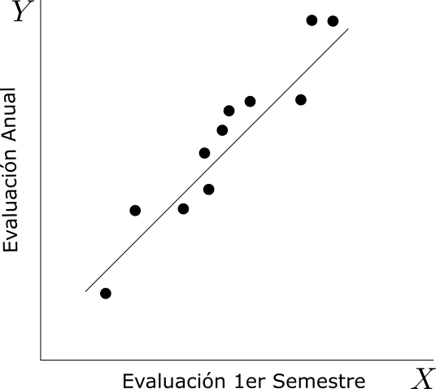
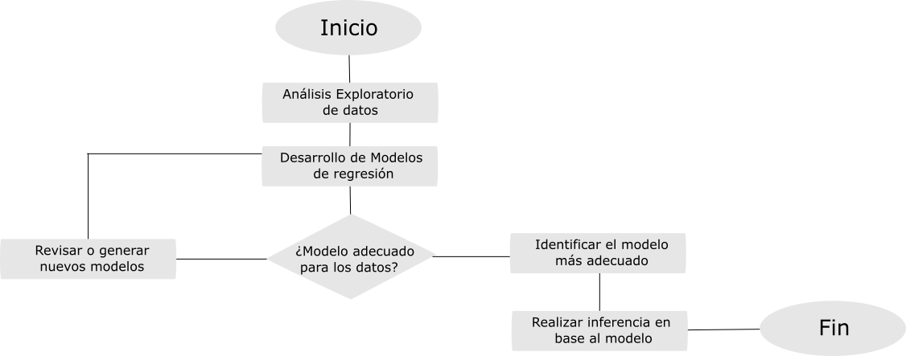
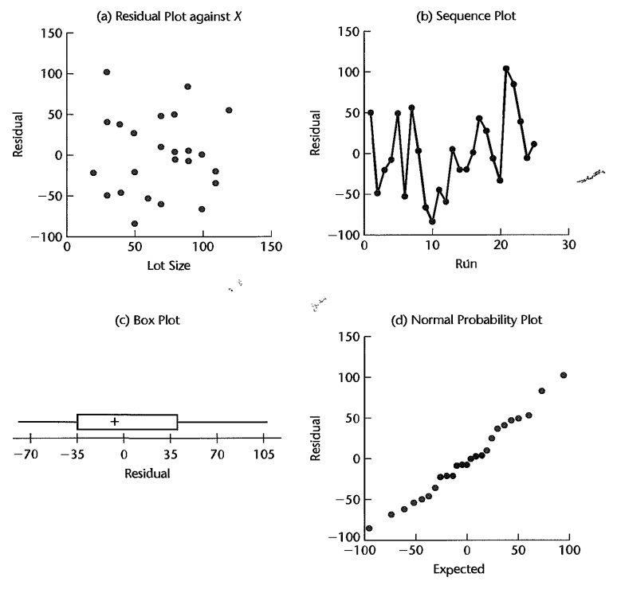
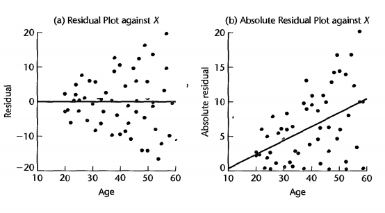
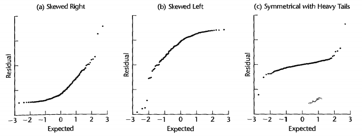
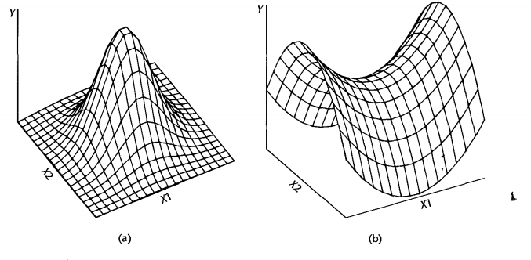

```{r setup, include=FALSE, cache=F, message=F, warning=F, results="hide"}
knitr::opts_chunk$set(cache=TRUE)
knitr::opts_chunk$set(fig.path='figs/')
knitr::opts_chunk$set(cache.path='cache/')

knitr::opts_chunk$set(
                  fig.process = function(x) {
                      x2 = sub('-\\d+([.][a-z]+)$', '\\1', x)
                      if (file.rename(x, x2)) x2 else x
                      }
                  )
library(tidyverse)
```


# Regresión Lineal Simple

## Introducción

El análisis de regresión es una metodología estadística que utiliza la relación entre dos o más variables cuantitativas de modo que una respuesta o variable dependiente puede ser predicha desde las otras.

Esta metodología es **ampliamente** utilizada en industria, ciencias sociales, biología, etc.

## Relación entre variables

Dentro del concepto de **relación entre dos variables** distinguiremos dos tipos:

* Relación funcional

* Relación estadística

### Relación funcional

Una relación funcional entre dos variables es expresada mediante una fórmula matemática. Si $X$ denota la **variable independiente** e $Y$ la **variable dependiente**, una relación funcional es de la forma:

$$Y=f(X)$$
Dado un valor particular de $X$, la función $f$ indica el valor correspondiente de $Y$.

### Ejemplo 

Consideremos la relación entre ventas en dólares ($Y$) de un producto vendido a un precio fijo y el número de unidades vendidad ($X$). Si el precio por unidad es de $2$ dólares por unidad, la relación es expresada por la ecuación:

$$Y=2X$$

---


{width=250px}

### Relación Estadística

Una relación estadística, en contraste a la relación funcional, no es *perfecta*. En general, las observaciones para este tipo de relación no caen directamente sobre la curva.


### Ejemplo

Evaluaciones de desempeño de 10 empleados fueron obtenidos a final del primer y segundo semestre. Estos datos se ven graficados en la  siguiente figura. Las evaluaciones a final del segundo semestre se considera como la *variable dependiente o respuesta* $Y$, y las evaluaciones a final del primer semestre como la variable *independiente, explicativa o predictor* $X$. 

---


{width=250px}

---

Como se ve en la figura, mediante el gráfico de dispersión, la relación estadística no es perfecta. En terminología estadística, cada punto representa un ensayo, caso u observación.

La línea en el gráfico, indica la tendencia general por la cual las evaluaciones de fin de año varían con el nivel de evaluación de desempeño de mitad de año.

Notamos que los puntos no caen directamente sobre la línea de la relación estadística. Este tipo de relaciones puede ser altamente útiles, a pesar de que no tienen la misma exactitud de una función relacional.

## Modelos de regresión y sus usos.

El análisis de regresión fue desarrollado por Sir Francis Galton al final del siglo XIX. Galton estudió la relación entre la estatura de los padres y sus hijos, en donde notó que la altura de los hijos de padres altos y bajos parecieran *revertirse* o *regresar* a la media del grupo. El consideró esta tendencia una regresión a la "mediocridad". Galton desarrolló una descripción matemática de esta tendencia de regresión, siendo el precursos de lo que consideramos modelos de regresión.

El termino *regresión* persiste hasta el día de hoy para describir relaciones estadísticas entre variables.

### Conceptos básicos

Un modelo de regresión es la manera formal de expresar dos ingredientes esenciales de una relación estadística:

* La tendencia de la variable respuesta $Y$ a variar junto a la variable predictora de manera sistemática

* Una dispersión de puntos alrededor de la curva de una relación estadística.

Estas dos características están incorporadas en un modelo de regresión al postular que:

* Hay una distribución de probabilidad de $Y$ para cada nivel de $X$.

* Las medias de estas distribuciones de probabilidad varían de manera sistemática con $X$.


---

Los modelos de regresión pueden diferir en la forma de la función de regresión (lineal, curvilinea), en la forma de la distribución de probabilidad de $Y$ (simétrica, oblicuidad) y de otras formas.

Cualquiera sea la variación, el concepto de una distribución de probabilidad de $Y$ para un $X$ dado es la contraparte formal a la dispersión empírica de una relación estadística.

De manera similiar, la curva de regresión que describe la relación entre las medias de las distribuciones de probabilidades de $Y$ en el nivel de $X$, es la contraparte de la tendencia general de $Y$ que varía con $X$ de manera sistemática en una relación estadística.

### Modelos de regresión con más de una variable predictora

Los modelos de regresión pueden contener **más de una variable predictora o independiente**. Por ejemplo:

* En un estudio de eficiencia de 67 oficinas de una empresa financiera, la variable respuesta fue el costo operacional para el año que terminó. Y se consideró 4 variable predictoras: tamaño medio de los préstamos otorgados, número de préstamos otorgados, número total de aplicaciones a nuevos préstamos y un índice de los salarios de la oficina.

* En un estudio médico de niños de baja estatura, se consideró la variable respuesta como el nivel máximo de hormonas de crecimiento en plasma. Se utilizó 14 variables predictoras, en donde se incluían: edad, género, altura, peso y 10 medidas de pliegues cutáneos.

### Construcción de un modelo de regresión

**Selección de las variables predictoras**

Debido a que en la práctica debemos trabajar con proporciones manejables, cuando construimos modelos, sólo un **número limitado de variables predictoras pueden (o deberían) ser incluidas en un modelo de regresión** para alguna situación de interés.

Un problema central en estudios exploratorios es la selección de las variables a incluir en el modelo, intentando considerar un conjunto de variables que sean *"buenas"* en algún sentido para el propósito del análisis.

* Una consideración importante al realizar esta decisión, es preguntarse en que grado la incorporación de estas variables contribuye a reducir la variabilidad de $Y$ tras usar el resto de predictores en el modelo: **¿Al incorporar un nuevo regresor al modelo, me reduce la variabilidad de $Y$?**

* Una segunda consideración es la importancia de la variable como agente causal en el proceso bajo análisis. Más adelante en el curso, veremos una metodología para escoger que predictores debieran ser incluidos.

---

**Forma funcional de la relación de regresión**

La elección de la forma funcional de la relación de regresión está sujeta a la elección de las variable predictoras. A veces, la teoría nos indica una forma apropiada de la forma funcional.

* **Ejemplos:** Relaciones lineales, cuadráticas, polinómicas o logísticas.

**Alcance del modelo**

Al formular un modelo de regresión, usualmente debemos restringir la cobertura de este a algún intervalo o región de valores de los predictores. El alcance del modelo está determinado por el diseño de la investigación o por el rango de los datos utilizados.

* **Ejemplo:** Una compañía estudia el efecto del precio en el volumen de ventas a lo largo de 6 niveles de precios, que van desde $4,95$ a $6,95$ USD. Así, el alcance del modelo está limitado al nivelos de los precios utilizados para generar el modelo, esto es, valores desde $5$ a $7$ USD aproximadamente. 

La forma de la función de regresión fuera de estos rangos, tiene poca utilidad debido a que no se tiene evidencia de valores en aquellos rangos.

### Usos del análisis de regresión

El análisis de regresión tiene 3 grandes propósitos:

* Describir
* Controlar
* Predecir

Estos propósitos del análisis de regresión frecuentemente se sobreponen en la práctica.

### Regresión y causalidad

La existencia de una relación estadística entre la variable respuesta $Y$ y la variable explicativa o predictora $X$ **no implica** en ningún sentido que $Y$ depende **causalmente** de $X$. Sin importar que tan fuerte sea esta relación estadística entre $X$ e $Y$, ningún patrón causa-efecto es necesariamente implicado por un modelo de regresión.

Incluso cuando una fuerte relación estadística refleja condiciones causales, esta última puede actuar en la dirección opuesta, desde $Y$ a $X$.

* **Ejemplo:** Calibración de un termómetro usando regresión.

Por lo que debemos tener especial cuidado en la obtención de conclusiones sobre la relación causal desde un análisis de regresión. **El análisis de regresión por si mismo no provee información sobre patrones de causalidad y estos deben ser complementados con otros análisis para obtener conclusiones sobre la relación causal**.

## Regresión lineal simple con distribución de errores sin especificar

### Definición formal 

Al inicio del curso, consideramos un modelo de regresión básico donde sólo hay una variable predictora y la función de regresión es lineal. Este modelo puede ser definido como:

$$Y_i=\beta_0+\beta_1 X_i + \varepsilon_i$$
donde,

* $Y_i$ es el valor de la varible respuesta en la i-ésima observación
* $\beta_0$ y $\beta_1$ son **parámetros**
* $X_i$ es una constante conocida: el valor de la variable predictora en la i-ésima observación.
* $\varepsilon_i$ es un término de error aleatorio con meadia $\mathbb{E}(\varepsilon_i)=0$ y varianza $\mathbb{V}(\varepsilon_i)=\sigma^2$
* $\varepsilon_i$ y $\varepsilon_j$ no están correlacionados, por lo que su covarianza es cero.

Esto modelo se le conoce como **modelo de regresión lineal simple**. **Lineal**, debido a que es lineal en los parámetros y en las variables predictoras. **Simple**, debido a que sólo incorpora una variable predictora.

### Características importantes del modelo

* La respuesta $Y_i$ en la i-ésimo **ensayo** es la suma de dos componentes:
    - El término constante $\beta_0+\beta_1 X_i$ y,
    - El término aleatorio $\varepsilon_i$. Por lo que $Y_i$ es una **variable aleatoria**
* Debido a que $\mathbb{E}(\varepsilon_i)=0$, sigue que:

$$\mathbb{E}(Y_i)=\mathbb{E}(\beta_0+\beta_1 X_i + \varepsilon_i)=\beta_0+\beta_1 X_i + \mathbb{E}(\varepsilon_i)= \beta_0+\beta_1 X_i$$

Así, la respuesta $Y_i$, cuando el nivel de $X$ en el i-ésimo ensayo es $X_i$, viene desde una distribución de  probabilidad cuya media está dada por:

$$\mathbb{E}(Y_i)=\beta_0+\beta_1 X_i$$

Por lo tanto, sabemos que la función de regresión para este modelo es:

$$\mathbb{E}(Y)=\beta_0+\beta_1 X$$

Debido a que la función de regresión relaciona la media de la distribución de probabilidad de $Y$ para un $X$ dado para el nivel de $X$.

---

* La respuesta $Y_i$ en el i-ésimo ensayo excede o queda bajo el valor de la función de regresión por la cantidad del término $\varepsilon_i$.

* Los errores $\varepsilon_i$ se asumen que tienen varianza constante $\sigma^2$, por lo que la variable respuesta $Y_i$ tiene la misma varianza constante.

Así, el modelo de regresión lineal simple asume que la distribución de probabilidad de $Y$ tiene la misma varianza $\sigma^2$, independiente del nivel de la variable predictora $X$.

* Los errores se asumen no correlacionados. Debido a que los términos $\varepsilon_i$ y $\varepsilon_j$ no están correlacionados, también no lo estáran las respuestas $Y_i$ e $Y_j$.

**En resumen, el modelo de regresión lineal simple implica que la respuesta $Y_i$ viene desde una distribución de probabilidad cuyas medias son $\mathbb{E}(Y_i)=\beta_0+\beta_1 X_i$ y cuyas varianzas son $\sigma^2$, para todos los niveles de $X$. Además, dos respuestas distintas $Y_i$ e $Y_j$ no están correlacionadas.**

### Interpretación de los parámetros de regresión

Los parámetros de regresión $\beta_0$ y $\beta_1$ en un modelo de regresión lineal simple son llamados **coeficientes de regresión**, siendo $\beta_1$ la pendiente y $\beta_0$ el **intercepto**. El primero indica el cambio en la media de la distribución de probabilidad de $Y$ por el incremento unitario en $X$. 

Cuando el alcance del modelo incluye $X=0$, $\beta_0$ entrega la media de la distribución de probabilidad de $Y$ en $X=0$. **Cuando el alcance del modelo no incluye $X=0$,$\beta_0$ no tienen ninguna interpretación particular como termino separado en la regresión.**

## Datos para una regresión lineal

Usualmente, no sabemos los valores de los parámetros de regresión $\beta_0$ y $\beta_1$ en el modelo de regresión lineal simple, y debemos estimarlos desde un conjunto de datos relevantes para el estudio. De hecho, frecuentemente no se tiene información adecuada *apriori* de los predictores a incorporar en el modelo o de la forma funcional de la relación de regresión, y debemos basarnos en un conjunto de datos para desarrollar un modelo de regresión adecuado.

El conjunto de datos que usamos en un análisis de regresión puede ser obtenido a partir de estudio no experimentales o experimentales:

---

* **Datos de observación (o datos observados)**

Datos de este tipo son obtenido a partir de estudio no experimentales. Este tipo de estudios no controla la(s) variable(s) predictoras de interés.

Los análisis de regresión son frecuentemente basados en datos de observación, debido a que en general es menos viable obtener datos desde una experimento controlado.

Una de las limitaciones de este tipo de datos, es que **usualmente no proveen información adecuada sobre la relación causa-efecto**. Cuando se utiliza un análisis de regresión con propósito de describir basándose en datos de observación, se debe investigar si existe otras variables predictoras que puedan explicar más directamente la relación causa-efecto.

---

* **Datos Experimentales**

Frecuentemente, es posible realizar experimentos controlados para obtener datos desde los cuales los parámetros de regresión pueden ser estimados.

Cuando existe un control sobre la variable explicativa (predictora) mediante asignaciones aleatorias, los datos obtenidos proveen de una mayor información sobre la relación causa-efecto que la de datos de observación. Esto debido a que **la aleatorización tiende a balancear los efectos de otras variables que puedan afectar la variable respuesta**


## Procedimiento general de un análisis de regresión

{width=480px}

## Estimación de la función de regresión

Los datos experimentakes o de observación que se usarán para estimar los parámetros de la función de regresión consisten en observaciones de la variable explicativa o predictora $X$ y su correspondiente observación de la variables respuesta $Y$. Para cada ensayo, existe una observación $X$ y una observación $Y$. Denotamos esto como el par $(X,Y)$ para el primer ensayo como $(X_1,Y_1)$, y de manera análoga para los siguientes ensayos. Siendo el término general, para el i-ésimo ensayo $(X_i,Y_i)$ donde $i=1,\dots,n$

### Método de mínimos cuadrados

Para encontrar un *"buen"* estimador de los parámetros de la regresión $\beta_0$ y $\beta_1$, debemos emplear el **método de mínimos cuadrados**. Para las observaciones $(X_i,Y_i)$ para cada caso, el método de mínimos cuadrados considera la desviación de $Y_i$ con respecto a su valor esperado:

$$Y_i-(\beta_0+\beta_1 X_i)$$

En particular, este método requiere que consideremos la suma de las $n$ desviaciones al cuadrado. Este criterio es denotado por $Q$:

$$Q=\sum_{i=1}^{n} (Y_i-\beta_0-\beta_1X_i)^2$$

De acuerdo al método de mínimos cuadrados, el estimador de $\beta_0$ y $\beta_1$ son los valores $b_0$ y $b_1$, respectivamente, que minimizan el criterio $Q$ para una conjunto de observaciones dado $(X_1,Y_2),(X_2,Y_2),\dots,(X_n,Y_n)$.

### Ejemplo

La siguiente figura presenta el diagrama de dispersión de un estudio y la recta de regresión que resulta al usar la respuesta media $(9)$ como el predictor e ignoramos $X$.

{width=45%}

---

Notamos que la recta de regresión usas las estimaciones $b_0=9$ y $b_1=0$, y que $\hat{Y}$ denota la ordenada de la estimación de la recta. Claramente, esta regresión no es un buen **ajuste**, debido a las grandes desviaciones o diferencias de dos observaciones de la ordenada $\hat{Y}$ correspondiente de la recta de regresión. La diferencia entre para la primera observación $(X_1,Y_1)=(20,5)$, es:

$$Y_1-(b_0+b_1 X)=5-(9+0*20)=5-9=-4$$

Siendo así la suma de estas diferencias para los tres casos:

$$Q=(5-9)^2+(12-9)^2+(10-9)^2=26$$

---

En la siguiente figura, presentamos los mismo datos pero con otra recta de regresión:

{width=45%}

---

El ajuste de regresión en este caso es claramente mejor. La diferencia vertical para la primera observación ahora es:

$$Y_1-(b_0+b_1 X)=5-(2.81+0.177*20)=5-6.35=-1.35$$
y el criterio $Q$ se reduce a:

$$Q=(5-6.35)^2+(12-12.55)^2+(10-8.12)^2=5.7$$

Por lo que un mejor ajuste de la recta de regresión corresponderá a un menor valor de $Q$.

**El objetivo de método de mínimos cuadrados es encontrar estimaciones $b_0$ y $b_1$ para $\beta_0$ y $\beta_1$, respectivamente, para el cual el $Q$ es mínimo.**

### Estimadores de mínimos cuadrados

Los estimadores $b_0$ y $b_1$ que satisfacen el criterio de mínimos cuadrados puede ser encontrado de dos maneras:

1. Procedimiento número de búsqueda para evaluar sistemáticamente el criterio $Q$ para diferentes $b_0$ y $b_1$ hasta que se encuentran los valores que minimizan $Q$.

2. Procedimientos analíticos para encontrar los valores de $b_0$ y $b_1$ que minimizan $Q$. Este enfoque es viable sólo cuando el modelo de regresión no es matemáticamente complejo.

---

Usando el enfoque analítico, se puede mostrar que en el modelo de regresión lineal simple, los valores $b_0$ y $b_1$ que minimizan $Q$ para algún conjunto de observaciones, están dados por las siguientes ecuaciones:

$$\sum Y_i=n b_0+b_1 \sum X_i$$
y,
$$\sum X_i Y_i= b_0 \sum X_i + b_1 \sum X_{i}^{2}$$
Estas ecuaciones reciben el nombre de **ecuaciones normales**; $b_0$ y $b_1$ son llamadas estimadores puntuales de $\beta_0$ y $\beta_1$, respectivamente.

---

Si resolvemos ambas ecuaciones simultáneamente para $b_0$ y $b_1$, se obtiene:

$$b_1=\dfrac{\sum (X_i-\overline{X})(Y_i - \overline{Y})}{\sum (X_i-\overline{X})^2}$$

y,

$$b_0=\dfrac{1}{n}\left( \sum Y_i - b_1 \sum X_i\right)=\overline{Y}-b_1 \overline{X}$$

donde $\overline{X}$ y $\overline{Y}$ son las medias de las $X_i$ e $Y_i$ observaciones, respectivamente.

### Comentario

**¿Cómo se obtienen las ecuaciones normales?**

Las ecuaciones normales pueden ser obtenidas usando cálculo. Para un conjunto de observaciones $(X_i,Y_i)$, la cantidad $Q$ es una función de $\beta_0$ y $\beta_1$. Los valores de $\beta_0$ y $\beta_1$ que minimizan $Q$ pueden ser derivados al diferenciar:

$$Q=\sum_{i=1}^{n} (Y_i-\beta_0-\beta_1X_i)^2$$

Del cual se obtiene:


$$\dfrac{\partial Q}{\partial \beta_{0}} =-2 \sum\left(Y_{i}-\beta_{0}-\beta_{1} X_{i}\right)$$
y,
$$\dfrac{\partial Q}{\partial \beta_{1}} =-2 \sum X_{i}\left(Y_{i}-\beta_{0}-\beta_{1} X_{i}\right)$$

---

Luego, igualamos a cero, usando $b_0$ y $b_1$ para denotar los valores particulares de $\beta_0$ y $\beta_1$ que minimizan $Q$:

$$-2 \sum\left(Y_{i}-\beta_{0}-\beta_{1} X_{i}\right) = 0$$
y,

$$-2 \sum X_{i}\left(Y_{i}-\beta_{0}-\beta_{1} X_{i}\right) = 0$$
Simplificando y expandiendo, se obtiene:


$$\sum Y_{i}-n b_{0}-b_{1} \sum X_{i}=0$$
y,
$$\sum X_{i} Y_{i}-b_{0} \sum X_{i}-b_{1} \sum X_{i}^{2}=0$$
De estas últimas, se obtiene las ecuaciones normales tras reordenar términos. **Al realizar la segunda derivada, se muestra que el mínimo se obtiene utilizando los estimadores de mínimos cuadrados $b_0$ y $b_1$.

### Propiedades de los estimadores de mínimos cuadrados

Un teorema importante, llamado **Teorema de Gauss-Markov** establece:

>Bajo las condiciones de un modelo de regresión lineal simple, los estimadores de mínimos cuadrados $b_0$ y $b_1$ son estimadores insesgados y tienen mínima varianza entre los estimadores insesgados lineales.

Este teorema, que demostraremos más adelante, primero establece que $b_0$ y $b_1$ son estimadores insesgados, por lo que:

$$\mathbb{E}(b_0)=\beta_0 \hspace{40pt} \mathbb{E}(b_1)=\beta_1$$

Por lo que ninguno de estos estimadores tiende a sobreestimar o subestimar sistemáticamente.

---

Segundo, el teorema establece que los estimadores $b_0$ y $b_1$ son más precisos (esto es, su distribución muestral es menos variable) que cualquier otro estimador perteneciente a la clase de estimadores insesgados que son funciones lineales de las observaciones $Y_1,\dots,Y_n$.

Los estimadores $b_0$ y $b_1$ son funciones lineal de $Y_i$.


---

Consideremos, por ejemplo, $b_1$. Por lo que se tiene:

$$b_1=\dfrac{\sum (X_i-\overline{X})(Y_i - \overline{Y})}{\sum (X_i-\overline{X})^2}$$

Más adelante veremos que esta expresión es igual a:

$$b_1=\dfrac{\sum (X_i-\overline{X})Y_i}{\sum (X_i-\overline{X})^2}=\sum k_i Y_i$$
donde

$$k_i=\dfrac{X_i-\overline{X}}{\sum (X_i - \overline{X})^2}$$

Como los $k_i$ son constantes conocidas, $b_i$ es una combinación lineal de los $Y_i$, por lo que es un estimador lineal.

## Estimación puntual de la respuesta media

**Función de regresión estimada**

Dado los parámetros de regresión $b_0$ y $b_1$ estimados a partir de una muestra, se tiene que:

$$\mathbb{E}(Y)=\beta_0 + \beta_1 X$$

Estimamos la función de regresión como sigue:

$$\widehat{Y}=b_0 + b_1 X$$

donde $\widehat{Y}$ es el valor de la función de regresión estimada en el nivel $X$ de la variable predictora.

Llamamos un **valor** de la variable respuesta una **respuesta** y  $\mathbb{E}(Y)$ la respuesta media. Así, la **respuesta media** representa la media de la distribución de probabilidad de $Y$ correspondiente al nivel $X$ de la variable predictora.

Por lo que, $\widehat{Y}$ es una estimación puntual de la respuesta media cuando el nivel de la variable predictora es $X$.

*Es posible mostrar que $\widehat{Y}$ es una estimador insesgado de $\mathbb{E}(Y)$, con varianza mínima en la clase de estimadores insesgados lineales*

## Propiedades del ajuste de regresión

El ajuste de regresión llegado al usar el método de mínimos cuadrados tiene un número de propiedades que valen la pena mencionar. Estas propiedades de los estimadores de mínimos cuadrados de una función de regresión **no aplican para todos los modelos de regresión**.

1. La suma de los residuos es cero:

$$\sum_{i=1}^{n} e_i = 0$$

2. La suma cuadrado de los residuos ($\sum e_{i}^{2}$), es un mínimo. Esto debido a que el criterio $Q$ (que fue minimizado) es igual a $\sum e_{i}^{2}$ cuando los estimadores de mínimos cuadrados $b_0$ y $b_1$ son usados para estimar $\beta_0$ y $\beta_1$.

---

3. La suma de los valores observados $Y_i$ es igual a la suma de los valores ajustados $\widehat{Y}_i$:

$$\sum_{i=1}^{n} Y_i = \sum_{i=1}^{n} \widehat{Y}_i$$

De esto último, se desprende que la media de los valores ajustados $\widehat{Y}_i$ es la misma que la media de los valores observados $Y_i$.

4. La suma de los residuos ponderados es cero cuando el i-ésimo residuo es ponderado con el nivel de la variable predictora i-ésima, esto es:

$$\sum_{i=1}^{n} X_i e_i = 0$$


---

5. Una consecuencia de las propiedades 1 y 4, es que la suma de los pesos ponderados es cero cuando el i-ésimo residuo es ponderado con el valor ajustado de la i-ésima variable respuesta, esto es:

$$\sum_{i=1}^{n} \widehat{Y}_i e_i = 0$$

6. La recta de regresión siempre pasa por el punto $(\overline{X},\overline{Y})$.


## Inferencia sobre los parámetros de regresión 

En lo que sigue, realizaremos inferencia sobre los parámetros del modelo de regresión:

$$Y_i=\beta_0+\beta_1 X_i + \varepsilon_i$$

En donde $\beta_0$ y $\beta_1$ son parámetros, $X_i$ son constantes conocidas y $\varepsilon_i$ son independientes $N(0,\sigma^2)$. Esto último, es un supuesto adicional al establecido en la definición formal que hemos visto.

## Inferencia sobre la pendiente 

Frecuentemente es de particular interés la inferencia sobre el parámetro de la pendiente de regresión, pues nos entrega una noción de cambio medio por unidad en la variable regresora. Un tipo de test relevante en este contexto es:

$$H_0: \beta_1=0 \hspace{20pt} H_1: \beta_1\ne 0$$

Este test de hipótesis es relevante debido a que cuando $\beta_1=0$, no existe una asociación lineal entre las variables $X$ e $Y$.

En el caso de que el término de error en el modelo de regresión sea normal, la condición de que $\beta_1=0$ implica aún más cosas. Debido a que en este modelo todas las distribución de probabilidades de $Y$ son normales con varianza constante, y que las medias son iguales cuando $\beta_1=0$, sigue que las distribuciones de probabilidad de $Y$ son **idénticas** cuando $\beta_1=0$.

**Así, $\beta_1=0$ para el modelo de regresión lineal normal implica que no sólo no existe relación lineal entre $X$ e $Y$, pero además no existe ningún tipo de relación entre $Y$ y $X$, dado que las distribuciones de probabilidad de $Y$ son idénticas para todos los niveles de $X$.**

### Distribución muestral de $b_1$

Por lo visto antes, sabemos que el estimador puntual de $b_1$ está dado por:

$$b_1=\dfrac{\sum (X_i-\overline{X})(Y_i - \overline{Y})}{\sum (X_i-\overline{X})^2}$$
La distribución muestral de $b_1$ hace referencia a los diferentes valores de $b_1$ que serían obtenidos con un muestreo repetido cuando los niveles de la variable predictora $X$ se mantiene constante entre las diferentes muestras. Para el modelo de regresión normal, la distribución muestral de $b_1$ es normal con media y varianza dada por:

$$\mathbb{E}(b_1)=\beta_1$$
y,
$$\mathbb{V}(b_1)=\dfrac{\sigma^2}{\sum (X_i-\overline{X})^2}$$

Para mostrar esto, debemos identificar que $b_1$ es una combinación lineal de las observaciones $Y_i$.

### $b_1$ como combinación lineal de $Y_i$

Se puede mostrar que $b_1$ puede ser reescrito como:

$$b_1=\sum k_i Y_i$$
donde, 
$$k_i=\dfrac{X_i-\overline{X}}{\sum (X_i-\overline{X})^2}$$

Notamos que los $k_i$ son funciones de $X_i$ y por lo tanto son cantidades fijas, ya que los $X_i$ son conocidos. Los coeficientes $k_i$ tienen propiedades interesantes que usaremos más adelante:
\begin{align*}
\sum k_i&=0 \\
\sum k_i X_i &= 1 \\
\sum k_{i}^{2}&=\dfrac{1}{\sum (X_i-\overline{X})^2}
\end{align*}

**Leer detalles de este cálculo página 42, Applied Lineal Statistical Models 5th Edition, Kutner et al.**

### Normalidad, media y varianza

Debido a que el término $b_1$ es una combinación lineal de $Y_i$, y este último son variables aleatoria normales independientes, sigue que $b_1$ también lo es.

La insesgadez del estimador puntual de $b_1$ debido al teorema de Gauss-Markov, sigue que:
\begin{align*}
\mathbb{E}(b_1)&=\mathbb{E}\left(\sum k_i Y_i\right)=\sum k_i \mathbb{E}(Y_i)= \sum k_i(\beta_0+\beta_1 X_i)\\
&= \beta_0 \sum k_i + \beta_1 \sum k_i X_i = \beta_1
\end{align*}
En cuanto a la varianza de $b_1$, sólo necesitamos recordar que $Y_i$ son variables aleatorias independientes, cada una con varianza $\sigma^2$ y que $k_i$ son constantes. Por lo que:
\begin{align*}
\mathbb{V}(b_1)&=\mathbb{V}\left(\sum k_i Y_i\right)=\sum k_{i}^{2} \mathbb{V}(Y_i)\\
&=\sum k_{i}^{2} \sigma^2=\sigma^2 \sum k_{i}^{2}\\
&= \dfrac{\sigma^2}{\sum (X_i -\overline{X})^2}
\end{align*}

### Varianza estimada

Podemos estimar la varianza de la distribución muestral de $b_1$:

$$\mathbb{V}(b_1)=\dfrac{\sigma^2}{\sum (X_i - \overline{X})^2}$$

Reemplazando el parámetro $\sigma^2$ con el ECM, el estimador insesgado de $\sigma^2$:

$$\widehat{\mathbb{V}(b_1)}=\dfrac{MSE}{\sum (X_i - \overline{X})^2}$$
Esta estimación puntual es un estimador insesgada de $\mathbb{V}(b_1)$.  Tomando la raíz cuadrado podemos obtener la estimación puntual para la desviación estándar.

**Leer comentario página 44, libro Applied Lineal Statistical Models 5th Edition, Kutner et al. para demostración de $b_1$ es el estimador de varianza mínima entre los estimadores insesgados lineales.**

## Distribución muestral útil

Con vistas en obtener intervalos de confianza para los parámetros de regresión, necesitamos obtener las distribuciones muestrales de cantidades pivotales, entre ellas la cantidad:


$$(b_1-\beta_1)/\sqrt{\widehat{\mathbb{V}(b_1)}}$$
Debido a que $b_1$ está distribuido normalmente, sabemos que la estandarización:

$$\dfrac{(b_1-\beta_1)}{\sqrt{\mathbb{V}(b_1)}}$$
es una variable aleatoria normal estándar. En la práctica, no se tiene acceso a la varianza teórica por lo que esta cantidad debe ser estimada por $\widehat{\mathbb{V}(b_1)}$ por que estamos particularmente interesados en la distribución de $(b_1-\beta_1)/\sqrt{\widehat{\mathbb{V}(b_1)}}$

---

Cuando una estadístico está estandarizado pero el denominador es una estimación de la desviación estándar en vez de su valor real, se le llama **estadístico estudentizado**. Un teorema importante en estadística establece que el estadístico:


$$\dfrac{(b_1-\beta_1)}{\sqrt{\widehat{\mathbb{V}(b_1)}}}\sim t(n-2)$$
Para el modelo de regresión que estamos estudiando. Esto viene del hecho que $SSE/\sigma^2 \sim \chi^2(n-2)$ y es independiente de $b_0$ y $b_1$.


## Intervalo de confianza para la pendiente

Debido a que esta cantidad sigue una distribución t-student, podemos establecer que:

$$\mathbb{P}(t(\alpha/2,n-2)\leq (b_1-\beta_1)/\sqrt{\widehat{\mathbb{V}(b_1)}} \leq  t(1-\alpha/2,n-2))=1-\alpha$$
Luego, operando de igual manera que en la construcción de intervalos de confianza  usual (vía pivote). Podemos llegar a un intervalo de confianza para $\beta_1$:

$$\left[ b_1 \pm t(1-\alpha/2, n-2) \sqrt{\widehat{\mathbb{V}(b_1)}}\right]$$

## Test de Hipótesis para la pendiente

Debido a que:

$$\dfrac{(b_1-\beta_1)}{\sqrt{\widehat{\mathbb{V}(b_1)}}}\sim t(n-2)$$

Toda la teoría de test de hipótesis usuales es válida (tests unilaterales y bilaterales). **Recordar cursos pasados.**

Tenemos particular interés en un test del tipo:

$$H_0: \beta_1 = 0 \hspace{20pt} H_1:\beta_1 \neq 0$$

Pues con ello probamos si existe una asociación lineal entre las variables del modelo bajo un cierto nivel de confianza.


## Inferencia sobre el intercepto

Como lo mencionamos antes, rara vez tendremos interés en hacer inferencia sobre el parámetro $\beta_0$, y estos son sólo válidos cuando el rango de la variable predictora incluye $X=0$.

Como hemos visto antes la estimación puntal del intercepto está dado por:

$$b_0=\overline{Y}-b_1\overline{X}$$
Para el modelo de regresión en estudio, la distribución muestral de $b_0$ es normal, con media y varianza:

$$\mathbb{E}(b_0)=\beta_0$$
y,
$$\mathbb{V}(b_0)=\sigma^2\left[ \dfrac{1}{n}+\dfrac{\overline{X}^2}{\sum (X_i-\overline{X})^2}\right]$$
La normalidad es obtenida debido a que $b_0$ al igual que $b_1$, es una combinación lineal de observaciones $Y_i$. Al igual que antes, una estimador de la varianza viene dado al reemplazar $\sigma^2$ por su estimación puntual (ECM). El estimador de la desviación estándar es obtenido aplicando raíz cuadrada.

## Intervalo de confianza para el intercepto

Al igual que antes, se tiene que:

$$\dfrac{b_0-\beta_0}{\sqrt{\widehat{\mathbb{V}(b_0)}}}\sim t(n-2)$$

para este modelo de regresión. Así, los intervalos de confianza pueden ser construidos al igual que para $\beta_1$. Esto es:

$$\left[ b_0 \pm t(1-\alpha/2, n-1)\sqrt{\widehat{\mathbb{V}(b_0)}}\right]$$
**Tarea: Sección 2.4 Estimación por intervalo para $\mathbb{E}(Y_h)$ y Sección 2.5 Predicción de nuevas observaciones**

**Lectura complementaria: Sección 2.6 Intervalo de confianza para la recta de regresión**

## Análisis de Varianza para análisis de regresión

Con lo anterior, ya hemos visto gran parte de la teoría de un modelo de regresión básico. En lo que sigue, estudiaremos el análisis de regresión desde la perspectiva de análisis de varianza.

**Nociones básicas:** El enfoque desde el análisis de varianza se base en particionar la suma de cuadrado y grados de libertad asociados con la variable respuesta $Y$. Identificaremos 3 términos que usaremos frecuentemente:

- *Suma de cuadrados total* (SSTO): $\sum (Y_i - \overline{Y})^2$

- *Suma de los cuadrados del error* (SSE): $\sum (Y_i - \hat{Y}_i)^2$

- *Suma de los cuadrados de la regresión* (SSR): $\sum (\hat{Y}_i-\overline{Y})^2$

en donde se tiene la relación:

$$SSTO=SSE+SSR$$

## Desglose de los grados de libertad

Al igual que para la varianza, podemos desglosar los grados de libertad. Es claro ver que:

- SSTO tiene asociado $n-1$ grados de libertad, debido a que estimamos la media poblacional.

- SSE tiene asociado $n-2$ grados de libertad, debido a que para obtener $\hat{Y}_i$ debemos estimar $\beta_0$ y $\beta_1$

- SSR tiene asociado $1$ grado de libertad debido a que los valores ajustados son calculados a partir de la recta de regresión, por lo que $2$ grados de libertad están a asociado a esta, pero uno de ello es perdido debido a la estimación $\overline{Y}$.

Así, se tiene que:

$$n-1=1+(n-2)$$


## Cuadrados medios

Llamamos cuadrados medios a las sumas cuadradas divididas por sus grados de libertad respectivos. Por lo que tenemos:

- **Error cuadrático medio**: $\dfrac{SSE}{n-2}$

- **Cuadrado medio de regresión**: $\dfrac{SSR}{1}$

En este caso, los cuadrados medios **no son aditivos**

## Tabla ANOVA

Lo que hemos visto anteriormente, puede ser resumido en la tabla ANOVA usual, en donde se incorporó además la esperanza de los cuadrados medios.

\begin{table}[]
\begin{tabular}{lllll}
\textbf{F.V.} & \textbf{SS}                                      & \textbf{g.l.} & \textbf{MS} & $\mathbf{\mathbb{E}(MS)}$                                  \\
Regresión           & $SSR = \sum (\hat{Y}_i-\overline{Y})^2$ & $1$    & $MSR=SSR$              & $\sigma^2+\beta_{1}^{2}\sum (X_i-\overline{X})^2$ \\
Error               & $SSE = \sum (Y_i - \hat{Y}_i)^2$        & $n-2$  & $MSE=\dfrac{SSE}{n-2}$ & $\sigma^2$                                        \\
Total               & $SSTO=\sum (Y_i - \overline{Y})^2$      & $n-1$  &                        &                                                  
\end{tabular}
\end{table}


## Test F

El enfoque de análisis de varianza nos permite realizar fácilmente test para modelos de regresión (y otros modelos lineales). Por ejemplo, consideremos:


$$H_0: \beta_1 = 0 \hspace{20pt} H_1:\beta_1 \neq 0$$

**Estadístico de prueba**

Bajo este enfoque consideramos el estadístico $F^*$, definido como:

$$F^*=\dfrac{MSR}{MSE}$$

**Distribución muestral de $F^*$**

*Es posible mostrar* que bajo $H_0$, $F^*$ sigue una distribución $F(1,n-2)$

---

**Regla de decisión**

Debido a que $F^*$ sigue una distribución $F(1,n-2)$ bajo $H_0$, la regla de decisión será:

- Si $F^* \leq F(1-\alpha; 1,n-2)$, optamos por $H_0$

- Si $F^* > F(1-\alpha; 1,n-2)$, optamos por $H_1$


## Medidas de asociación lineal entre X e Y

Hasta ahora no hemos definido ningún nivel de asociación lineal para las variables en estudio, pues nos concentramos en la regresión misma, su inferencia y utilidad de predicción, pero existen casos en los cuales la asociación lineal **en sí misma** es de principal interés. Para determinar el grado de asociación lineal, utilizamos el **coeficiente de determinación y correlación**

### Coeficiente de determinación

El coeficiente de determinación lo definimos como:

$$R^2=\dfrac{SSR}{SSTO}=1-\dfrac{SSE}{SSTO}$$

y lo interpretamos como **la proporción de la variabilidad que es explicada por el ajuste de regresión lineal**. Este coeficiente se mueve entre 0 y 1, siendo 1 un ajuste perfecto. *Un buen ajuste de regresión suele estar entre 0.7 - 0.9*, pero esto puede variar dependiendo del contexto del problema.

### Limitaciones del coeficiente de determinación

* Un coeficiente de determinación alto **no indica** que se puedan hacer predicciones buenas

* Un coeficiente de determinación alto **no indica** que el ajuste es necesariamente bueno

* Un coeficiente de determinación cercano a cero **no indica** que $X$ e $Y$ no estén relacionados.

### Coeficiente de correlación

Este coeficiente puede ser definido como la raíz del coeficiente de determinación.

$$r=\pm \sqrt{R^2}$$

y lo interpretamos como el **coeficiente de correlación de Pearson**

## Aplicación computacional

```{r echo=TRUE, results='hide',message = FALSE, warning=FALSE,fig.show='hide'}
require(tidyverse)
require(MASS)
require(car)
require(mosaic)
data(UScereal)
ggplot(UScereal,aes(x=fibre,y=calories)) + geom_point() +
  geom_smooth(method=lm,se=FALSE,color="red") 
```


---


```{r echo=FALSE,warning=FALSE, message=FALSE}
data(UScereal)
ggplot(UScereal,aes(x=fibre,y=calories)) + geom_point() +
  geom_smooth(method=lm,se=FALSE,color="red") 
```

---

\footnotesize
```{r}
model <- lm(calories~fibre,data=UScereal)
summary(model)
```

---

\footnotesize
```{r}
confint(model)
anova(model)
```

## Diagnóstico 

Cuando realizamos un modelo de regresión, como por ejemplo el modelo de regresión lineal simple antes visto, frecuentemente no podemos estar seguros por adelantado si el modelo es apropiado para aplicación que se le desea dar. Muchas de las características del modelo, tales como la linealidad de la función de regresión o normalidad de los errores podría no ser apropiada, por lo que toma relevancia saber si el modelo puede ser aplicado.

En lo que sigue estudiaremos métodos gráficos y test formales, para saber si un modelo es apropiado usarlo. Nos concentramos en el modelo de regresión lineal simple, pero los mismos principios son válidos para todos los modelos estadísticos que veremos.


### Diagnóstico para las variables predictoras

Primero debemos analizar las variables predictora para detectar la presencia de datos anómalos o *outliers*, que puedan influenciar la viabilidad del modelo. La presencia de outliers, puede provocar residuos grandes en magnitud, influenciando enormemente el ajuste de regresión.


---


### Diagnóstico para Residuos

En general, los gráficos de diagnósticos utilizando directamente la variable respuesta $Y$ no son muy útiles en el análisis de regresión debido a que el valor de las observaciones en la variable respuesta son una función del nivel de la variable predictora. Por lo que usualmente, se analizan indirectamente mediante la inspección de los residuos.

Los residuos $e_i$ son la diferencia entre el valor observado $Y_i$ y el valor ajustado $\hat{Y}_i$:

$$e_i=Y_i-\hat{Y}_i$$

Estos pueden ser considerados como el **error observado**, a diferencia de valor real del error $\varepsilon_i$ en el modelo de regresión:

$$\varepsilon_i=Y_i - \mathbb{E}(Y_i)$$
Para el modelo de regresión lineal simple, los errores $\varepsilon_i$ se asumen **variables aleatorias normales independientes, con media 0 y varianza constante $\sigma^2$**. Si el modelo es apropiado para los datos disponibles, el residuo observado $e_i$ deben reflejar las propiedades que se asumieron para $\varepsilon_i$.

Esta es la idea básica del **análisis de residuos**, una herramienta útil para evaluar la viabilidades de los modelos.

### Propiedades de los residuos

**Media**

La media de los $n$ residuos $e_i$ para el modelo de regresión lineal simple es:

$$\overline{e}=\dfrac{\sum e_i}{n}=0$$
donde $\overline{e}$ denota la media de los residuos. Así, debido a que $\overline{e}$ es siempre 0, este **no** provee información sobre si los errores reales $\varepsilon_i$ tienen valor esperado $\mathbb{E}(\varepsilon_i)=0$.


---

**Varianza**

La varianza de los $n$ residuos $e_i$ está definida como:

$$s^2=\dfrac{\sum (e_i - \overline{e})^2}{n-2}=\dfrac{\sum e_{i}^{2}}{n-2}=\dfrac{SSE}{n-2}=MSE$$
Si el modelo es apropiado, el **error cuadrático medio** es un estimador insesgado de la varianza del error $\sigma^2$.

---

**No independencia**

Los residuos $e_i$ no son variables aleatorias independientes debido a que involucran los valores ajustados $\hat{Y}_i$, los cuales están basado en la misma función de regresión ajustada. Como resultado de lo anterior, los residuos para el modelo de regresión están sujetos a dos restricciones:

* La suma de $e_i$ debe ser 0
* la suma de $X_i e_i$ debe ser 0

Cuando el tamaño de muestra es grande en comparación con el número de parámetros en el modelo de regresión, la efecto de dependencia entre los residuos $e_i$ no tiene mayor importancia y puede ser ignorado.

### Residuos semi-studentizados

Frecuentemente, sirve estandarizar los residuos para realizar el análisis. debido a que la desviación estándar de los términos de error $\varepsilon_i$ es $\sigma$, el cual puede ser estimado mediante $\sqrt{MSE}$, por lo que es natural considerar la estandarización:

$$e_{i}^{*}=\dfrac{e_i-\overline{e}}{\sqrt{MSE}}=\dfrac{e_i}{\sqrt{MSE}}$$

Si $\sqrt{MSE}$ fuese una estimación de la desviación estándar de los residuos $e_i$, llamaríamos $e_{i}^{*}$ residuos *studentizados*. Sin embargo, la desviación estándar de $e_i$ es compleja y varía para los diferentes residuos $e_i$, y $\sqrt{MSE}$ es **sólo una aproximación** de la desviación estándar de $e_i$.

Por lo que llamamos el estadístico $e_{i}^{*}$ un **residuo semi-studentizado**. Estos tipo de residuos nos sirven para identificar la presencia de datos anómalos.

### Diferencias con el modelo estudiado

Usualmente, estaremos en busca de 6 formas en la cuales un modelo de regresión lineal simple con errores normales no es adecuado.

* La función de regresión no es lineal
* Los errores no tienen varianza constante
* Los errores no son independientes
* El modelo ajusta todas las observaciones exceptuando algunas
* Los errores no se distribuyen de manera normal
* Unas o varias variables predictoras fueron omitidas del modelo

### Diagnóstico de los residuos

Utilizaremos varios gráficos para identificar si ocurre alguna de las 6 situaciones antes planteadas. Los siguientes gráficos son usualmente usados para este fin

* Gráficos de los residuos vs la variable predictora
* Gráfico del valor absoluto o el cuadrado de los residuos vs la variable predictora
* Gráfico de los residuos vs valores ajustados
* Gráfico de los residuos vs tiempo u otra secuencia
* Gráfico de los residuos vs variables predictoras omitidas
* Box-Plot de los residuos
* Gráfico de probabilidad normal de los residuos

---



### No linealidad de la función de regresión

Para evaluar si una función de regresión lineal es apropiada para los datos a disposición podemos estudiar el **gráfico de residuos vs la variable predictora**, o equivalentemente, desde el **gráfico de residuos vs los valores ajustados**.

La no linealidad de la función de regresión puede ser estudiada desde un gráfico de dispersión, pero este gráfico no siempre tan efectivo como el gráfico de los residuos.


---


### No consistencia de la varianza del error

Graficar los residuos vs la variable predictora o vs los valores ajustados, no solo es útil para estudiar si una función de regresión lineal es apropiada pero además nos sirve para examinar si la varianza de los errores es constante.
 
 
### Presencia de outliers

Los residuos *outliers* pueden ser identificados mediante el gráfico de residuos vs $X$ o $\hat{Y}$, como también a través de box-plots y diagramas de tallo y hoja de los residuos.

Graficar los residuos semi-studentizados es particularmente útil para distinguir valores extremos, debido a que se vuelve más fácil identificar los residuos que caen varias desviaciones estándar de cero.

Los valores extremos pueden provocar gran dificultad en el ajuste. Cuando estamos en presencia de datos anómalos, debemos sospechar que la observación pudo haber sido resultado de una equivocación, error de medición u otro factor externo, por lo que debe ser descartado. Una motivación para descartarlos es que bajo un método de mínimos cuadrados, un ajuste de regresión puede ser empujado **desproporcionalmente** hacia la observación extrema debido a que la suma del cuadrado de las desviaciones es minimizada.

### No independencia de los errores


Cuando los datos fueron obtenidos en una secuencia de tiempo determinada u otro tipo de secuencia (como por ejemplo áreas geográficos adyacentes), es buena idea preparar un gráfico secuencial de los residuos.

El objetivo de graficar los residuos vs el tiempo u otra secuencia, es ver si existe alguna correlación entre los términos de error que están cercanos.

 

### No normalidad de los errores

Como mencionamos antes, pequeñas desviación de la normalidad no crean mayores problemas. En cambio, si estas diferencias son sustanciales, debemos tener especial cuidado pues no se está cumpliendo un supuesto de nuestro modelo de regresión. La normalidad de los errores pueden ser estudiados informalmente examinando los residuos de varias maneras.

* **Gráfico de distribución**: Un Box-Plot de los residuos es útil para obtener información resumida respecto de la simetría de los residuos y posibles datos extremos. Mediante un histograma o diagrama de tallo y hoja de los residuos, podemos identificar diferencias sustanciales de la normalidad esperada, pero el número de observaciones debe ser relativamente alto para que estos gráficos otorguen información confiable sobre la forma de la distribución de los errores.

* **Gráfico de probabilidad normal**: Otra posibilidad es realizar un gráfico de probabilidad normal de los residuos. En donde se grafica cada residuo vs el valor esperado bajo normalidad.

---




### Omisión de variables predictoras

Los residuos también deben ser graficados vs las variables omitidas en el modelo que pudiesen tener efectos importantes en la respuesta. En las siguientes figuras, ejemplificamos un caso particular de omisión de variable.

---


### Test relacionados con los residuos

El análisis de residuos mediante gráficos es inherentemente subjetivo. Aún así, este análisis subjetivo de una variedad de gráficos de residuos frecuentemente revela dificultades en la implementación del modelo más claramente que un test formal.

* Test de aleatoriedad: Durbin-Watson Test
* Test para la consistencia de varianza:  Brown-Forsythe test y Breusch-Pagan test
* Test de normalidad: Test Chi-cuadrado, Kolmogorov-Smirnov, Lilliefors test.

### Medidas correctivas

Si el modelo de regresión lineal simple no es apropiado para el conjunto de datos que se está analizando, se tienen dos opciones:

* Abandonar el modelo de regresión lineal simple y desarrollar otro modelo
* Aplicar alguna transformación a los datos tal que el modelo de regresión lineal simple sea apropiado para los datos transformados.

---

* **No linealidad de la función de regresión**: Cuando la función de regresión no es lineal, un enfoque directo es modificar el modelo de regresión, por ejemplo elevando al cuadrado las variables predictoras.

* **No consistencia de la varianza del error**:  Cuando la varianza del error no es constante, pero varía de manera sistemática, un enfoque directo es modificar el modelo para permitir el uso de **mínimos cuadrados ponderados** para estimar los parámetros. También es posible realizar transformaciones para solucionar la problemática.

* **No independencia de los errores**: Cuando los errores están correlacionados, un forma de solucionar el problema es trabajar con un modelo que utilice errores. (En series de tiempo verán modelos de este estilo)

* **No normalidad de los errores**: Falta de normalidad y errores no constantes, por lo general ocurren de manera simultánea. Afortunadamente, usualmente transformaciones apropiadas que estabilicen la varianza sirven también para aproximadamente normalizar los errores.

* **Omisión de variables predictoras**: En este caso debemos modificar el modelo, más adelante veremos como seleccionar las variables a incluir en el modelo.

* **Observaciones extremas**: Si los datos outliers no pueden ser descartados, es posible utilizar métodos de estimación que asignan menos peso a las observaciones extremas.
# Regresión Lineal Múltiple

Como lo hemos mencionado antes, extenderemos las nociones del análisis de regresión lineal simple al caso general. Pero antes:

* ¿Por qué es necesario varias variables predictoras?
* ¿Existe un mínimo o máximo de variables a utilizar?


#  Modelo de regresión lineal general

Definimos el modelo de regresión lineal general con errores normales de la siguiente manera:

$$Y_i=\beta_0+\beta_1 X_{i1}+\beta_2 X_{i2} + \cdots + \beta_{p-1}X_{i,p-1}+\varepsilon_i$$

donde:

* $\beta_0,\beta_1,\dots,\beta_{p-1}$ son los parámetros de regresión
* $X_{i1},\dots,X_{i,p-1}$ son constantes conocidas
* $\varepsilon_i$ son independientes $N(0,\sigma^2)$
* $i=1,\dots,n$

---

Si consideramos $X_{i0}=1$, el modelo de regresión anterior puede reescrito como:

$$Y_i=\beta_0 X_{i0}+\beta_1 X_{i1}+\beta_2 X_{i2} + \cdots + \beta_{p-1}X_{i,p-1}+\varepsilon_i$$
por lo que,

$$Y_i=\sum_{k=0}^{p-1} \beta_k X_{ik}+\varepsilon_i$$
La respuesta media para este modelo de regresión está dado por:

$$\mathbb{E}(Y)=\beta_0+\beta_1 X_1 + \beta_2 X_2 + \cdots+\beta_{p-1} X_{p-1}$$
debido a que $\mathbb{E}(\varepsilon_i)=0$

Así, el modelo de regresión lineal general con errores normales implica que las observaciones $Y_i$ son variables aleatorias normales, con media $\mathbb{E}(Y_i)$ dado por la expresión anterior y con varianza constante $\sigma^2$.

---

El modelo de regresión lineal general abarca un basta cantidad de situaciones, mencionaremos algunas de ellas:

* **p-1 variables predictoras:** Cuando $X_1,\dots, X_{p-1}$ representan $p-1$ variables predictoras diferentes y es lineal en las variables predictoras, el modelo de regresión lineal general es un **modelo de regresión de primer order**.

## Variables predictoras cualitativas:

El modelo de regresión lineal general abarca **no sólo variables predictoras cuantitativas, sino también variables cualitativas**. Estas se conocen como variables indicadoras que toman los valores 0 y 1 para identificar las clases de la variable cualitativa.

**Ejemplo**

Consideramos el siguiente análisis de regresión para predecir el largo de la estadía en un hospital $(Y)$ basado en la edad $(X_1)$ y género $(X_2)$ del paciente. Definimos $X_2$ como:

$$X_2=\begin{cases}1 \hspace{20pt} \text{si el paciente es mujer}\\  0 \hspace{20pt} \text{si el paciente es hombre}\end{cases}$$
El modelo de regresión lineal de primer order estará dado por:

$$Y_i=\beta_0+\beta_1 X_{i1} + \beta_2 X_{i2}+\varepsilon_i$$
donde:

\begin{align*}
X_{i1}&= \text{ Edad del paciente}\\
X_{i2}&=\begin{cases}1 \hspace{20pt} \text{si el paciente es mujer}\\  0 \hspace{20pt} \text{si el paciente es hombre}\end{cases}
\end{align*}

---

En este caso, la función de respuesta estará dada por:

$$\mathbb{E}(Y)=\beta_0+\beta_1 X_1 +\beta_2 X_2$$

Para los pacientes hombres, $X_2=0$ y la respuesta media será:

$$\mathbb{E}(Y)=\beta_0+\beta_1 X_1$$

Y para los pacientes mujeres, $X_2=1$ y la respuesta media será:

$$\mathbb{E}(Y)=(\beta_0+\beta_2)+\beta_1 X_1$$


**En general, representamos una variable cualitativa con $c$ clases mediante $c-1$ variables indicadoras.**

---

Por ejemplo, si en el ejemplo anterior se agrega una variable cualitativa que representa el estado de discapacidad. Podemos agregar dos variable indicadoras $X_3$ y $X_4$ como:

$$X_3=\begin{cases}1 \hspace{20pt} \text{si el paciente no es discapacitado}\\  0 \hspace{20pt} \text{en otro caso}\end{cases}$$
y,

$$X_4=\begin{cases}1 \hspace{20pt} \text{si el paciente es discapacitado}\\  0 \hspace{20pt} \text{en otro caso}\end{cases}$$
Así, el modelo quedaría como:

$$Y_i=\beta_0+\beta_1 X_{i1} + \beta_2 X_{i2}+ \beta_3 X_{i3} + \beta_4 X_{i4} + \varepsilon_i$$

donde las variables predictoras están definidas como antes.

## Regresión polinómica

Las regresiones polinómicas son casos especiales del modelo de regresión lineal general. Estos contienen términos cuadrados o de grados mayores de las variables predictoras, provocando que la función de respuesta sea curvilínea. Un ejemplo de una regresión polinómica sería:

$$Y_i=\beta_0 + \beta_1 X_i + \beta_2 X_{i}^{2}+\varepsilon_i$$

## Variables transformadas

Los modelos con variables transformadas involucran funciones respuesta complejas y curvilíneas, aún así son casos especiales de un modelo de regresión lineal general. Consideremos el siguiente modelo:

$$\log Y_i = \beta_0 + \beta_1 X_{i1} +\beta_2 X_{i2}+\beta_3 X_{i3} +\varepsilon_i$$

Acá, la superficie de respuesta (desde el punto de vista geométrico) es compleja, aún así puede ser tratada como un modelo de regresión lineal general. Si consideramos $Y_{i}^{'}=\log Y_i$, podemos reescribir el modelo de regresión anterior como:

$$Y_{i}^{'}=\beta_0 + \beta_1 X_{i1} +\beta_2 X_{i2}+\beta_3 X_{i3} +\varepsilon_i$$

El cual tiene la forma del modelo general. La variable respuesta es el logaritmo de $Y$.

---

Muchos modelos pueden ser transformados al modelo de regresión lineal general, por ejemplo el modelo:

$$Y_i=\dfrac{1}{\beta_0 + \beta_1 X_{i1} +\beta_2 X_{i2}+\varepsilon_i}$$

Puede ser transformado al modelo de regresión lineal general al considerar $Y_{i}^{'}=1/Y_i$. Así, se puede reescribir como:

$$Y_{i}^{'}=\beta_0 + \beta_1 X_{i1} +\beta_2 X_{i2}+\varepsilon_i$$

## Efectos de Interacción

Cuando los efectos de la variables predictoras en la variable respuesta no son **aditivos**, el efecto de un predictor depende del nivel en otra variable predictora. El modelo de regresión lineal general abarca modelos con efectos no aditivos o que interactúan entre sí. Un ejemplo de un modelo de regresión lineal no aditivo con dos variables predictoras $X_1$ y $X_2$ es:

$$Y_i=\beta_0 + \beta_1 X_{i1}+\beta_2 X_{i2} + \beta_3 X_{i1} X_{2i} +\varepsilon_i$$

Acá, la función de respuesta es compleja debido a la término de interacción $\beta_3 X_{i1} X_{2i}$. Aún así, el modelo anterior, es un caso especial de un modelo de regresión lineal general. Sea $X_{i3}=X_{i1}X_{i2}$, podemos reescribir el modelos anterior como:

$$Y_i=\beta_0 + \beta_1 X_{i1}+\beta_2 X_{i2} + \beta_3 X_{i3} +\varepsilon_i$$

En el cual es claro ver que tiene la forma general buscada.

## Combinación de casos

Un modelo de regresión puede combinar muchos de los elementos que hemos mencionado, y aún así ser tratado como un modelo de regresión lineal general. Consideremos el siguiente modelo de regresión que contiene términos lineal y cuadráticos para cada una de las variables predictoras, y un término de interacción.

$$Y_i=\beta_0 + \beta_1 X_{i1}+\beta_{2}X_{i1}^{2} + \beta_3 X_{i2} + \beta_4 X_{i2}^{2}+\beta_5 X_{i1}X_{i2}+\varepsilon_o$$
Si definimos,

$$Z_{i1}=X_{i1} \hspace{15pt} Z_{i2}=X_{i1}^{2} \hspace{15pt} Z_{i3}=X_{i2} \hspace{15pt} Z_{i4}=X_{i2}^{2} \hspace{15pt} Z_{i5}=X_{i1}X_{i2}$$
Podemos representar el modelo como:

$$Y_i=\beta_0 + \beta_1 Z_{i1}+\beta_2 Z_{i2}+\beta_3 Z_{i3} + \beta_4 Z_{i4} + \beta_5 Z_{i5} +\varepsilon$$


### Representación gráfica de la función de respuesta


 

## Interpretación

Debe estar claro, por lo ejemplos, que el modelo de regresión lineal general no está restringido a una respuesta lineal. El término **modelo lineal** hace referencia al hecho que el modelo en estudio es lineal en los parámetros; no hace referencia a la forma de la superficie de respuesta.

Decimos que un modelo de regresión es lineal en los parámetros cuando puede ser escrito de la forma:

$$Y_i=c_{i0}\beta_0 + c_{i1}\beta_1 + c_{i2}\beta_2 + \dots + c_{i,p-1}\beta_{p-1} +\varepsilon_i$$

donde los términos $c_{i0},c_{i1},$etc, son coeficientes que acompañan a las variables predictoras. Un ejemplo de un modelo de regresión lineal no lineal sería:

$$Y_i=\beta_0 \exp (\beta_1 X_i) + \varepsilon$$

Este último modelo no puede ser expresado en la forma de un modelo de regresión lineal.

## Modelo de regresión lineal general en términos matriciales

El modelo de regresión lineal general que hemos estudiado puede ser expresado:

$$Y_i=\beta_0 X_{i0}+\beta_1 X_{i1}+\beta_2 X_{i2} + \cdots + \beta_{p-1}X_{i,p-1}+\varepsilon_i$$
Si definimos:

$$Y_{n\times 1}=\begin{bmatrix}
Y_1\\
Y_2\\
\vdots\\
Y_n
\end{bmatrix}\hspace{30pt}
X_{n\times p}=\begin{bmatrix}
1 & X_{11} & X_{12} & \cdots & X_{1,p-1}\\
1 & X_{21} & X_{22} & \cdots & X_{2,p-1}\\
\vdots & \vdots & & \vdots\\
1 & X_{n1} & X_{n2} & \cdots & X_{n,p-1}\\
\end{bmatrix}$$

y,

$$\beta_{p\times 1}=\begin{bmatrix}
\beta_0\\
\beta_1\\
\vdots\\
\beta_{p-1}
\end{bmatrix}\hspace{30pt}
\varepsilon_{n\times 1}=\begin{bmatrix}
\varepsilon_1\\
\varepsilon_2\\
\vdots\\
\varepsilon_n
\end{bmatrix}
$$

---

Notamos que los vectores $Y$ y $\varepsilon$ son los mismo que para un modelo de regresión lineal simple.

Así, podemos reescribir el modelo de regresión general como:

$$Y_{n\times 1}=X_{n\times p}\ \beta_{p\times 1}+\varepsilon_{n\times 1}$$

En donde,

* $Y$ es un vector de respuestas
* $\beta$ es un vector de parámetros
* $X$ es una matriz de constantes
* $\varepsilon$ es un vector de variables aleatorias normales independientes con $\mathbb{E}(\varepsilon)=0$ y matriz de varianza-covarianza:

$$\mathbb{V}(\varepsilon)=\begin{bmatrix}
\sigma^2 & 0 & \cdots & 0\\
0 & \sigma^2 & \cdots & 0\\
\vdots & \vdots & & \vdots\\
0 & 0 &  \cdots & \sigma^2\\
\end{bmatrix}=\sigma^2 I$$

en donde, $I$ es la matriz identidad.

---

En consecuencia, el vector aleatorio $Y$ tiene esperanza:

$$\mathbb{E}(Y)_{n\times 1}=X\ \beta$$

y varianza:

$$\mathbb{V}(Y)_{n\times n}=\sigma^2 I$$


## Estimación de los coeficientes de regresión

El método de estimación de mínimos cuadrados, puede ser generalizado de la manera:

$$Q=\sum_{i=1}^{n}(Y_i-\beta_0-\beta_1 X_{i1}-\cdots-\beta_{p-1} X_{i,p-1})^2$$

Los estimadores mínimos cuadrados son los valores de $\beta_0,\beta_1,\dots,\beta_{p-1}$ que minimizan $Q$. Si llamamos $b$ al vector de coeficientes de regresión $b_0,b_1,\dots,b_{p-1}$. Así, las ecuaciones normales para el modelo de regresión lineal general pueden ser reescritas en términos matriciales como:

$$X'Xb=X'Y$$

Luego, despejando b, se tiene que:

$$b=(X'X)^{-1}X'Y$$

---

Alternativamente, podemos utilizar el método de máxima verosimilitud en donde tenemos que maximizar la siguiente función de verosimilitud:

$$L(\beta,\sigma^2)=\dfrac{1}{(2\pi \sigma^2)^{\pi/2}} \exp \left[ -\dfrac{1}{2\sigma^2}\sum_{i=1}^{n}(Y_i-\beta_0-\beta_1 X_{i1}-\cdots-\beta_{p-1} X_{i,p-1})^2 \right]$$

De igual manera que en el caso de regresión lineal simple, los coeficientes que se obtienen mediante este método serán los mismos obtenidos bajo mínimos cuadrados.

## Valores ajustados y residuos

Sea $\hat{Y}$ el vector de valores ajustados y $e_i=Y_i-\hat{Y}_i$ el vector de residuos denotado por $e$, entonces:

$$\hat{Y}_{n\times 1}=\begin{bmatrix}
\hat{Y}_1\\
\hat{Y}_2\\
\vdots\\
\hat{Y}_n
\end{bmatrix}\hspace{30pt}
e_{n\times 1}=\begin{bmatrix}
e_1\\
e_2\\
\vdots\\
e_n
\end{bmatrix}
$$

por lo que valores ajustados pueden ser escritos como:

$$\hat{Y}_{n\times 1}=Xb$$

y los residuos como:

$$e_{n\times 1}=Y-\hat{Y}=Y-Xb$$

---

El vector de valores ajustados $\hat{Y}$ puede ser expresado en términos de una matriz $H$:

$$\hat{Y}_{n\times 1}=HY$$
donde,
$$H_{n\times n}=X(X'X)^{-1}X'$$
De manera similar, el vector de residuos puede ser expresado:

$$e_{n\times 1}=(I-H)Y$$

y la matriz de varianza-covarianza de los residuos como:

$$\mathbb{V}(e)_{n\times n}=\sigma^2(I-H)$$

el cual es estimado como:

$$\widehat{\mathbb{V}(e)}_{n\times n}=MSE(I-H)$$


## Análisis de varianza

Al igual que antes, podemos reescribir la suma de cuadrados y cuadrados medios en términos matriciales. Así:

* **SSTO**: $Y'Y-\left( \dfrac{1}{n}\right)Y'JY= Y'\left[I -\left( \dfrac{1}{n}\right)J\right] Y$
* **SSE**: $e'e= (Y-Xb)'(Y-Xb)=Y'Y-b'X'Y=Y'(I-H)Y$
* **SSR**: $b'X'Y-\left( \dfrac{1}{n}\right)Y'JY=Y'\left[ H - \left( \dfrac{1}{n}\right) J\right]Y$

donde la matriz $J$ es una matriz $n \times n$ de 1s, y $H$ es la matriz definida anteriormente. De manera similar, los grados de libertad asociados estarán dados por:


* **SSTO**: $n-1$
* **SSE**: $n-p$
* **SSR**: $p-1$

---

Al igual que antes, definimos los cuadrados medios como:

* $MSR=\dfrac{SSR}{p-1}$
* $MSE=\dfrac{SSE}{n-p}$

En un modelo de regresión lineal simple, la esperanza del error cuadrático medio es $\sigma^2$, pero en el caso de un modelo de regresión lineal general, se tiene que es $\sigma^2$ más una cantidad no negativa. Por ejemplo, en el caso de $p-1=2$, se tiene.

$$\mathbb{E}(MSR)=\sigma^2+\dfrac{1}{2}\left[\beta_{1}^{2}\sum (X_{i1}-\overline{X}_1)^2+(X_{i2}-\overline{X}_2)^2]+2\beta_1\beta_2 \sum (X_{i1}-\overline{X}_1)(X_{i2}-\overline{X}_2)\right]$$

Notamos que si $\beta_1$ y $\beta_2$ son iguales a cero, entonces $\mathbb{E}(MSR)=\sigma^2$. En caso contrario, $\mathbb{E}(MSR)>\sigma^2$.

---

Por lo que podemos resumir estos resultados, en una tabla ANOVA:

\begin{table}[]
\begin{tabular}{llll}
Fuente de Variación & SS                                      & g.l. & MS                     \\
Regresión           & $SSR = b'X'Y-\left( \dfrac{1}{n}\right)Y'JY$ & p-1   & $MSR=\dfrac{SSR}{p-1}$              \\
Error               & $SSE = Y'Y-b'X'Y$        & $n-p$  & $MSE=\dfrac{SSE}{n-p}$ \\
Total               & $SSTO=Y'Y-\left( \dfrac{1}{n}\right)Y'JY$      & $n-1$  &                       
\end{tabular}
\end{table}

## Test F para la relación de regresión

Para probar si existe una relación de regresión entre la variable respuesta $Y$ y el conjunto de variables $X_1,\dots,X_{p-1}$, esto es:

\begin{align*}
H_0 &=\beta_1=\beta_2=\cdots=\beta_{p-1}=0\\
H_a &= \text{ Al menos un }\beta_k \neq 0, \hspace{10pt}k=1,\dots,p-1
\end{align*}

Usamos el estadístico de prueba:

$$F^{*}=\dfrac{MSR}{MSE}$$

y la regla de decisión para controlar el error tipo I a un nivel $(1-\alpha)$ es:

* Si $F^* \leq F(1-\alpha; p-1,n-p)$, optamos por $H_0$

* Si $F^* > F(1-\alpha; p-1, n-p)$, optamos por $H_1$

La existencia de una relación de regresión por si sola, no asegura que predicciones útiles pueden ser obtenidas usándola. Notar que si $p-1=1$, entonces se reduce al test $F$ antes visto.

## Coeficiente de determinación múltiple

De igual manera que en el caso de regresión lineal simple, el coeficiente de determinación múltiple $R^2$ está definido por:

$$R^2=\dfrac{SSR}{SSTO}=1-\dfrac{SSE}{SSTO}$$

Este coeficiente la proporción de la variabilidad es explicada por el ajusto de regresión utilizando las variables regresoras $X_1,\dots,X_{p-1}$. Este coeficiente se mueve entre:

$$0\leq R^2 \leq 1$$

donde $R^2$ toma el valor $0$ cuando todos los $b_k=0$, con $k=1,\dots,p-1$ y toma el valor $1$ cuando todas las $Y$ observaciones caen directamente en la superficie de regresión, esto es: $Y_i=\hat{Y}_i\hspace{10pt} \forall i$

**Agregar más variables regresoras, sólo puede incrementar el $R^2$ y nunca reducirlo, debido a que SSE no aumenta al agregar más variables predictoras y SSTO es constante para un conjunto de respuestas.**

---

Debido a que el coeficiente $R^2$ puede ser incrementado simplemente agregando variables predictoras, se sugiere usar una medida alternativa que ajusta dependiendo del número de variables predictoras. A esta medida la llamamos el **coeficiente de determinación múltiple ajustado**, y lo denotamos por $R_{a}^{2}$:

$$R_{a}^{2}=1-\dfrac{\dfrac{SSE}{n-p}}{\dfrac{SSTO}{n-1}}=1-\left( \dfrac{n-1}{n-p}\right)\dfrac{SSE}{SSTO}$$

Esta medida puede reducirse cuando se agregan variables predictoras adicionales en el modelo.

**Adicionalmente, el coeficiente de correlación múltiple lo definimos de manera análoga que en el caso de regresión lineal simple, esto es:**

$$R=\sqrt{R^2}$$

## Inferencia sobre los parámetros de regresión

Los estimadores mínimos cuadrados y de máxima verosimilitud para $b$ son insesgados:

$$\mathbb{E}(b)=\beta$$
La matriz de varianza-covarianza está dada por:

$$\mathbb{V}(b)_{p\times p}= \begin{bmatrix}
\mathbb{V}(b_0) & COV(b_0,b_1) & \cdots & COV(b_0,b_{p-1})\\
COV(b_1,b_0) & \mathbb{V}(b_1)& \cdots & 0\\
\vdots & \vdots & & \vdots\\
COV(B_{p-1},b_0) & COV(b_{p-1},b_1) &  \cdots & \mathbb{V}(b_{p-1})\\
\end{bmatrix}$$

y puede ser reescrita como:

$$\mathbb{V}(V)_{p\times p}=\sigma^2 (X'X)^{-1}$$

---

y su estimación respectiva:

$$\widehat{\mathbb{V}}(b)_{p\times p}= \begin{bmatrix}
\mathbb{V}(b_0) & COV(b_0,b_1) & \cdots & COV(b_0,b_{p-1})\\
COV(b_1,b_0) & \widehat{\mathbb{V}}(b_1)& \cdots & 0\\
\vdots & \vdots & & \vdots\\
COV(B_{p-1},b_0) & COV(b_{p-1},b_1) &  \cdots & \widehat{\mathbb{V}}(b_{p-1})\\
\end{bmatrix}$$

y puede ser reescrito como:

$$\widehat{\mathbb{V}}(b)_{p\times p}=MSE(X'X)^{-1}$$

También es posible utilizar notación alternativa: $\sigma$ y $s$, respectivamente.


### Estimación por intervalo para $\beta_k$

Para el modelo de regresión normal, tenemos:

$$\dfrac{b_k-\beta_k}{s(b_k)}\sim t(n-p) \hspace{20pt} k=0,1,\dots,p-1$$
Por lo que, los intervalos de confianza para $\beta_k$ con coeficiente de confianza $1-\alpha$ son:

$$\left[ b_k \pm t(1-\alpha/2, n-p)s(b_k)\right]$$


### Test para $\beta_k$

Los test para $\beta_k$ se realizan de manera usual, esto es, para probar:

$$H_0: \beta_k = 0 \hspace{20pt} H_a:\beta_k\neq 0$$

Usamos el estadístico de prueba:

$$t^*=\dfrac{b_k}{s(b_k)}$$
y la regla de decisión será:

* Si $|t^*|\leq t(1-\alpha/2,n-p)$ se concluye $H_0$, en caso contrario concluimos $H_a$.


## Estimación de la respuesta media

### Intervalo de confianza para $\mathbb{E}(Y_h)$

Para valores dados $X_1,\dots,X_{p-1}$, denotados por $X_{h,1},\cdots X_{h,p-1}$, la respuesta media la definimos como $\mathbb{E}(Y_h)$. Sea:

$${X_h}=\begin{bmatrix}
1\\
X_{h1}\\
\vdots\\
X_{h,p-1}
\end{bmatrix}$$

por lo que la respuesta media se estima como:

$$\mathbb{E}(Y_h)=X_{h}^{'}\beta$$
La estimación de la respuesta media correspondiente a  $X_{h}$, denotada por $\hat{Y}_h$, es:

$$\hat{Y}_h=X_{h}^{'}b$$
Este estimador es claramente insesgado.

---

y su varianza está dada por:

$$\sigma^2(\hat{Y}_h)=\sigma^2 X_{h}^{'} (X'X)^{-1} X_h$$
Esta varianza puede ser expresada como una función de la matriz varianza-covarianza de los coeficientes de regresión estimados:

$$\sigma^2(\hat{Y}_h)=X_{h}^{'}\sigma^2(b) X_h$$
Esta última cantidad la estimamos como:

$$s^2(\hat{Y}_h)=MSE(X_{h}^{'} (X'X)^{-1}X_h)=X_{h}^{'} s^2(b) X_h$$
Así, el $(1-\alpha)\%$ intervalo de confianza para $\mathbb{E}(Y_h)$ es:

$$\left[\hat{Y}_h\pm t(1-\alpha/2,n-p)s(\hat{Y}_h)\right]$$


