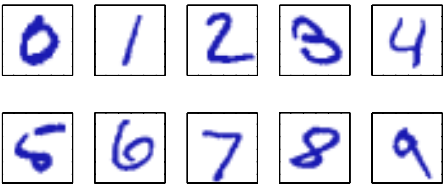
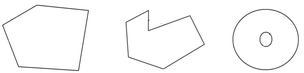
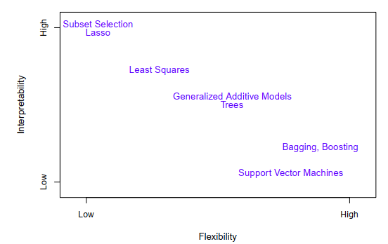
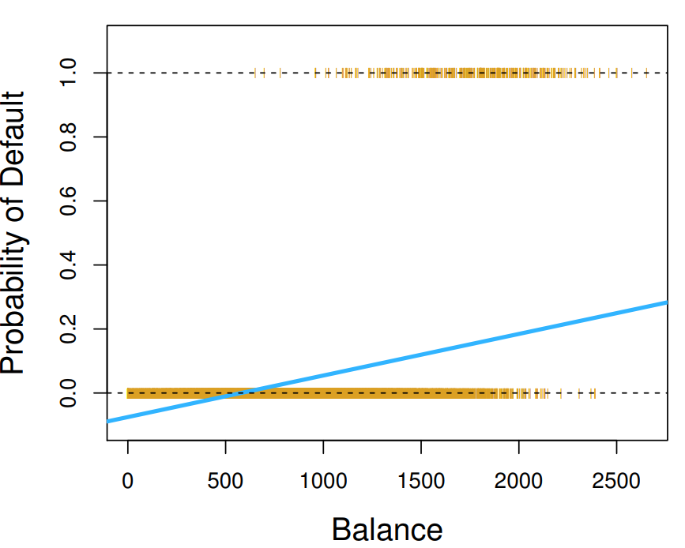
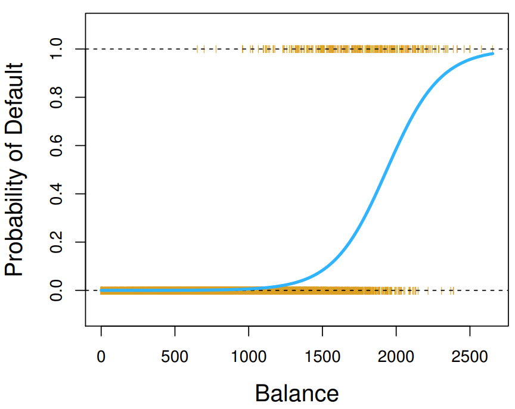

```{r setup, include=FALSE, cache=F, message=F, warning=F, results="hide"}
knitr::opts_chunk$set(cache=TRUE)
knitr::opts_chunk$set(fig.path='figs/')
knitr::opts_chunk$set(cache.path='cache/')

knitr::opts_chunk$set(
                  fig.process = function(x) {
                      x2 = sub('-\\d+([.][a-z]+)$', '\\1', x)
                      if (file.rename(x, x2)) x2 else x
                      }
                  )
library(tidyverse)
```

# Introducción

-   El problema de buscar patrones
-   El reconocimiento de patrones se ocupa del descubrimiento automático de regularidades en los datos mediante el uso de algoritmos, y usa estas regularidades para tomar acciones.

### Ejemplo

Tomemos como ejemplo el reconocer dígitos escritos a mano.



------------------------------------------------------------------------

Estos dígitos corresponden a imágenes de 28x28 pixeles, por lo que pueden ser representados en un vector $\mathbf{x}$ que contiene 784 números reales.

El objetivo es construir una **máquina** que tome el vector $\mathbf{x}$ como entrada y produzca la identidad del dígito $0,\dots,9$ como salida.

Este problema es claramente no-trivial debido a la gran variedad de escrituras. Podría abordarse utilizando reglas heurísticas para distinguir los dígitos en función de las formas de los trazos, pero en la práctica, tal enfoque conduce a una proliferación de reglas y de excepciones a las reglas, etc., e invariablemente da malos resultados.

------------------------------------------------------------------------

Mejores resultados pueden ser obtenidos adoptando un enfoque de **meachine learning**, en donde un conjunto grande de datos de $N$ dígitos $\{x_1 ,\ldots, x_n\}$ llamados **conjunto de entrenamiento (training set)** se utiliza para ajustar los parámetros de un modelo adaptativo.

Las categorías de los dígitos en el conjunto de entrenamiento se conocen de antemano, normalmente inspeccionándolos individualmente y etiquetándolos a mano.

Podemos expresar la categoría de un dígito usando un **vector objetivo (target vector)** $\mathbf{t}$, que representa la identidad del dígito correspondiente. Notar que hay un vector objetivo $\mathbf{t}$ para cada dígito de la imágen $\mathbf{x}$.

------------------------------------------------------------------------

El resultado tras aplicar el algoritmo de **machine learning** puede ser expresado como una functión $\mathbf{y}(\mathbf{x})$, que toma una nueva imagen del dígito $\mathbf{x}$ como entrada y que genera como salida un vector $\mathbf{y}$, codificada de la misma manera que los vector objetivos.

La forma exacta de la función $\mathbf{y}(\mathbf{x})$ es determinada durante la **fase de entrenamiento**, también conocida como la fase de aprendizaje, en base al conjunto de entrenamiento.

Una vez que el modelo es entrenado, este puede ser usado para identificar nuevas imágenes de dígitos, que les llamamos **conjunto de prueba (test set)**.

La habilidad de categorizar correctamente nuevos ejemplos que difieren de los utilizados en la fase de aprendizaje es conocido como **generalización**.

------------------------------------------------------------------------

En la mayoría de las aplicaciones reales, las variables de entrada son típicamente preprocesadas para transformarlas a un n uevo espacio de variables donde, se espera que la problemática de reconocer patrones sea más fácil de resolver.

Por ejemplo, en el reconocimiento de dígitos escritos a mano, las imágenes de los dígitos generalmente se transforman y escalan tal que cada dígito esté contenido dentro de un cuadro de tamaño fijo. Esto reduce en gran medida la variabilidad dentro de cada clase de dígito, debido a que la localización y la escala de todos los dígitos serán las mismas, por lo que la identificación de patrones se facilitará.

La etapa de de **pre-procesamiento** es usualmente conocida como **extracción de características (feature extraction)**.

Notar que los nuevos datos, incluidos en el conjunto de entrenamiento, deben ser preprocesados de igual manera que los del conjunto de entrenamiento.

------------------------------------------------------------------------

La etapa de preprocesamiento también puede ser utilizada para acelerar el cálculo del algoritmo utilizado. Se debe tener especial cuidado en esta etapa debido a que usualmente, cierta información es descartada, y si esta es imporatnte para la solución del problema, la precisión general del sistema confeccionado puede verse afectada.

Las aplicaciones en donde la entrada son los datos de entrenamiento (training set) en conjunto con sus correspondientes vectores objetivo son conocidas como **problemas de aprendizaje supervisado (supervised learning problems)**.

Los casos en donde el objetivo es asignar a cada vector de entrada una categoría, se conocen como **problemas de clasificación**.

Si se desean salidas que consisten en una o más variables continuas, entonces le llamamos **regresión**.

------------------------------------------------------------------------

Las aplicaciones en donde la entrada son los datos de entrenamiento (training set) sin sus correspondientes vectores objetivos son conocidas como **problemas de aprendizaje no supervisado (unsupervised learning problems)**. Varios pueden ser los objetivos en este tipo de problemas:

-   Descubrir grupos de elementos similares dentro de los datos, en este caso le llamamos **agrupamiento (clustering)**
-   Estimar la distribución de los datos dentro del espacio de los datos, a esto le llamamos **estimación de densidad**
-   Proyectar los datos desde un espacio multidimensional a uno de 2 o 3 dimensiones, para así poder visualizarlo, a esto le llamamos **visualización**.

------------------------------------------------------------------------

Otra técnica utilizada en **machine learning** es el **aprendizaje reforzado (reinforcement learning)**, que se ocupa del problema de encontrar acciones adecuadas para tomar en una situación específica con el fin de maximizar una recompensa.

En este caso, el algoritmo de aprendizaje no recibe ejemplos de resultados óptimos (como se tienen en el aprendizaje supervisado), sino que debe descubrirlos mediante un proceso de prueba y error.

## Optimización no lineal

La forma estándar de un problema de optimización no lineal es:

```{=tex}
\begin{align*}
\min_{x}\,& f(x) \\
\text{donde } & g_1(x)  \leq 0\\
& \vdots \\
& g_l(x)  \leq 0\\
& h_1(x)  = 0 \\
& \vdots \\
& h_m(x)  = 0 \\
\end{align*}
```
$f(x)$ le llamamos la función objetivo, usualmente a minimizar. Todas las otras restricción son de la forma $\leq$ o $=$.

## Conjunto convexo

El problema **general** de optimización no lineal (donde, $f,g$ y $h$ pueden ser cualquier función) es extremadamente dificil de resolver. Sin embargo, si la función objetivo y las restricción son lo suficientemente *buenas*, existen algoritmos eficientes para encontrar un mínimo global.

Una de estas *buenas* condiciones, es la **convexidad**.

Existen dos definiciones para convexidad, una para conjuntos y otra para funciones. Intuitivamente, un conjunto convexo no tiene ningún agujero.



------------------------------------------------------------------------

Una definición más precisa es:

**Para dos puntos cualesquiera del conjunto, la línea recta que conecta esos dos puntos también se encuentra en el conjunto**.

Especificamente, El conjunto $X$ es convexo si, para cualquier $x_1\in X, x_2 \in X$, y $\lambda \in [0,1]$, el punto $\lambda x_1 + (1-\lambda)x_2 \in X$ (este punto es una combinación convexa de $x_1$ y $x_2$).

-   ¿El plano $X=\{ (x,y,z): 3x+4y-3z=1\}$ es convexo?

-   ¿Es la región $X=\{ (x,y): x^2+y^2\geq 1\}$ convexa?

**Para mostrar que un conjunto es convexo, se debe mostrar que toda combinación convexa de dos puntos en el conjunto está dentro del conjunto**.

**Para mostrar que un conjunto no es convexo, basta mostrar un caso en donde no suceda**.

## Funciones convexas

Una definición clásica que se da en cálculo (aunque acotada), es que una función unidimensional, diferenciable dos veces, es convexa si $f''(x)\geq 0$ en todo punto.

Ahora, generalizaremos este definición a más dimensiones, y a funciones que no son dos veces diferenciables.

Una función $f:X\rightarrow \mathbb{R}$ es **convexa** si, para cada $x_1,x_2 \in X$ y cada $\lambda \in (0,1)$,

$$f((1-\lambda)x_1+\lambda x_2))\leq (1-\lambda)f(x_1)+\lambda f(x_2)$$ Si la desigualdad es estricta, entonces se llama **estrictamente convexa**.

------------------------------------------------------------------------

```{=tex}
\begin{tikzpicture}
\begin{axis}[width=5in,axis equal image,
    axis lines=middle,
    xmin=0,xmax=8,
    xlabel=$x$,ylabel=$y$,
    ymin=-0.25,ymax=4,
    xtick={\empty},ytick={\empty}, axis on top
]

% 
\addplot[thick,domain=0.25:7,blue,name path = A]  {-x/3 + 2.75} coordinate[pos=0.4] (m) ;
\draw[thick,blue, name path =B] (0.15,4) .. controls (1,1) and (4,0) .. (6,2) node[pos=0.95, color=black, right]  {$f(x)$} coordinate[pos=0.075] (a1)  coordinate[pos=0.95] (a2);
\path [name intersections={of=A and B, by={a,b}}];

% 
\draw[densely dashed] (0,0) -| node[pos=0.5, color=black, label=below:$a$] {}(a1);
\draw[densely dashed] (0,0) -| node[pos=0.5, color=black, label=below:$x_{1}$] {}(a);
\draw[densely dashed, name path=D] (3,0) -|node[pos=0.5, color=black, label=below:$\lambda x_{1}+ (1-\lambda)x_{2}$] {} node[pos=1, fill,circle,inner sep=1pt] {}(m);
\draw[densely dashed] (0,0) -|node[pos=0.5, color=black, label=below:$x_{2}$] {}(b);
\draw[densely dashed] (0,0) -|node[pos=0.5, color=black, label=below:$b$] {}(a2);

% 
\path [name intersections={of=B and D, by={c}}] node[fill,circle,inner sep=1pt] at (c) {}; 

% 
\node[anchor=south west, text=black] (d) at (0.75,3) {$f[\lambda x_{1}+(1-\lambda)x_{2}]$};
\node[anchor=south west, text=black] (e) at (5,2.5) {$\lambda f(x_{1})+(1-\lambda)f(x_{2})$};
\draw[-{Latex[width=4pt,length=6pt]}, densely dashed] (d) -- (c);
\draw[-{Latex[width=4pt,length=6pt]}, densely dashed] (e) -- (m);
\end{axis}
\end{tikzpicture}
```
-   ¿Es $f(x)=|x|$ convexa?

------------------------------------------------------------------------

Esta definición puede ser difícil de manejar, por lo que hay una caracterización alternativa.

Si la función es diferenciable, la convexidad puede ser caracterizada en términos de rectas tangentes a la función.

**La función** $f$ es convexa si está sobre todas sus rectas tangentes.

Matemáticamente, si $f$ es diferenciable en su dominio, entonces $f$ es convexa si y solo si

$$f(x_2)\geq f(x_1)+f'(x_1)(x_2-x_1)$$

para todo $x_1,x_2 \in X$.

-   ¿Es $x^2$ convexa?

Si $f$ es dos veces diferenciable en su dominio, entonces $f$ es convexa si y solo si $f''(x)\geq 0$ en todas partes.

------------------------------------------------------------------------

Cuando $f$ es una función de múltiples variables, las condiciones de convexidad que involucran la primera y segunda derivada deben cambiar.

El análogo a la primera derivada es el **vector gradiente**.

$$\nabla f=[\partial f / \partial x_1 \quad \partial f / \partial x_2 \cdots \partial f / \partial x_n]^T$$

El análogo de la segunda derivada es la **matrix Hessiana**.

$$H_f=\left[\begin{array}{cccc}
\partial^{2} f / \partial x_{1}^{2} & \partial^{2} f / \partial x_{1} \partial x_{2} & \cdots & \partial^{2} f / \partial x_{1} \partial x_{n} \\
\partial^{2} f / \partial x_{2} \partial x_{1} & \partial^{2} f / \partial x_{2}^{2} & \cdots & \partial^{2} f / \partial x_{2} \partial x_{n} \\
\vdots & \vdots & \ddots & \vdots \\
\partial^{2} f / \partial x_{n} \partial x_{1} & \partial^{2} f / \partial x_{n} \partial x_{2} & \cdots & \partial^{2} f / \partial x_{n}^{2}
\end{array}\right]$$

------------------------------------------------------------------------

Para funciones multidimensionales dos veces diferenciables, $f$ es convexa si cualquier de estas condiciones equivalentes se satisface.

1.  Para todo $x_1$ y $x_2$ en $X$ $$f(\lambda x_2+ (1-\lambda)x_1)\leq \lambda f(x_2)+(1-\lambda)f(x_1)$$

2.  Para todo $x_1$ y $x_2$ en $X$. $$f(x_2)\geq f(x_1)+\nabla f(x_1)^T(x_2-x_1)$$

3.  Para todo $x \in X, H(x)$ es semidefinida positiva (esto es, $y^T H(x)y\geq 0$ para todos los vectores $y$).

------------------------------------------------------------------------

Hay ciertas propiedades que se cumplen para las funciones convexas:

-   Cualquier función lineal es convexa
-   Un múltiplo no negativo de una función convexa es convexa
-   La suma de funciones convexas es convexa
-   La composición de funciones convexas es convexa.

Un problema de optimización convexa, es un problema de optimización en donde la función objetivo es una función convexa, y la región factible es un conjunto convexo.

### Método de Lagrange

La idea del método de Lagrange o más usualmente conocido como multiplicadores de Lagrange, es mover las restricciones hacia la función objetivo, y luego resolver como si fuese un problema sin restricciones.

```{=tex}
\begin{align*}
\min \quad -x_1-x_2 &\\
\text{sujeto a} \quad x_{1}^{2}+x_{2}^{2}-1&=0
\end{align*}
```
¿Cómo solucionamos este problema?

------------------------------------------------------------------------

Multiplicamos la restricción por $\lambda$ y luego la agregamos a la función objetivo para formar la función lagrangiana:

$$\mathcal{L}(x_1,x_2,\lambda)=-x_1-x_2+\lambda(x_{1}^{2}+x_{2}^{2}-1)$$

Los puntos estacionarios de esta función son los puntos en donde todas sus derivadas parciales son cero.

\begin{align*}
\dfrac{\partial \mathcal{L}}{\partial x_1}&=-1+2\lambda x_1=0\\
\dfrac{\partial \mathcal{L}}{\partial x_x}&=-1+2\lambda x_2=0\\
\dfrac{\partial \mathcal{L}}{\partial \lambda}&=x_{1}^{2}+x_{2}^{2}-1=0\\
\end{align*} Notar que la tercera ecuación nos entrega las restricciones iniciales.

------------------------------------------------------------------------

Estas ecuaciones se resuelven cuando $x_1=x_2=\lambda=1/\sqrt{2}$.

Así, la solución óptima del problema original es $x_1=x_2=1/\sqrt{2}$

Si hay más de una restricción, se introduce un multiplicador adicional diferente para cada una de estas.

### Tarea

Considere el siguiente problema de optimización

```{=tex}
\begin{align*}
\min \quad x^2+y^2+z^2 &\\
\text{sujeto a} \quad x^2+y^2-z^2&=0\\
x-2z-3&=0
\end{align*}
```
## Ejemplo

Se desea mejorar las ventas de un producto en particular. El siguiente conjunto de datos contiene datos de las ventas de aquel producto en 200 mercados diferentes, junto con el presupuesto de publicidad para el producto en cada uno de los mercados para 3 medios de publicidad: TV, radio y diario.

```{r, message=FALSE, warning=FALSE}
library(ISLR)
library(ggplot2)
library(gridExtra)
Advertising <- read.csv("./db/Advertising.csv")
head(Advertising)
```

------------------------------------------------------------------------

\small

```{r,fig.show=FALSE, message=FALSE}
p1<- ggplot(data = Advertising, mapping = aes(x = TV, y = Sales))+
    geom_point() + geom_smooth(method = "lm", se = FALSE)
p2<- ggplot(data = Advertising, mapping = aes(x = Radio, y = Sales))+
    geom_point() + geom_smooth(method = "lm", se = FALSE)
p3<- ggplot(data = Advertising, mapping = aes(x = Newspaper, y = Sales))+
    geom_point() + geom_smooth(method = "lm", se = FALSE)
```

------------------------------------------------------------------------

```{r,message=FALSE}
grid.arrange(p1, p2, p3, nrow = 1)
```

------------------------------------------------------------------------

En este ejemplo, los presupuestos son las variables de entrada (**input**) mientras que las ventas es la variable de salida (**output**). Usualmente denotaremos a las variables de entrada por la letra $X$, así $X_1$ es el presupuesto en televisión, $X_2$ en Radio y $X_3$ en periódicos.

Estas variables de entregada también se le conocen como **predictores, variables independientes, *features*** o simplemente **variables**.

La variable respuesta **Sales** es usualmente llamada **respuesta** o **variable dependiente**, y se denota por la leta $Y$.

------------------------------------------------------------------------

En general, supongamos que observamos una variable respuesta cuantitative $Y$ y $p$ diferentes predictores $X_1,\dots,X_p$. Asumiremos que existe algún tipo de relación entre $Y$ y $X=(X_1,X_2,\dots,X_p)$ que puede ser escrito de forma general como

$$Y=f(X)+\varepsilon$$

Donde $f$ es una función fija de $X_1,\dots,X_p$ y $\varepsilon$ es un error aleatorio, que es independiente de $X$ y tiene media cero. En lo anterior, $f$ representa la información sistemática que $X$ provee sobre $Y$.

## Aprendizaje estadístico

El aprendizaje estadístico refiere al conjunto de herramientas y enfoques para **estimar** $f$.

**¿Para qué estimar** $f$?

### Predicción

En muchas situaciones, un conjunto de variables de entrada $X$ son fácilmente obtenibles, pero las salidas $Y$ tienen difícil acceso. Bajo esta configuración, debido a que el promedio de los errores tiene media cero, podemos predecir $Y$ usando:

$$
\hat{Y}=\hat{f}(X)
$$

donde $\hat{f}$ representa nuestra estimación para $f$ e $\hat{Y}$ representa la predicción obtenida para $Y$. En este contexto, $\hat{f}$ es usualmente tratada como una **caja negra**, en el sentido que no estamos usualmente preocupados con la forma exacta de $\hat{f}$, si es que esta entrega predicciones precisas de $Y$.

------------------------------------------------------------------------

\small

```{r}
library(plot3D)
Income2<- read.csv("./db/Income2.csv")
# Ajuste
fit_2_3_loess <- loess(Income ~ Education + Seniority, data = Income2) 
# Predicción de valores
x.pred <- seq(min(Income2$Education), max(Income2$Education), length.out = 30)
y.pred <- seq(min(Income2$Seniority), max(Income2$Seniority), length.out = 30)
xy     <- expand.grid(Education = x.pred, Seniority = y.pred)
z.pred <- matrix(predict(fit_2_3_loess, newdata = xy), nrow = 30, ncol = 30)
```

------------------------------------------------------------------------

\small

```{r,fig.show='hide'}
Income2 %>% 
  scatter3D(
    type = "p",
    x = Income2$Education, 
    y = Income2$Seniority, 
    z = Income2$Income,
    colvar = NA, pch = 19, col = "gold", cex = 1.75,
    phi = 25, theta = 45, expand = 0.6,
    xlab = "Years of Education", ylab = "Seniority", zlab = "Income",
    panel.first = scatter3D(x = Income2$Education,y = Income2$Seniority,
    z = Income2$Income,colvar = NA, col = "black", add = T,
    surf = list(x = x.pred, y = y.pred, z = z.pred, 
    fit = predict(fit_2_3_loess), facets = T, col = "skyblue",
    border = "royalblue", alpha = 0.45)))
```

------------------------------------------------------------------------

\small

```{r, echo=FALSE}
Income2 %>% 
  scatter3D(
    type = "p",
    x = Income2$Education, 
    y = Income2$Seniority, 
    z = Income2$Income,
    colvar = NA, pch = 19, col = "gold", cex = 1.75,
    phi = 25, theta = 45, expand = 0.6,
    xlab = "Years of Education", ylab = "Seniority", zlab = "Income",
    panel.first = scatter3D(x = Income2$Education,y = Income2$Seniority,
    z = Income2$Income,colvar = NA, col = "black", add = T,
    surf = list(x = x.pred, y = y.pred, z = z.pred, 
    fit = predict(fit_2_3_loess), facets = T, col = "skyblue", border = "royalblue", alpha = 0.45)))
```

------------------------------------------------------------------------

Consideremos que un estimador $\hat{f}$ y un conjunto de variables $X$ entregan la predicción $\hat{Y}=\hat{f}(X)$ . Asumiendo que $\hat{f}$ y $X$ son fijos, entonces se tiene:

```{=tex}
\begin{align*}
\mathbb{E}(Y-\hat{Y})^2 &= \mathbb{E}(f(X)+\varepsilon - \hat{f}(X))^2 \\
&= \underbrace{[f(X) - \hat{f}(X)]^2}_\text{Reducible} + \underbrace{\mathbb{V}(\varepsilon)}_\text{Irreducible}
\end{align*}
```
Nosotros nos concentraremos en técnicas para estimar $f$ con el fin de poder minimizar el error reducible.

### Inferencia

Usualmente estamos interesados en entender la forma en que $Y$ se ve afectada conforme $X_1,\dots,X_p$ cambia. En este tipo de situaciones, deseamos estimar $f$, pero nuestro objetivo no es necesariamente hacer predicciones para $Y$. En cambio, se quiere entender la relación entre $X$ e $Y$, por lo que ya no podemos tratar $\hat{f}$ como una caja negra, debido a que para poder explicar el fenómeno debemos tener una **forma exacta**. Usualmente nos preguntamos:

-   ¿Qué predictores están asociados con la respuesta?

-   ¿Cuál es la relación entre la respuesta y cada predictor?

-   ¿La relación entre $Y$ y cada predictor ser explicada adecuadamente usando una ecuación lineal o la relación es más complicada?

### ¿Cómo estimamos $f$?

A lo largo del curso, veremos enfoques lineales y no lineales para estimar $f$. Estos métodos usualmente comparten ciertas características.

En general, la mayoría de las técnicas de aprendizaje estadístico pueden ser categorizadas como **paramétricas** o **no-paramétricas**.

### Métodos paramétricos

Este enfoque tiene dos pasos y se base en modelos que reducen el problema de estimar $f$ a estimar un conjunto de parámetros.

**Pros**

-   Es mucho más fácil que ajustar una función arbitraria cualquiera

**Contras**

-   El modelo usualmente no seguirá la forma real de $f$

-   Si el ajuste está muy lejano a la forma real, la estimación será mala

-   Se puede caer en sobreajuste

------------------------------------------------------------------------

¿Cuales serían los pasos de un enfoque paramétrico?

1.  Asumir la forma de $f$
2.  Realizar un proceso que ajuste el conjunto de datos (**training set**) para el modelo

### Métodos no paramétricos

El enfoque no paramétrico se caracteriza por no asumir la forma de $f$, pero en lugar de eso intenta obtener una estimación de $f$ que sea lo más cercano al conjunto de datos sin llegar a un sobreajuste.

**Pros**

-   Al no asumir nada sobre $f$, estos métodos permiten un vasto rango de formas que se ajustan con precisión a $f$

**Contras**

-   Un gran número de datos es necesario para estimar de forma precisa $f$, mucho más que bajo un enfoque paramétrico.

## Compensación entre precisión vs interpretabilidad

Como sabemos hay métodos de aprendizaje estadístico que son menos flexibles que otros, por ejemplo la regresión lineal. Sin embargo, existen razones para escoger estas metodologías en vez de una más flexible.

-   Si la inferencia es nuestro principal objetivo, los modelos más restrictivos son recomendados debido a que la relación entre $X$ e $Y$ es fácilmente interpretable.

-   Métodos más flexibles usualmente llegar a estimación más complejas que dificultan el análisis de alguna relación individual entre un predictor y la variable respuesta.

-   Incluso cuando la predicción es el único objetivo, modelos más restrictivos pueden entregar mayor precisión que la mayoría de los métodos más flexible, debido a que estos últimos pueden sobreajustar.

------------------------------------------------------------------------



## Teorema del No-Free-Lunch

¿Por qué no simplemente elegimos el **mejor** método para todos los problemas?

El teorema de No-Free-Lunch establece que todos los algoritmos de optimización se desempeñan igualmente bien cuando su desempeño es promediado sobre todas las funciones objetivos posibles.

## Compromiso sesgo-varianza

Una de las herramientas que tenemos para cuantificar que tan bueno es nuestro ajuste es el Error cuadrático medio, lo notamos por sus siglas en inglés **MSE**. Para un valor $x_0$ dado, es posible mostrar que el error cuadrático medio se puede descomponer de la forma

$$
\mathbb{E}\left(y_0 - \hat{f}(x_0)\right)^2=\mathbb{V}(\hat{f}(x_0))+[Bias(\hat{f}(x_0))]^2+\mathbb{V}(\varepsilon)
$$

En donde el lado izquierdo representa el error cuadrado medio esperado cuando se estima $f$ y se evalúan en el punto $x_0$.

De la ecuación anterior se desprende que para minimizar el error cuadrático medio se debe seleccionar una metodología que simultáneamente logre una varianza baja y un bajo sesgo.

------------------------------------------------------------------------

A esta relación le llamamos un compromiso, debido a que es fácil obtener un método con extremadamente bajo sesgo pero varianza alta o un modelo con baja varianza pero alto sesgo.

Como regla general, si se utilizan metodologías más flexibles, la varianza crecerá y el sesgo disminuirá.

# Métodos supervisados

Como hemos mencionado a lo largo del curso, una regresión lineal simple asume que la variable respuesta $Y$ es **cuantitativa**, pero en muchas situaciones esta es **cualitativa** (también referida como categórica). En lo que sigue, veremos métodos para predecir respuestas cualitativas, más comúnmente llamado **clasificación**.

Existen mucha técnicas de clasificación o **clasificadores**, que se pueden usar para predecir una variable cualitativa. Entre ellos se encuentras:

-   Regresión logística

-   Análisis discriminante lineal

-   *k-NN (k- nearest neighbors / k-vecinos cercanos)*

-   Modelos generalizados aditivos

-   Árboles y bosques aleatorios

-   Boosting

-   SVM

### Ejemplo

```{r}
data<-Default
head(data)
```

------------------------------------------------------------------------

```{r, fig.show='hide'}
ggplot(data) +
 aes(x = balance, y = income, colour = default) +
 geom_point(shape = "bullet", size = 1.5) +
 scale_color_hue(direction = -1) +
 theme_gray()

```

------------------------------------------------------------------------

```{r, echo=FALSE}
ggplot(data) +
 aes(x = balance, y = income, colour = default) +
 geom_point(shape = "bullet", size = 1.5) +
 scale_color_hue(direction = -1) +
 theme_gray()
```

------------------------------------------------------------------------

```{r, echo=FALSE}
ggplot(data) +
  aes(x = default, y = balance, fill = default) +
  geom_boxplot(shape = "circle") +
  scale_fill_hue(direction = -1) +
  theme_gray()
```

------------------------------------------------------------------------

```{r, echo=FALSE}
ggplot(data) +
  aes(x = default, y = income, fill = default) +
  geom_boxplot(shape = "circle") +
  scale_fill_hue(direction = -1) +
  theme_gray()

```

### ¿Por qué no usar una regresión lineal?

Supongamos que se intenta predecir la condición médica de un paciente en la sala de emergencia con base a sus síntomas. Para simplificar, imaginemos que sólo que tienen 3 posibles diagnósticos: accidente cardiovascular, sobredosis y ataque epiléptico. Por lo que podríamos clasificar la variable respuesta como

$$
Y=\begin{cases} 1 \quad \text{si Accidente cardiovascular}\\
2 \quad \text{si Sobredosis} \\
3 \quad \text{si Ataque epiléptico}
\end{cases}
$$

Usando esta codificación, se puede usar el método de mínimos cuadrados para ajustar una regresión lineal para predecir $Y$ en base a los predictores $X_1,\dots, X_p$.

------------------------------------------------------------------------

Desafortunadamente, esta codificación implica un ordenamiento de las salidas, estableciendo sobredosis entre accidente cardiovascular y Ataque epiléptico, e inherentemente afirmando que la diferencia entre categorías contiguas son la misma.

Es claro notar que si usamos otra codificación, el ajuste de regresión lineal obtenido será diferente al primero. En general, no hay una forma natural de convertir una variable respuesta cualitativa con más de dos niveles en una variable cuantitativa que esté lista para hacer una regresión lineal.

------------------------------------------------------------------------

En el caso de variable respuesta binaria, la situación es algo más favorable, debido a que si se cambia la codificación, el ajuste de regresión obtenido será el mismo. Sin embargo, el método de mínimos cuadrados no tiene sentido, provocando que algunas de nuestras estimación estén fuera del intervalo [0,1], haciendo difícil la interpretación de las probabilidades.

Lo anterior debido a que se puede mostrar que el $X\hat{\beta}$ obtenido con la regresión lineal con codificación binaria, es simplemente una estimación de $\mathbb{P}(\text{ Sobredosis })$ si la codificación es

$$
Y = \begin{cases} 0 \quad \text{si Accidente cardiovascular}\\
1 \quad \text{si Sobredosis} 
\end{cases}
$$

## Regresión logística

Usando el mismo conjunto de datos `Default`, donde la variable respuesta `default` cae dentro de dos categorías `Yes` y `No`. En vez de modelar la respuesta $Y$ directamente, la **regresión logística** modela la probabilidad que $Y$ pertenezca a una categoría particular.

Para el conjunto de datos `Default`, la regresión logística modela la probabilidad de que haya default (morosidad). Por ejemplo, la probabilidad de default dado cierto `balance` puede ser escrito como

$$
\mathbb{P}( \text{default}=\text{Yes}|\text{balance})
$$

Los valores de esta probabilidad, que la abreviamos como $p(\text{balance})$, estarán entre 0 y 1. Por lo que para un valor particular de `balance`, se puede hacer una predicción para `default`. Por ejemplo, se podría predecir que `default=Yes` para cualquier individuo cuyo $p(\text{balance})>0.5$. Alternativamente, si una compañía quisiese ser más conservador en la predicción, podría definir $p(\text{balance})>0.1$.

### Modelo logístico

¿Cómo deberíamos modelar la relación entre $p(X)=\mathbb{P}(Y=1|X)$ y $X$?

Podemos utilizar un enfoque de regresión lineal para representar estar probabilidades, esto es:

$$
p(X)=\beta_0 + \beta_1 X
$$

Si usamos este enfoque para predecir `default=Yes` usando `balance`, entonces obtendremos el siguiente modelo (izquierda).

------------------------------------------------------------------------



------------------------------------------------------------------------

Para evitar lo anterior, debemos modelar $p(X)$ usando una función que entregue salidas entre 0 y 1 para todos los valores de $X$. Muchas funciones cumplen estas condiciones. En una **regresión logística**, usamos la *función logística*.

$$
p(X)=\dfrac{\exp(\beta_0 + \beta_1 X)}{1+\exp(\beta_0 + \beta_1 X)}
$$

Para ajustar el modelo anterior, usamos máxima verosimilitud

------------------------------------------------------------------------



------------------------------------------------------------------------

Manipulando un poco la fórmula anterior, se tiene que

$$
\dfrac{p(X)}{1-p(X)}=\exp(\beta_0 + \beta_1 X)
$$

La cantidad ${p(X) \over 1-p(X)}$ se le llaman **odds**, que pueden toman cualquier valor en $\mathbb{R}^{+}$. Valores cercanos a cero y tendiendo a infinito, indican muy baja y alta probabilidad de `default`, respectivamente.

------------------------------------------------------------------------

Tomando el logaritmo en ambos lados, se tiene

$$
\log \left(\dfrac{p(X)}{1-p(X)}\right)=\beta_0 + \beta_1 X
$$

a esta cantidad la llamamos **log-odds** o **logit**. Notamos que el modelo de regresión logística tiene un logit lineal en $X$.

### Estimación de los coeficientes de regresión

Los coeficiente $\beta_0$ y $\beta_1$ en la ecuación$$
p(X)=\dfrac{\exp(\beta_0 + \beta_1 X)}{1+\exp(\beta_0 + \beta_1 X)}
$$

son desconocidos, por lo que deben ser estimados basándose en los datos de entrenamiento. Si bien podríamos ocupar una metodología de métodos cuadrados no lineales para ajustar el modelo:

$$
\log \left(\dfrac{p(X)}{1-p(X)}\right)=\beta_0 + \beta_1 X
$$

La metodología de máxima verosimilitud es usualmente preferida, debido a que tiene mejores propiedades estadísticas.

------------------------------------------------------------------------

Formalmente, definimos la **función de verosimilitud** como:

$$
\ell(\beta_0,\beta_1)=\prod_{i:y_i=1}p(x_i)\prod_{i':y_{i'}=0}(1-p(x_{i'}))
$$

Las estimaciones $\hat{\beta}_0$ y $\hat{\beta}_1$ son escogidos para maximizar la función de verosimilitud.

### Ejemplo

```{r, results='hide'}
logit <- glm(default ~ balance, data = data, family = "binomial")
summary(logit)
```

------------------------------------------------------------------------

\small

```{r, echo=FALSE}
summary(logit)
```

### Predicciones

Una vez que los coeficientes han sido estimados, lo que resta es calcular la probabilidad de `default` para una `balance` dado. Por ejemplo, la predicción para una persona con balance $\$1000$ es

$$
\hat{p}(X)=\dfrac{\exp(-10.65+ 0.0055 \times 1000)}{1+\exp(-10.65+ 0.0055 \times 1000)}\approx 0.00576
$$

que es bajo $1\%$. En contraste con alguien que adeuda $\$2000$, en cuyo casi $\hat{p}(X)=0.586$.

------------------------------------------------------------------------

Si utilizamos *dummy variables* para el predictor `student` codificado como 0 y 1. tendremos el siguiente ajuste

```{r, results='hide'}
logit_dummy<-glm(default ~ student, data = data, family = "binomial")
summary(logit_dummy)
```

------------------------------------------------------------------------

\small

```{r, echo=FALSE}
summary(logit_dummy)
```

------------------------------------------------------------------------

Así, podemos calcular las probabilidades

$$
\mathbb{P}\left( \text{default=Yes }| \text{ student=Yes}\right)=\dfrac{\exp(-3.5041+ 0.4049 \times 1)}{1+\exp(-3.5041+ 0.4049 \times 1)}\approx 0.0431
$$

y,

$$
\mathbb{P}\left( \text{default=Yes }| \text{ student=No}\right)=\dfrac{\exp(-3.5041+ 0.4049 \times 0)}{1+\exp(-3.5041+ 0.4049 \times 0)}\approx 0.0292
$$

## Regresión logística múltiple

Ahora consideramos el problema de predecir una respuesta binaria usando múltiples predictores. La extensión natural del modelo de regresión es

$$
\log \left(\dfrac{p(X)}{1-p(X)}\right)=\beta_0 + \beta_1 X_1 +\dots + \beta_p X_p
$$

donde $X=(X_1,\dots,X_p)$ son $p$ predictores. La ecuación anterior la podemos reescribir como

$$
p(X)=\dfrac{\exp(\beta_0 + \beta_1 X_1 +\dots + \beta_p X_p)}{1+ \exp(\beta_0 + \beta_1 X_1 +\dots + \beta_p X_p)}
$$

Al igual que antes, usamos método de máxima verosimilitud para estimar $\mathbf{\beta}$

### Ejemplo

```{r, results='hide'}
logit2 <- glm(default ~ balance + student + income, data = data,
             family = "binomial")
summary(logit2)
```

------------------------------------------------------------------------

\footnotesize

```{r, echo=FALSE}
summary(logit2)
```

------------------------------------------------------------------------


### Regresión logística para $>2$ clases en la respuesta

En el caso en que tengamos más de dos clases en la variable respuesta, es posible extender la regresión lineal. En el ejemplo de determinación de diagnóstico en una sala de emergencia se tenían las categorías accidente cardiovascular, sobredosis y ataque epiléptico, por lo que se desearía modelar

$$
\mathbb{P}\left( Y= \text{ acc. card. }| X\right)
$$

y $$
\mathbb{P}\left( Y= \text{ sobredosis }| X\right)
$$

siendo el remanente,$$
\mathbb{P}\left( Y= \text{ ataque epiléptico }| X\right)= 1-\mathbb{P}\left( Y= \text{ acc. card }| X\right)-\mathbb{P}\left( Y= \text{ sobredosis }| X\right) 
$$

Si bien es posible la extensión, en la práctica no es frecuentemente usado, pues se prefiere realizar un **análisis discriminante**.

## Análisis discriminante lineal

La regresión logística que vimos antes involucra modelar directamente $\mathbb{P}\left( Y=k|X=x\right)$ usando la función logística dada por $$
p(X)=\dfrac{\exp(\beta_0 + \beta_1 X_1 +\dots + \beta_p X_p)}{1+ \exp(\beta_0 + \beta_1 X_1 +\dots + \beta_p X_p)}
$$

para el caso de dos clases en la variable respuesta. En lo que sigue, consideramos una manera alternativa y menos directa para estimar estas probabilidades. En esta metodología, modelamos la distribución de los predictores $X$ por separado en cada una de las categorías de la variable respuesta $(Y)$, y luego usamos el teorema de Bayes para convertir estos resultados en estimaciones de $\mathbb{P}\left(Y=k|X=x\right)$.

Cuando estas distribuciones se asumen normales, la forma de este modelo es muy similar a una regresión logística.

### Teorema de Bayes para clasificación

Supongamos que queremos clasificar una observación entre $K$ clases, donde $K\geq 2$. Esto es, que la variable respuesta $Y$ puede tomar $K$ posibles valores distintos y no-ordenados.

Sea $\pi_k$ la probabilidad *apriori* que una observación escogida aleatoriamente provenga de la clase $k-$ésima. Sea $f_k(X)=\mathbb{P}(X=x|Y=k)$ la **función de densidad** de $X$ para una observación que proviene de la clase $k-$ésima. Luego, por el teorema de Bayes se tiene

$$
\mathbb{P}(Y=k|X=x)=\dfrac{\pi_k f_k(x)}{\sum_{l=1}^{K} \pi_l f_l(x)}
$$

al igual que antes usamos la notación $p_k(X)=\mathbb{P}(Y=k|X)$.

------------------------------------------------------------------------

La idea general, es estimar no estimar $p_k(X)$ directamente, sino estimar $\pi_k$ y $f_k$ para obtener lo deseado.

Usualmente $\pi_k$ es fácil de obtener si se tiene una muestra aleatoria de $Y$, pues obtenemos estas estimaciones como las proporciones de cada clase.

En cambio, estimar $f_k(X)$ tiende a ser más difícil, a menos que se asuman formas simples para las densidades.

Llamamos a la cantidad $p_k(x)$ la probabilidad *posterior* que una observación $X=x$ pertenezca a la clase $k-$ésima.

### Análisis discriminante lineal con $p=1$

Primero asumiremos que $p=1$, es decir, sólo tenemos un predictor. Deseamos obtener una estimación para $f_k(x)$ para utilizarlo en la ecuación$$
\mathbb{P}(Y=k|X=x)=\dfrac{\pi_k f_k(x)}{\sum_{l=1}^{K} \pi_l f_l(x)}
$$

y así poder estimar $p_k(x)$. Para poder estimar $f_k$, primero debemos asumir su forma, por lo que asumiremos que $f_k$ es *Gaussiana*. Por lo que,

$$
f_k(x)=\dfrac{1}{\sqrt{2\pi}\sigma_k}\exp\left( -\dfrac{1}{2\sigma_{k}^{2}}(x-\mu_k)^2\right)
$$

donde $\mu_k$ y $\sigma_{k}^{2}$ son la media y la varianza de la clase $k-$ésima. Por ahora, asumiremos que $\sigma_{1}^{2}=\dots=\sigma_{K}^{2}=\sigma^2$

------------------------------------------------------------------------

Por lo anterior, se tendrá

$$
p_k(x)=\dfrac{\pi_k \dfrac{1}{\sqrt{2\pi}\sigma}\exp\left( -\dfrac{1}{2\sigma^{2}}(x-\mu_k)^2\right)}{\sum_{l=1}^{K}\pi_l\dfrac{1}{\sqrt{2\pi}\sigma}\exp\left( -\dfrac{1}{2\sigma^{2}}(x-\mu_l)^2\right) }
$$

El clasificador Bayesiano asigna una observacion $X=x$ a la clase que su $p_k(x)$ es más grande. Si tomamos el logaritmo y arreglamos términos en la expresión anterior, se tiene que el proceso es equivalente a asignar la observación a la clase en la que

$$
\delta_k(x)=x \dfrac{\mu_k}{\sigma^2}-\dfrac{\mu_{k}^{2}}{2\sigma^2}+\log \pi_k
$$

es más grande.

------------------------------------------------------------------------

Por ejemplo, si $K=2$ Y $\pi_1=\pi_2$, entonces el clasificador Bayesiano asigna una observación a la clase 1 si $2x(\mu_1-\mu_2)>\mu_{1}^{2}-\mu_{2}^{2}$ y a la clase 2 en caso contrario. En este caso, el límite de decisión de Bayes (*Bayes decision boundary*) corresponde al punto donde

$$
x=\dfrac{\mu_{1}^{2}-\mu_{2}^{2}}{2(\mu_1-\mu_2)}=\dfrac{\mu_1+\mu_2}{2}
$$

Llamamos a este punto el punto (o área) en donde la clasificación es ambigua.

------------------------------------------------------------------------

\small

```{r}
p4<-ggplot(data.frame(x = c(-4, 4)), aes(x)) +
stat_function(fun = dnorm, args = list(mean = -1.25, sd = 1),
              color = "firebrick") + 
stat_function(fun = dnorm, args = list(mean = 1.25, sd = 1), color = "green3") +
geom_vline(xintercept = 0, linetype = "longdash") +
theme_bw()
```

------------------------------------------------------------------------

```{r,echo=FALSE}
p4
```

------------------------------------------------------------------------

El análisis discriminante lineal (LDA) aproxima el clasificador bayesiano ingresando estimaciones para $pi_k,\mu_k$ y $\sigma^2$ en $\delta_k(x)$. Particularmente, las siguientes estimaciones son usadas.

$$
\hat{\mu}_k=\dfrac{1}{n_k}\sum_{i:y_i=k}x_i
$$

y,

$$
\hat{\sigma}^{2}=\dfrac{1}{n-K}\sum_{k=1}^{K}\sum_{i:y_i=K}(x_i-\hat{\mu}_k)^2
$$

donde $n$ es el número total de observaciones en el conjunto de entrenamiento, $n_k$ es el número de observaciones en el conjunto de entrenamiento en la clase $k-$ésima.

------------------------------------------------------------------------

En el caso de que no tengamos información de $\pi_1,\dots,\pi_K$, el análisis discriminante lineal estima $\pi_k$ usando la proporción de las observaciones en el conjunto de entrenamiento que pertenece a la clase $k-$ésima. Esto es,

$$
\hat{\pi}_k=\dfrac{n_k}{n}
$$

El clasificador **LDA** reemplaza las estimaciones anteriores en $\delta_k(x)$ y asigna una observación $X=x$ a la clase en la cual $$
\hat{\delta}_k=x\dfrac{\hat{\mu}_k}{\hat{\sigma}^2}-\dfrac{\hat{\mu}_{k}^{2}}{\hat{2\sigma}^2}+\log \hat{\pi}_k
$$

es más grande. El nombre de **lineal** viene de la linealidad de la *función discriminante* $\hat{\delta}_k$ para $x$.

------------------------------------------------------------------------

\small

```{r}
set.seed(411)
grupo_a <- rnorm(n = 30, mean = -1.25, sd = 1)
grupo_b <- rnorm(n = 30, mean = 1.25, sd = 1)
datos <- data.frame(valor = c(grupo_a, grupo_b),
                    grupo = rep(c("A","B"), each = 30))

p5<-ggplot(data = datos, aes(x = valor, fill = grupo)) +
geom_histogram(alpha = 0.5, position = "identity") +
geom_vline(xintercept = 0, linetype = "longdash") +
geom_vline(xintercept = (mean(grupo_a) + mean(grupo_b))/2)  +
annotate(geom = "text", x = 1.5, y = 9, label = "Límite decisión Bayes") +
annotate(geom = "text", x = -1.5, y = 10, label = "Límite decisión LDA") +
theme_bw() + 
theme(legend.position = "top")
```

------------------------------------------------------------------------

```{r, echo=FALSE, message=FALSE, warning=FALSE}
p5
```

### Análisis discriminante liean con $p>1$

tbd
