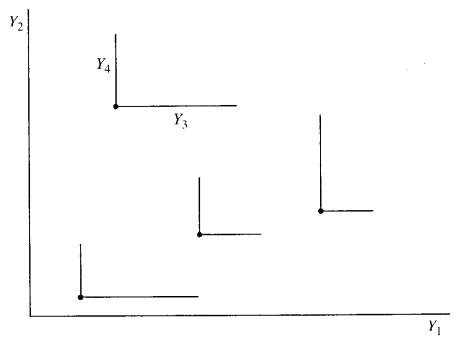
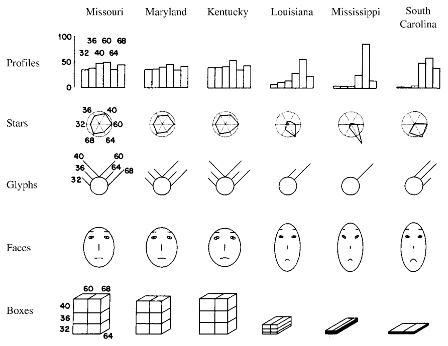

```{r setup, include=FALSE, cache=F, message=F, warning=F, results="hide"}
knitr::opts_chunk$set(cache=TRUE)
knitr::opts_chunk$set(fig.path='figs/')
knitr::opts_chunk$set(cache.path='cache/')

knitr::opts_chunk$set(
                  fig.process = function(x) {
                      x2 = sub('-\\d+([.][a-z]+)$', '\\1', x)
                      if (file.rename(x, x2)) x2 else x
                      }
                  )
library(tidyverse)
```

# Introducción

-   La mayoría de estudios de investigación requieren obtener observaciones con muchas variables diferentes.

-   El análisis multivariado (y por ende sus técnicas) es la disciplina encargada de obtener información de este tipo datos. Particularmente usando técnicas estadísticas.

------------------------------------------------------------------------

En general, podemos identificar varios objetivos que conllevan el uso de técnicas multivariadas.

-   Reducción de datos o simplificación estructural
-   Ordenar o agrupar
-   Investigación de dependencia entre las variables
-   Predicción
-   Construcción de hipótesis y testeo

# Descripción de datos multivariados

## Matriz de datos

La matriz general de datos $(n \times p)$ con $n$ objetos y $p$ variables puede ser escrita como:

$$\mathbf{X}=\left[\begin{array}{cccccc}
x_{11} & x_{12} & \cdots & x_{1 k} & \cdots & x_{1 p} \\
x_{21} & x_{22} & \cdots & x_{2 k} & \cdots & x_{2 p} \\
\vdots & \vdots & & \vdots & & \vdots \\
x_{j 1} & x_{j 2} & \cdots & x_{j k} & \cdots & x_{j p} \\
\vdots & \vdots & & \vdots & & \vdots \\
x_{n 1} & x_{n 2} & \cdots & x_{n k} & \cdots & x_{n p}
\end{array}\right]$$

Esta matriz $\mathbf{X}$ le llamamos la **matriz de datos**.

## Estadística descriptiva

-   ¿Es posible extender las nociones de estadística descriptiva unidimensional a esta matriz de datos?

### Vector de medias y matriz de covarianza

Una extensión natural de la media aritmética y varianza son las siguientes:

La **media muestral** de la $i-$ésima variable es:

$$\overline{x}_i={1\over n} \sum_{r=1}^{n} x_{ri}$$

y la **varianza muestral** de la $i-$ésima variable:

$$s_{ii}={1\over n}\sum_{r=1}^{n} (x_{ri}-\overline{x}_i)^2=s_{i}^{2}\quad \text{con}\quad i=1,\ldots,p$$

------------------------------------------------------------------------

La covarianza muestral entre la $i-$ésima y la $j-$ésima variable estará dado:

$$s_{ij}={1\over n}\sum_{r=1}^{n} (x_{ri}-\overline{x}_i)(x_{rj}-\overline{x}_j)=s_{i}^{2}\quad \text{con}\quad i=1,\ldots,p$$

Así, el **vector de medias** estará dado por:

$$\overline{\mathbf{x}}=\begin{bmatrix}
           \overline{x}_{1} \\
           \overline{x}_{2} \\
           \vdots \\
           \overline{x}_{p}
         \end{bmatrix}$$

Este vector representa el centro de gravedad de los puntos $x_{r\cdot},r=1,\ldots,n$. La matrix $(p\times p)$

$$\mathbf{S}=(s_{ij})$$ en donde sus elementos están dados por $s_{ii}$ y $s_{ij}$ es llamada la **matrix de covarianza muestral**

------------------------------------------------------------------------

Las expresiones anterior también puede ser expresadas en notación matricial:

$$\overline{\mathbf{x}}={1\over n}\sum_{r=1}^{n} \mathbf{x}_{r}={1\over n} \mathbf{X}'\mathbf{1}$$

En donde $\mathbf{1}$ es un vector columna de $n$ unos. Además,

$$s_{ij}={1\over n}\sum_{r=1}^{n} x_{ri}x_{rj}-\overline{x}_i \overline{x}_j$$

Por lo que

$$\mathbf{S}={1\over n}\sum_{r=1}^{n} (\mathbf{x}_r -\overline{\mathbf{x}})(\mathbf{x}_r -\overline{\mathbf{x}})'={1\over n} \sum_{r=1}^{n} \mathbf{x}_r \mathbf{x}_{r}' - \overline{\mathbf{x}}\overline{\mathbf{x}}'$$

------------------------------------------------------------------------

Equivalentemente,

$$\mathbf{S}={1\over n}\mathbf{X}'\mathbf{X}-\overline{\mathbf{x}}\overline{\mathbf{x}}'={1\over n}\left(\mathbf{X}'\mathbf{X}-{1\over n}\mathbf{X}'\mathbf{1}\mathbf{1}'\mathbf{X}\right)$$

### Matriz de centrado

Denotamos $\mathbf{H}$ como la matriz de centrado, definida como:

$$\mathbf{H}=\mathbf{I}-{1\over n}\mathbf{1}\mathbf{1}'$$

Luego, podemos usar para reescribir

$$\mathbf{S}={1\over n}\mathbf{X}'\mathbf{H}\mathbf{X}$$

que es una forma conveniente de representar la matriz de covarianza.

------------------------------------------------------------------------

Debido a que la matriz $\mathbf{H}$ es simétrica e idempotente ($\mathbf{H}=\mathbf{H}',\mathbf{H}=\mathbf{H}^2$), sigue que para cualquier $p-$vector $a$, se tiene:

$$\mathbf{a}'\mathbf{S}\mathbf{a}={1\over n}\mathbf{a}'\mathbf{X}'\mathbf{H}'\mathbf{H}\mathbf{X}\mathbf{a}={1\over n}\mathbf{y}'\mathbf{y}\geq 0$$

donde $\mathbf{y}=\mathbf{H}\mathbf{X}\mathbf{a}$. Por lo que la matriz de covarianza $\mathbf{S}$ es semi-definida positiva.

Al igual que en estadística univariada, usualmente es conveniente definir la matriz de covarianza con divisor $n-1$ en vez de $n$. Así,

$$\mathbf{S}_u={1\over n-1}\mathbf{X}'\mathbf{H}\mathbf{X}={n \over n-1} \mathbf{S}$$

------------------------------------------------------------------------

Si los datos forman una muestra aleatoria desde una distribución multivariada, con segundo momento finito, entonces $\mathbf{S}_u$ es un estimador insesgado de la matriz de covarianza poblacional.

La matriz

$$\mathbf{M}=\sum_{r=1}^{n}\mathbf{x}_r\mathbf{x}_r'=\mathbf{X}'\mathbf{X}$$

es llamada la **matriz de suma de cuadrados y productos cruzados**.

## Matriz de correlación

El coeficiente de correlación muestral entre la $i-$ésima y $j-$ésima variable, está dado:

$$r_{ij}={s_{ij}\over (s_i s_j)}$$

Así, la matriz definida como:

$$\mathbf{R}=(r_{ij})$$

con $r_{ii}=1$ es llamada la **matriz de correlación muestral**. Si $\mathbf{R}=\mathbf{I}$, decimos que las variables no están correlacionadas. Si definimos $\mathbf{D}=\text{diag}(s_i)$, entonces

$$\mathbf{R}=\mathbf{D}^{-1}\mathbf{S}\mathbf{D}^{-1}, \quad \mathbf{S}=\mathbf{D}\mathbf{R}\mathbf{D}$$

### Ejercicio

Se desea investigar sobre las ventas realizadas en una librería, para ello se tienen cuatro boletas, en ella se especifica (entre otras cosas) el número de libros comprados y el precio total pagado, como sigue:

```{=tex}
\begin{align*}
\text{Monto total (USD)}:\quad && 42 && 52 && 48 && 58 \\
\text{Cantidad de libros}:\quad && 4 && 5 && 4 && 3
\end{align*}
```
Usando la notación presentada, escriba las matrices:

$$\mathbf{X}\quad \overline{\mathbf{x}}\quad \mathbf{S}\quad \mathbf{R}$$

# Combinaciones lineales

Tomar combinaciones lineales de las variables es una de las herramientas más importantes del análisis multivariado. Un par de combinaciones lineales escogidas de manera correcta pueden entregar más información que una multiplicidad de variables originales, usualmente debido a que la dimensionalidad se reduce.

Las combinaciones lineales también pueden simplificar la estructura de la matriz de covarianza, por lo que interpretar los datos se hace más sencillo.

------------------------------------------------------------------------

Consideremos la siguiente combinación lineal

$$y_r=a_1x_{r1}+\dots+a_p x_{np}$$

donde $a_1,\dots,a_p$ son dados. Sabemos que la media

$$\overline{y}={1\over n} \mathbf{a}' \sum_{r=1}^{n} \mathbf{x}_r=\mathbf{a}'\overline{\mathbf{x}}$$

y la varianza está dada por

$$s_{y}^{2}={1\over n} \sum_{r=1}^{n} (y_r-\overline{y})^2={1\over n} \sum_{r=1}^{n} \mathbf{a}'(\mathbf{x}_r-\overline{\mathbf{x}})(\mathbf{x}_r-\overline{\mathbf{x}})'\mathbf{a}=\mathbf{a}'\mathbf{S}\mathbf{a}$$

------------------------------------------------------------------------

En general, estaremos interesados en una transformación lineal $q-$dimensional

$$\mathbf{y}_r=\mathbf{Ax}+\mathbf{b}\quad r=1,\dots,n$$

que también puede ser escrito como

$$\mathbf{Y}=\mathbf{XA}'+\mathbf{1b}'$$ donde $\mathbf{A}$ es una matriz $(q\times p)$ y $\mathbf{b}$ es un $q-$vector. Usualmente $q\leq p$.

------------------------------------------------------------------------

El vector de medias y la matriz de covarianza del nuevo objeto $\mathbf{y}$, estarán dados por:

$$\overline{\mathbf{y}}=\mathbf{A}\overline{\mathbf{x}}+\mathbf{b}$$ y, $$\mathbf{S}_y={1\over n}\sum_{r=1}^{n}(\mathbf{y}_r-\overline{\mathbf{y}})(\mathbf{y}_r-\overline{\mathbf{y}})'=\mathbf{ASA}'$$

Si $\mathbf{A}$ es una matriz no singular (en particular, $q=p$), entonces

$$\mathbf{S}=\mathbf{A}^{-1}\mathbf{S}_y(\mathbf{A}')^{-1}$$

En lo que sigue daremos varios ejemplos de transformaciones lineales que usaremos más adelante.

### Transformación de escala

Sea $y_r=\mathbf{D}^{-1}(\mathbf{x}_r-\overline{\mathbf{x}})$ , con $r=1,\dots,n$, donde $\mathbf{D}=diag(s_i)$. Esta transformación escala cada variable a varianza unitaria por lo que elimina la arbitrariedad de la escala de medición escogida.

Por ejemplo, si $\mathbf{x}_{(1)}$ mide longitud, entonces $y_{(1)}$ será la misma independiente si $\mathbf{x}_{(1)}$ se mide en pulgadas o metros.

Notar que $\mathbf{S}_y=\mathbf{R}$.

## Transformación de Mahalanobis

Sea $\mathbf{S}>0$ entonces $\mathbf{S}^{-1}$ tiene una única raíz cuadrada simétrica definida positiva $\mathbf{S}^{-1/2}$. La transformación de Mahalanobis está definida por

$$\mathbf{z}_r=\mathbf{S}^{-1} (\mathbf{x}_{r} -\overline{\mathbf{x}}), \quad r=1,\dots,n$$

Así, $\mathbf{S}_z=\mathbf{I}$, por lo que esta transformación elimina la correlación entre las variables y estandariza la varianza de cada variable.

## Transformación de componentes principales

Por el teorema de descomposición espectral, la matriz de covarianza $\mathbf{S}$ puede ser escrita como

$$
\mathbf{S}=\mathbf{GLG}'
$$

donde $\mathbf{G}$ es una matriz ortogonal y $\mathbf{L}$ es una matriz diagonal de los valores propies de $\mathbf{S}$, $l_1\geq l_2\geq\dots\geq l_p\geq 0$. La transformación de componentes principales está definida por la *rotación*

$$\mathbf{w}_r=\mathbf{G}'(\mathbf{x}_r-\overline{\mathbf{x}}), \quad r=1,\dots,n$$ Debido a que $\mathbf{S}_w=\mathbf{G}'\mathbf{S}\mathbf{G}=\mathbf{L}$ es diagonal, las columnas de $\mathbf{W}$, llamadas **componentes principales** representan un combinación lineal no correlacionada de las variables.

En la práctica, se desea resumir la mayoría de la variabilidad en los datos usando sólo las componentes principales de mayor varianza, reduciendo así la dimensionalidad.

# Gráficos multivariantes

En general el proceso de visualización de datos bivariados no es complicado, pero para 3 o más variables graficar se dificulta enormemente. Sin embargo, existen propuestas de gráficos para poder conllevar esta problemática.

------------------------------------------------------------------------



------------------------------------------------------------------------

Describiremos 4 metodologías para visualizar $p$ dimensiones

1.  **Perfiles**: Representa cada punto por $p$ barras verticales, en donde las alturas de las barras representan el valor de las variables.
2.  **Estrellas**: Retrata el valor de cada variable normalizada como un punto a lo largo de una línea entre el centro y el perímetro de un círculo. Los puntos usualmente se unen para formar un polígono
3.  **Glifos**: Son círculos de tamaño fijo con líneas cuyas longitudes representan el valor de las variables.
4.  **Caras**: Representa cada variable variable como una característica en una cara, como la longitud de la nariz, tamaño de los ojos, forma de los ojos, etc.
5.  **Cajas**: Representa cada variable como la longitud de una dimensión de una caja. Para más de tres variables, las dimensiones son particionadas en segmentos.

------------------------------------------------------------------------



## Ejemplos en R

```{r}
library(carData)
library(ggplot2)
data(Salaries, package="carData")
head(Salaries)
```

------------------------------------------------------------------------

```{r}
plot1<-ggplot(Salaries, 
       aes(x = yrs.since.phd, 
           y = salary)) +
  geom_point() + 
  labs(title = "Salario de Académicos por años desde su doctorado")
```

------------------------------------------------------------------------

```{r}
plot1
```

------------------------------------------------------------------------

```{r}
plot2<-ggplot(Salaries, aes(x = yrs.since.phd, 
                     y = salary, 
                     color=rank)) +
  geom_point() +
  labs(title = "Salaries de académicos por rango y
       años desde su doctorado")
```

------------------------------------------------------------------------

```{r}
plot2
```

------------------------------------------------------------------------

```{r}
plot3<-ggplot(Salaries, 
       aes(x = yrs.since.phd, 
           y = salary, 
           color = rank, 
           shape = sex)) +  geom_point(size = 3,alpha = .6) +
  labs(title = "Salario de académicos por rango, sexo y
       años desde su doctorado")
```

------------------------------------------------------------------------

```{r}
plot3
```

------------------------------------------------------------------------

```{r}
plot4<-ggplot(Salaries, 
       aes(x = yrs.since.phd, 
           y = salary, 
           color = rank, 
           size = yrs.service)) +
  geom_point(alpha = .6) +
  labs(title = "Salario de académicos por rango, años de servicio 
       y años desde su doctorado")
```

------------------------------------------------------------------------

```{r}
plot4
```

------------------------------------------------------------------------

```{r, warning=FALSE}
library(GGally)
ggpairs(iris[,-5])+ theme_bw()
```

## Medidas multivariadas de curtosis y asimetría

Si bien hemos visto medidas de estadística descriptiva, estas fueron basadas en los dos primeros momentos. En el caso multivariado, queremos tener expresiones para la curtosis y asimetría al igual que $b_1=m_{3}^{3} / s^6$ y $b_2=m_4/s^4$ que son las medidas de asimetría y curtosis para el caso univariado.

Si usamos las funciones invariantes

$$
g_{rs}=(\mathbf{x_r-\overline{x})'S^{-1}(x_s-\overline{x})}
$$

Se pueden definir medidas de curtosis y asimetría multivariada de la forma:

$$
b_{1,p}=\dfrac{1}{n^2}\sum_{r,s=1}^{n} g_{rs}^{3}
$$

y,

$$
b_{2,p}=\dfrac{1}{n}\sum_{r=1}^{n} g_{rr}^{2}
$$

### Taller #1

Ejercicios (Libro Mardia)

-   1.4.1

-   1.51

-   1.52

-   1.53

-   1.54

Ejercicios (Libro Rencher) Usando R, resolver:

-   3.18

-   3.22

------------------------------------------------------------------------
