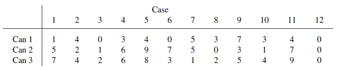
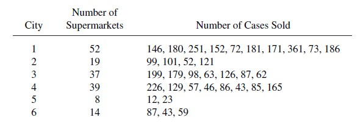
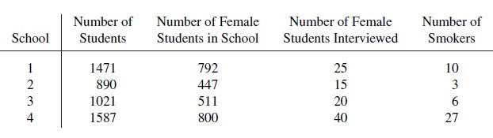
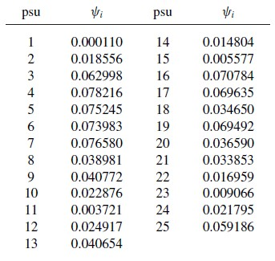

---
header-includes:
   - \usepackage{mathtools}
output:
  html_document:
    df_print: paged
  html_notebook: default
  pdf_document: default
---
## Ejercicios Prueba 1 - IEST 412
### Muestreo por conglomerado
1. A city council of a small city wants to know the proportion of eligible voters that oppose having a incinerator of Phoenix garbage opened just outside of the city limits. They randomly select 100 residential numbers from the city's telephone book that
contains 3,000 such numbers. Each selected residence is then called and asked for (a) the total number of eligible voters and (b) the number of voters opposed to the incinerator. A total of 157 voters were surveyed; of these, 23 refused to answer the question. Of the remaining 134 voters, 112 opposed the incinerator, so the council estimates the proportion by:
$$\hat{p}=112/134=0.83582$$
with,
$$\hat{V}(\hat{p})=0.83582(1-0.83582)/134=0.00102$$
¿Son válidos estas estimaciones? ¿Por qué?

Acá hay dos problemas con las estimaciones: la primera -más a la vista- es la no incorporación de los votantes que no desearon responder en la estimación, y segundo: las estimaciones a las que se llegaron fueron utilizando un M.A.S.,(y no un M.C), de el curso anterior nosotros sabemos que (bajo un M.A.S.), se tiene:
$$\hat{p}=\dfrac{1}{n}\sum_{i=1}^{n}y_i=\overline{y}$$
al binarizar los valores $y_i$ como es este caso, y

$$\mathbb{V}(\hat{p})=\left(\dfrac{N-n}{N-1}\right)\dfrac{p(1-p)}{n}$$
,

$$\widehat{\mathbb{V}(\hat{p})}=\left(\dfrac{N-n}{N}\right)\dfrac{\hat{p}(1-\hat{p})}{n-1}$$
En donde claramente, no se utilizó un factor de corrección y se asumió el $p$ obtenido como poblacional. Así, estas estimaciones no son válidas.

2. Senturia et al. (1994) describe a survey taken to study how many children have
access to guns in their households. Questionnaires were distributed to all parents
who attended selected clinics in the Chicago area during a one-week period for well
or sick child visits.
+ Suppose that the quantity of interest is percentage of the households with guns.
Describe why this is a cluster sample. What is the psu? The ssu? Is it a one-stage or
two-stage cluster sample? How would you estimate the percentage of households
with guns, and the standard error of your estimate?

Claramente, el muestreo descrito es un muestreo por conglomerado, pues los cuestionarios son dirigidos a los hogares y estos los podemos considerar un conglomerado con todas sus propiedades que esto conlleva. Las $\textbf{UPM}$ son los hogares, y las $\textbf{USM}$ es la presencia o no de armas dentro del hogar. El muestreo es unietápico. Como mencioné anteriormente, y según lo visto en el curso de Muestreo I, para pasar de media a proporción (y en consecuencia sus estimaciones también) basta sólo binarizar lo observado, esto es -dentro de este contexto- tener los datos de presencia o ausencia de armas dentro del hogar, luego resta sólo utilizar las fórmulas vistas para M.C. unietápico.

+ What is the sampling population for this study? Do you think this sampling procedure
results in a representative sample of households with children? Why, or
why not?

3. Kleppel et al. (2004) report on a study of wetlands in upstate NewYork. Four wetlands
were selected for the study: Two of the wetlands drain watersheds from small towns
and the other two drain suburban watersheds. Quantities such as pH were measured
at two to four randomly selected sites within each of the four wetlands.
+ Describe why this is a cluster sample. What are the psus? The ssus? How would
you estimate the average pH in the suburban wetlands?

Es un M.C. debido a que los humedales (al igual que los hogares) son similares entre sí. (a diferencia de los estratos). Las $\textbf{UPM}$ son los humadales y las $\text{USM}$ son los sitios dentro de los humedales.

+ The authors used Student's two-sample t test to compare the average pH from the
sites in the suburban wetlands with the average pH from the sites in the small town
wetlands, treating all sites as independent. Is this analysis appropriate? Why, or
why not?

Recordar que este test tiene 3 supuestos: normalidad de los promedios, homocedasticidad e independencia de los datos. En este caso, la normalidad puede ser cuestionada, pues el rango del ph es $[0,14]$ siendo $0$ lo más ácido y $14$ lo más básico, claramente fallando en el rango normal. Homocedasticidad puede ser omitida, pues este test bastante robusto en cuanto a varianzas desiguales. Y la independencia pareciera que no se cumple, pues sospecharía que los humedales han de interactuar de alguna manera pues son humedales de la misma localización. 

4. Survey evidence is often introduced in court cases involving trademark violation and
employment discrimination. There has been controversy, however, about whether
nonprobability samples are acceptable as evidence in litigation. Jacoby and Handlin (1991)
selected 26 from a list of 1285 scholarly journals in the social and behavioral
sciences. They examined all articles published during 1988 for the selected journals,
and recorded (1) the number of articles in the journal that described empirical research
from a survey (they excluded articles in which the authors analyzed survey data which
had been collected by someone else) and (2) the total number of articles for each
journal which used probability sampling, nonprobability sampling, or for which the
sampling method could not be determined. The data are in file journal.dat.
+ Explain why this is a cluster sample.
+ Estimate the proportion of articles in the 1285 journals that use nonprobability
sampling, and give the standard error of your estimate.
+ The authors conclude that, because "an overwhelming proportion of . . .
recognized scholarly and practitioner experts rely on non-probability sampling designs,"courts "should have no problem admitting otherwise well-conducted non-probability surveys and according them due weight" (p. 175). Comment on this statement.

```{r, include=FALSE}
setwd("C:/Users/Eloy/Google Drive/Teaching/topics/Sampling_theory/beamer/exercises/IEST412_exercises/Exam_1")
journal <- read.csv("journal.csv")

```


```{r warning=FALSE}
journal
```

La explicación de porqué es un M.C. es clara, pues las revistas son consideradas como conglomerados (y tiene sus propiedades). La estimación de la proporción de artículos en las 1285 revistas que usan muestreos no probabilísticos, están dados por las fórmulas:

$$\hat{t}_{unb}=\dfrac{N}{n}\sum_{i\in S} t_i$$

número total de $\textbf{USM}$ en la población

$$M_0=\sum_{i=1}^{N} M_i$$

entonces 

$$\widehat{\overline{y}_{unb}}=\widehat{t}_{unb}/M_0$$
y donde su desviación estándar está dada por:

\begin{align*}
SE[\widehat{\overline{y}_r}]&=\sqrt{ \left(1-\dfrac{n}{N}\right)\dfrac{1}{n\overline{M}^2}\dfrac{\sum_{i\in \mathcal{S} (t_i-\widehat{\overline{y}_r}M_i)^2}}{n-1}}\\
&=\sqrt{ \left(1-\dfrac{n}{N}\right)\dfrac{1}{n\overline{M}^2}\dfrac{\sum_{i\in \mathcal{S}} M_{i}^{2}(\overline{y}_i-\widehat{\overline{y}_r})^2}{n-1}}
\end{align*}

así, podemos podemos calcular lo pedido (ajustando las fórmulas para proporción) como:
```{r warning=FALSE}
journal=journal[journal$numemp!=0,]
#y barra estimado (o proporción estimada)
y_barra=sum(journal$nonprob/journal$numemp)/26
y_barra

#desv. estándar de p estimado
(sum((journal$numemp^2)*(journal$nonprob/journal$numemp-y_barra))/25)*(1/(25*mean(journal$numemp)^2))*(1-(25/1285))
```

¿Según estos resultados, que podemos concluir?

5. A language school owner takes an SRS of 10 of the 72 Introductory Spanish classes
offered by the school. Each student in each of the sampled classes is given a vocabulary
test and is also asked whether he or she is planning a trip to a Spanish-speaking country
in the next year. The data are in file spanish.dat.
+ Estimate the total number of students planning a trip to a Spanish-speaking country
in the next year, and give a 95% CI.
+ Estimate the mean vocabulary test score for Introductory Spanish students in the
language school, and give a 95% CI.

6. An inspector samples cans from a truckload of canned creamed corn to estimate the
total number of worm fragments in the truckload. The truck has 580 cases; each case
contains 24 cans. The inspector samples 12 cases at random, and subsamples 3 cans
randomly from each selected case.

<center>

</center>


+ Debemos usar 
$$\hat{t}_{unb}=\sum_{i\in \mathcal{S}}\sum_{j\in \mathcal{S}_i} w_{ij}y_{ij}$$
en donde,
$$w_{ij}=\dfrac{NM_i}{n m_i}$$
y
$$\widehat{\mathbb{V}[ \hat{t}_{unb} ]}=N^2 \left( 1- \dfrac{n}{N}\right) \dfrac{s_{t}^{2}}{n}+\dfrac{N}{n}\sum_{i\in \mathcal{S}} \left( 1 -\dfrac{m_i}{M_i}\right)M_{i}^{2} \dfrac{s_{i}^{2}}{m_i} $$
que debemos compararlo con:

$$\widehat{\mathbb{V}_{WR}[ \hat{t}_{unb} ]}=N^2 \dfrac{s_{t}^2}{n}$$
Así,
```{r warning=FALSE}
#t estimado
N=580
n=12
M_grande=24
m_chico=3
wij=(N/n)*(M_grande/m_chico)
wij
#acá w_ij es constante debido a que en todos los conglomerados se muestrean la misma cantidad  de tarros de camiones de igual carga
t_est=wij*sum(1,4,0,3,4,0,5,3,7,3,4,0,5,2,1,6,9,7,5,0,3,1,7,0,7,4,2,6,8,3,1,2,5,4,9,0)
t_est
#v_est
datos=c(1,4,0,3,4,0,5,3,7,3,4,0,5,2,1,6,9,7,5,0,3,1,7,0,7,4,2,6,8,3,1,2,5,4,9,0)
var_t=var(datos)
var_1=var(c(1,4,0,3,4,0,5,3,7,3,4,0))
var_1
var_2=var(c(5,2,1,6,9,7,5,0,3,1,7,0))
var_2
var_3=var(c(7,4,2,6,8,3,1,2,5,4,9,0))
var_3
v_est=N^2*(1-(n/N))*(var_t/n)+(N/n)*(1-(m_chico/M_grande))*(M_grande^2/m_chico)*(var_1+var_2+var_3)
v_est
#Intervalos de confianza
t_inf=t_est-qnorm(0.975)*sqrt(var_t)
t_inf
t_sup=t_est+qnorm(0.975)*sqrt(var_t)
t_sup
#v_est_wr
v_est_wr=N^2*(var_t/n)
v_est_wr

```
7. The new candy Green Globules is being test-marketed in an area of upstate NewYork.
The market research firm decided to sample 6 cities from the 45 cities in the area and
then to sample supermarkets within cities, wanting to know the number of cases of
Green Globules sold.

<center>

</center>

+ Obtain summary statistics for each cluster. Plot the data, and estimate the total number
of cases sold, and the average number sold per supermarket, along with the standard
errors of your estimates.

El análisis exploratorio de datos es estándar:
```{r warning=FALSE}
cluster1=c(146, 180, 251, 152, 72, 181, 171, 361, 73, 186)
cluster2=c(99, 101, 52, 121)
cluster3=c(199, 179, 98, 63, 126, 87, 62)
cluster4=c(226, 129, 57, 46, 86, 43, 85, 165)
cluster5=c(12, 23)
cluster6=c(87,43,59)
summary(cluster1)
summary(cluster2)
summary(cluster3)
summary(cluster4)
summary(cluster5)
summary(cluster6)
library("qpcR")
datos=qpcR:::cbind.na(cluster1,cluster2,cluster3,cluster4,cluster5,cluster6)
datos
boxplot(datos)
```
Luego, para la estimación del número total de casos, utilizamos la misma fórmula que en el problema 6. Así,
```{r warning=FALSE}
#pesos
N=45
n=6
M_grande=c(52,19,37,39,8,14)
m_chico=c(10,4,7,8,2,3)
wij=(N/n)*(M_grande/m_chico)
wij
#t estimado
t_est=sum(cluster1*wij[1],cluster2*wij[2],cluster3*wij[3],cluster4*wij[4],cluster5*wij[5],cluster6*wij[6])
t_est
#varianza estimada de t estimado
var_t=var(c(cluster1,cluster2,cluster3,cluster4,cluster5,cluster6))
var_t
var_c=c(var(cluster1),var(cluster2),var(cluster3),var(cluster4),var(cluster5),var(cluster6))
v_est=N^2*(1-(n/N))*(var_t/n)+(N/n)*sum((1-m_chico/M_grande)*M_grande^2*(var_c/m_chico))
v_est
sqrt(v_est)
```
Para estimar el número medio de unidades vendidas usamos:

$$\widehat{\overline{y}_r}=\dfrac{\widehat{t}_{unb}}{\widehat{M}_0}= \dfrac{ \sum_{i\in \mathcal{S}} \sum_{i\in \mathcal{S}_j} w_{ij}y_{ij}}{\sum_{i\in \mathcal{S}} \sum_{i\in \mathcal{S}_j} w_{ij}}$$

en donde su varianza está dada por:
$$\widehat{\mathbb{V}[ \hat{\overline{y}}_{r} ]}=\dfrac{1}{\overline{M}^2}\left( 1- \dfrac{n}{N}\right) \dfrac{s_{r}^{2}}{n}+\dfrac{1}{nN\overline{M}^2}\sum_{i\in \mathcal{S}} M_{i}^2 \left( 1 -\dfrac{m_i}{M_i}\right)\dfrac{s_{i}^{2}}{m_i} $$
Así,
```{r warning=FALSE}
#ventas promedio estimadas por supermercado
y_barra_est=t_est/sum(wij*m_chico)
y_barra_est
#varianza t barra est
mean_vector=c(mean(cluster1),mean(cluster2),mean(cluster3),mean(cluster4),mean(cluster5),mean(cluster6))
mean_vector
var_total=var(mean_vector)
var_total
var_vector=c(var(cluster1),var(cluster2),var(cluster3),var(cluster4),var(cluster5),var(cluster6))
var_vector
var_y_barra_est=1/mean(M_grande)^2*(1-(n/N))*(var_total/n)+(1/(n*N*mean(M_grande)^2))*sum(M_grande^2*(1-(m_chico/M_grande))*(var_vector^2/m_chico))
var_y_barra_est
sqrt(var_y_barra_est)
```

14. A researcher took an SRS of 4 high schools from a region with 29 high schools for a
study on the prevalence of smoking among female high school students in the region.
The results were as follows:

<center>

</center>

+ Estimate the percentage of female high school students in the region who smoke,
along with a 95% CI.
+ Estimate the total number of female high school students in the region who smoke,
along with a 95% CI.
+ The researcher now wants to study the prevalence of smoking and other risk
behaviors among female high school students in a different region with 35 high
schools. She intends to drive to n of the schools and then interview some or all
of the female students in the selected schools. Assuming that MSB and MSW
are similar in the two regions, use information from the study of 4 schools to
estimate R2
a and design a cluster sample for the new study. Suppose it takes about
50 hours per school to contact school officials, obtain permission, obtain a list of
female students, and travel back and forth. Although interviews themselves are
only about 10 minutes, it takes about 30 minutes per interview obtained to allow
for additional scheduling of no-shows, obtaining parental permission, and other
administrative tasks. The investigator would like to spend 300 hours or less on
the data collection.

Para la estimación de los porcentaje, utilizamos las fórmulas para la media problacional. Notamos que el caso descrito es un muestreo por conglomerado bietápico. Obtendremos las estimaciones puntuales y las varianzas, los intervalos se omitirán, pues son el mismo cálculo de antes.
```{r warning=FALSE}
#pesos
N=29
n=4
M_grande=c(792,447,511,800)
m_chico=c(25,15,20,40)
wij=(N/n)*(M_grande/m_chico)
wij
#p estimado
smokers=c(10,3,6,27)
y_ij=smokers/m_chico
y_ij
t_est=sum(wij*y_ij)
p_est=t_est/sum(wij)
p_est
#var p estimado
colegio1=c(rep(1,10),rep(0,15))
colegio2=c(rep(1,3),rep(0,12))
colegio3=c(rep(1,6),rep(0,14))
colegio4=c(rep(1,27),rep(0,13))
var_vector=c(var(colegio1),var(colegio2),var(colegio3),var(colegio4))
var_vector
var_p_est=1/mean(M_grande)^2*(1-(n/N))*(var(y_ij)/n)+(1/(n*N*mean(M_grande)^2))*sum(M_grande^2*(1-(m_chico/M_grande))*(var_vector^2/m_chico))
var_p_est
sqrt(var_p_est)
```
Luego, de igual manera hacemos para el total poblacional. La estimación puntal ya la sacamos para obtener la proporción media.
```{r warning=FALSE}
#t estimado
t_est
#varianza estimada de t estimado
v_est_t_est=N^2*(1-(n/N))*(var(c(rep(1,46),rep(0,54)))/n)+(N/n)*sum((1-m_chico/M_grande)*M_grande^2*(var_vector/m_chico))
v_est_t_est
sqrt(v_est_t_est)
```

En la última parte de la pregunta, basta obtener $R_{a}^2$ mediante su fórmula. Luego, para diseñar el nuevo muestreo es necesario utilizar:

$$\text{Costo total}= C = c_1 n + c_2 n m$$
donde $c_1$ es el costo por $\textbf{UPM}$ (sin incluir es costo de medir las $\textbf{USM}$) y $c_2$ es el costo de medir cada $\textbf{USM}$. Así,
$$n_{opt}=\dfrac{C}{c_1+c_2m_{opt}}$$
y,
$$m_{opt}=\sqrt{\dfrac{c_1 M (N-1)(1-R_{a}^{2}}{c_2(NM-1)R_{a}^{2}}}$$

En donde $C$ son las 300 horas, $c_1$ son las 50 horas y $c_2$ son 30 minutos. Luego resta encontrar los valores óptimos de $n$ y $m$, aunque en el problema sólo se plantea que se desea un nuevo diseño (sin ser este el que minimize la varianza), por lo que para un par $(n,m)$ que satisfaga los anterior, se considera válido.

### Ejercicios Muestreo con probablidad desiguales

2. An investigator wants to take an unequal-probability sample of 10 of the 25 psus in
the population listed below and in file exercise0602.dat, and wishes to sample units
with replacement.


<center>

</center>

+ Adapt the cumulative-size method to draw a sample of size 10 with replacement
with probabilities $\psi_i$. Instead of randomly selecting integers between 1 and $M_0=\sum_{i=1}^{N} M_i$, select 10 random numbers between 0 and 1.

```{r warning=FALSE}
#Primero generamos 10 números aleatorios entre 0 y 1
#primero hacemos el ejercicio replicable.
set.seed(123098)
runif(10)
datos=read.csv("exercise0602.csv")
datos
#creamos la frecuencia acumulada
v=cumsum(datos)
v
```
Por lo que bajo estos números aleatorios, tenemos que la muestra estará compuesta por las $\textbf{UPM}$

$$\{ 9,21,17,19,25,5,9,13,10,6 \}$$

+ Adapt Lahiri’s method to draw a sample of size 10 with replacement with probabilities $\psi_i$

Implementamos un pequeño código para que haga el método de lahiri.

```{r warning=FALSE}
set.seed(123098)
psi=c(datos$psi)
muestra<-c()
i=1
while (i<=10){
  if (runif(1)<=psi[sample(1:length(psi),1)]){
  muestra=c(muestra,sample(1:length(psi),1))
  i=i+1
  }
}

muestra

```
Notamos, que le $\textbf{UPM}$ 17 se repite dos veces.

6. Data from the 2000 U.S. Census on population and
housing unit counts for the counties in Arizona (excluding Maricopa County and
Pima County, which are much larger than the other counties and would be placed in a
separate stratum). For this exercise, suppose that year 2000 population ($M_i$) is known
and you want to take a sample of counties to estimate the total number of housing
units ($t=\sum_{i=1}^{13} t_i$). 

```{r warning=FALSE}
datos=read.csv("azcounties.csv")
datos
```
+ Calculate the selection probabilities $\psi_i$ for a sample of size 1 with probability
proportional to 2000 population. Find $\hat{t}_{\psi}$ for each possible sample, and calculate
the theoretical variance $\mathbb{V}(\hat{t}_{\psi})$

Primero calculamos las probabilidades de selección, proporcionales a el número de elementos en cada $\textbf{UPM}$, así:
```{r warning=FALSE}
prob=datos$population/sum(datos$population)
prob
```

Luego, nos piden calcular $\hat{t}_{\psi}$ y su varianza teórica para cada muestra posible de tamaño 1. Por lo que utilizamos:

$$\widehat{t_{\psi}}=\dfrac{1}{n} \sum_{i\in \mathcal{R}} \dfrac{t_i}{\psi_i}$$

con $n=1$. Notamos que la sumatoria se simplifica bastante en el caso de una sola unidad muestral.

```{r warning=FALSE}
#t est
t_est=datos$housing/prob
t_est
```

Luego, para la varianza utilizamos:
$$\mathbb{V}[\widehat{t_\psi}]=\dfrac{1}{n}\sum_{i=1}^{N}\psi_i \left( \dfrac{t_i}{\psi_i}-t\right)^2$$

```{r warning=FALSE}
#varianza teórica
var_teo=(1/13)*sum(prob*(t_est-sum(datos$population))^2)
var_teo
sqrt(var_teo)
```
