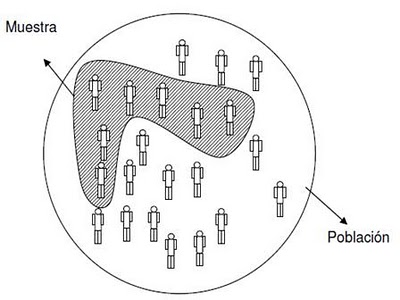
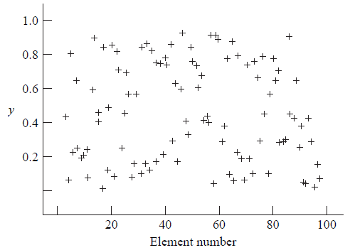
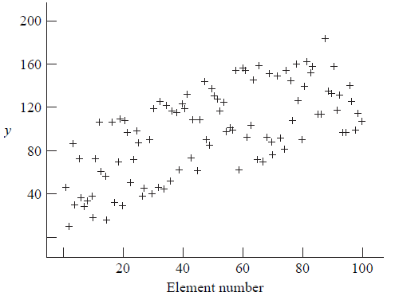
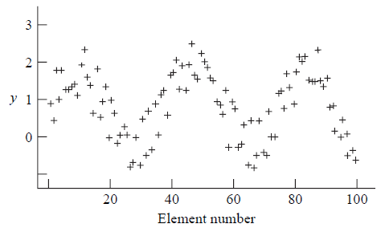
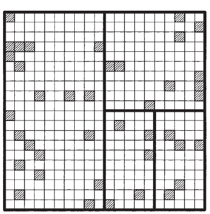

```{r setup, include=FALSE, cache=F, message=F, warning=F, results="hide"}
knitr::opts_chunk$set(cache=TRUE)
knitr::opts_chunk$set(fig.path='figs/')
knitr::opts_chunk$set(cache.path='cache/')

knitr::opts_chunk$set(
                  fig.process = function(x) {
                      x2 = sub('-\\d+([.][a-z]+)$', '\\1', x)
                      if (file.rename(x, x2)) x2 else x
                      }
                  )
library(tidyverse)
```


# Introducción al Muestreo
El mundo empírico está compuesto por un sin fin de conjuntos de elementos; tales como: personas, animales, objetos, etc., habitualmente de cantidades suficientemente grandes, cuyo trabajo de recopilación y posterior análisis para obtener alguna información de interés de ésta, resulta impracticable en tiempos reales. Estos conjuntos de elementos son llamados **población** o **población objetivo**, que en una investigación, debe quedar claramente acotada, geográficamente o en el tiempo.

Un mecanismo más apropiado para obtener información es la extracción de un subconjunto de unidades o elementos a la cual realizar el análisis y obtener un diagnóstico de la población. Este subconjunto de unidades o elementos es llamado **muestra**.

---

  

## Métodos de Muestreo

Al hablar de **métodos de muestreo** nos referimos al conjunto de técnicas estadísticas que estudian la forma de seleccionar una **muestra lo suficientemente representativa** de una población cuya información permita inferir las propiedades o características de toda la población cometiendo un **error medible y acotable**.

A partir de la muestra, seleccionada mediante un determinado método de muestreo, se estiman las características poblacionales (media, total, proporción, etc.) con un **error cuantificable y controlable.**

## Terminología Técnica

* Elemento: Objeto al que se le toma una medición. 
* Población: Colección de elementos del cual se quiere hacer inferencia.
* Unidad de Muestreo: Unidad mínima de observación de la que se obtendrá información de las variables útiles.
* Marco Muestral: Lista de unidades de muestreo.
* Muestra: Colección de unidades de muestreo extraídas desde uno o más marcos muestrales.

## Ejemplo 

En cierta comunidad, una encuesta fue realizada con el fin de determinar la opinión pública sobre 
la emisión de bonos para una futura elección.

* **Elemento:** Votante registrado de la comunidad
* **Población:**  Colección de los votantes de la comunidad
* **Unidad de Muestreo:** Votante registrado de la comunidad / hogares de la comunidad
* **Marco Muestral:** Lista de todos los votantes registrados de la comunidad. / Directorio de teléfonos - lista de registro de hogares obtenidos desde un censo.
* **Muestra:** Votantes encuestados.


## Tipos de Muestreo

* **Muestreo no Probabilístico:** Los resultados obtenidos sólo representan las características de los elementos muestrados y no de la población 
    + Muestreo por conveniencia
    + Muestreo consecutivo
    + Muestreo por cuotas
    + Muestreo de bola de nieve. (Muestreo en cadena).
* **Muestreo Probabilístico:** Cada uno de los elementos de la población de interés, o población objeto, tiene una probabilidad conocida (frecuentemente igual) de ser elegidos en la muestra.

## Sesgo de selección

Una buena muestra debe ser lo más libre de sesgo de selección. **Sesgo de selección** ocurre cuando una parte de la población objectivo no es parte de la población a muestrear, o más generalmente, cuando ciertas unidades muestrales son muestreadas a una tasa diferente a la prevista por el investigador.

Un muestreo por conveniencia (y en general, los muestreos no probabilísticos) es usualmente sesgado, debido a que las unidades que son más fácil de seleccionar son usualmente no representativas de las unidades más difíciles de obtener o de no-respuesta. 

## Error de medición

Un buena muestra tiene respuestas precisas a los items de interés. Cuando una respuesta en la encuesta difiere de su valor real, **un error de medición** ha ocurrido. **Sesgo de medición** ocurre cuando la respuesta tiene una tendencia a diferir de su valor real en una dirección.

## Diseño de cuestionario

Si se desea escribir un cuestionario, una pauta general para su confección es:

* Siempre probar el instrumento antes de realizar la encuesta
* Mantener las preguntas simples y limpias
* Se debe priorizar preguntas específicas, a las generales
* Relacionar las preguntas con los conceptos de interés
* Se debe decidir si se usarán preguntas abiertas o cerradas
* Reportar la pregunta hecha
* Evitar preguntas que motiven alguna respuesta en particular
* Evitar doble negación
* Preferir alternativas *impuestas* en vez de Concuerda/No concuerda
* Preguntar un concepto por pregunta
* Tomar atención al efecto provocado por el orden de las preguntas

## Errores Muestrales y No Muestrales

Los errores muestrales hacen referencia al error inherente provocado por tomar muestra en vez de examinar toda la población. En cambio, los errores no muestrales son los dados por **sesgos de selección** y **errores de medición**

# Muestreo Aleatorio Simple: Sin reposición
Procedimiento de selección de muestra en el cual $n$ distintas unidades son seleccionadas desde $N$ unidades de la población, de tal manera que cualquier posible combinación de $n$ unidades extraídas es igualmente probable de ser seleccionada. Esto es, cada elemento tiene la misma probabilidad de ser escogido (en cada paso).

## Probabilidades elementales

* Probabilidad de que una muestra cualquiera sea escogida:
$$\mathbb{P}(u_1,\dots,u_n)=\dfrac{1}{{N\choose n}}$$
* Probabilidad que tiene una unidad de la población de pertenecer a la muestra:

$$\mathbb{P}(u_i \in \tilde{x})=\dfrac{{N-1\choose n-1}}{{N\choose n}}=\dfrac{n}{N}$$

## Estimación de parámetro poblacionales

Por lo general, el objetivo de la obtención de una muestra es realizar estimación sobre ciertos parámetros poblacionales usando la información extraída. Usualmente, uno de los parámetros a estimar es la **media poblacional** , denotada por $\mu$. Es sabido que $\mu$ está definido como:

$$\mu=\dfrac{1}{N}\sum_{i=1}^{N} y_i$$

y la media muestral $\overline{y}$ es su estimación insesgada, definida por:

$$\overline{y}=\dfrac{1}{n}\sum_{i=1}^{n}y_i$$

---

A su vez, bajo un muestreo aleatorio simple, la **varianza muestral** $s^2$ es un estimador insesgado de la **varianza poblacional de una muestra finita** $\sigma^2$. Es sabido que $s^2$ y $\sigma^2$ están definidos por:

$$s^2=\dfrac{1}{n-1}\sum_{i=1}^{n}(y_i-\overline{y})^2$$

y
$$\sigma^2=\dfrac{1}{N-1}\sum_{i=1}^{N}(y_i-\mu)^2$$

---

Bajo un M.A.S. **sin reemplazo** la varianza del estimador $\overline{y}$ está dada por:

$$\mathbb{V}(\overline{y})=\left( \dfrac{N-n}{N}\right)\dfrac{\sigma^2}{n}$$

y un estimador insesgado de esta varianza es:

$$\widehat{\mathbb{V}(\overline{y})}=\left( \dfrac{N-n}{N}\right)\dfrac{s^2}{n}$$
La cantidad $\dfrac{N-n}{N}=1-\dfrac{n}{N}$ es llamada **factor de corrección para poblaciones finitas**.

## Estimación del total poblacional

Para estimar el total de la población $\tau$, donde:
$$\tau=\sum_{i=1}^{N}y_i=N\mu$$
Un estimador insesgado del total poblacional está dado por:
$$\hat{\tau}=N\overline{y}=\dfrac{N}{n}\sum_{i=1}^{n}y_i$$
Debido a que el estimador $\hat{\tau}$ es $N$ veces el estimador $\overline{y}$, la varianza de $\hat{\tau}$ es $N^2$ veces la varianza de $\overline{y}$. Así,
$$\mathbb{V}(\hat{\tau})=N^2\mathbb{V}(\overline{y})=N(N-n)\dfrac{\sigma^2}{n}$$

--- 

Un estimador insesgado de esta varianza es:

$$\widehat{\mathbb{V}(\hat{\tau})}=N^2\widehat{\mathbb{V}(\overline{y})}=N(N-n)\dfrac{s^2}{n}$$

## Estimación de una proporción poblacional

Sea $y_i=0$ si el elemento $i-$ésimo muestreado no posee una característica específica, y este valor sea $1$ en caso contrario. Escribimos la proporción poblacional como:
$$p=\dfrac{1}{N}\sum_{i=1}^{N} y_i=\mu$$
La varianza para poblaciones finitas está dada por:
$$\sigma^2=\dfrac{\sum_{i=1}^{N}(y_i-p)^2}{N-1}=\dfrac{\sum_{i=1}^{N}y_{i}^{2}-Np^2}{N-1}=\dfrac{Np-Np^2}{N-1}=\dfrac{N}{N-1}p(1-p)$$

---


Sea $\hat{p}$ la proporción muestral de los mismos atributos anteriores, entonces:
$$\hat{p}=\dfrac{1}{n}\sum_{i=1}^{n}y_i=\overline{y}$$
La varianza muestral es:
$$s^2=\dfrac{\sum_{i=1}^{n}(y_i-\overline{y})^2}{n-1}=\dfrac{\sum_{i=1}^{n}y_{i}^{2}-n\hat{p}^2}{n-1}=\dfrac{n}{n-1}\hat{p}(1-\hat{p})$$


---


La varianza de la proporción muestral está dada por:
$$\mathbb{V}(\hat{p})=\left(\dfrac{N-n}{N-1}\right)\dfrac{p(1-p)}{n}$$
y un estimador insesgado de esta varianza es:
$$\widehat{\mathbb{V}(\hat{p})}=\left(\dfrac{N-n}{N}\right)\dfrac{\hat{p}(1-\hat{p})}{n-1}$$

## Ejemplo

Se desea estimar el número de personas que asiste a clases, para ello, se realiza un muestreo de $n=2$ de un total de $N=4$ secciones de un curso. Las secciones son enumeradas del $1$ al $4$. Al muestrear se cada una de las secciones se han de obtener los siguientes resultados.

| Sección $i$  | 1  | 2  | 3  | 4  |
|--------------|----|----|----|----|
| Persona $y_i$| 10 | 17 | 13 | 20 |


---


| Muestra  |   $y_s$   | $\overline{y}$ | $\hat{\tau}$ | $s^2$ | $\widehat{\mathbb{V}}(\hat{\tau})$ |
| :------: | :-------: | :------------: | :----------: | :---: | :--------------------------------: |
| (1,   2) | (10,  17) |      13.5      |      54      | 24.5  |                 98                 |
| (1,   3) | (10,  13) |      11.5      |      46      |  4.5  |                 18                 |
| (1,   4) | (10,  20) |      15.0      |      60      | 50.0  |                200                 |
| (2,   3) | (17,  13) |      15.0      |      60      |  8.0  |                 32                 |
| (2,   4) | (17,  20) |      18.5      |      74      |  4.5  |                 18                 |
| (3,   4) | (13,  20) |      16.5      |      66      | 24.5  |                 98                 |


* Calcule $\mathbb{E}(\hat{\tau}),\mathbb{E}(\overline{y}),\mathbb{E}(s^2),\mathbb{E}(\widehat{\mathbb{V}(\hat{\tau}}))$. Contraste estos valores con sus respectivos valores poblacionales.

## Ejercicio

Sea realiza un M.A.S. de tamaño $n=10$ desde una población de 100 hogares. El número de personas en la muestra es $2,5,1,4,4,3,2,5,2,3$.

* Estime el número total de personas en la población. Estime la varianza de su estimador.
* Estime el número medio de personas por hogar y estime la varianza de su estimador.


## Intervalos de Confianza para los parámetros de interés
Al tener una muestra y en consecuencia una estimación de algún parámetro de interés, es deseable además realizar una estimación sobre la precisión de este último. Usualmente, lo anterior es hecho mediante **intervalos de confianza**.
Un intervalo de confianza usa los datos muestrales para determinar un intervalo con la propiedad de que este tenga una gran probabilidad de contener el verdadero parámetro de interés antes de escoger una muestra en particular.

## Intervalo de Confianza para la media poblacional
Sea $I$ el intervalo de confianza para la media poblacional $\mu$. Se escoge un número $\alpha$ que representa la máxima probabilidad de error admisible, tal que $\mathbb{P}(\mu \in I)=1-\alpha$.

Los límites de este intervalo $I$ varían entre muestras, mientras que el parámetro $\mu$ está fijo.
La cantidad $1-\alpha$ es llamado **coeficiente de confianza**. Usualmente se utilizan niveles de 0.01,0.05 y 0.1 , estos valores son **arbitrarios**.


---


Un intervalo de confianza para estimar la **media poblacional** con un nivel de confianza del $100(1-\alpha)\%$, bajo un muestreo aleatorio simple, está dado por:
$$\overline{y}\pm t\sqrt{\left( \dfrac{N-n}{N}\right)\dfrac{s^2}{n}}$$
donde $t$ es el cuantil $\alpha/2$ superior correspondiente de una distribución t-student con $n-1$ grados de libertad.

## Intervalo de Confianza para el total poblacional

Un intervalo de confianza para estimar el **total poblacional** con un nivel de confianza del $100(1-\alpha)\%$, bajo un muestreo aleatorio simple, está dado por:
$$\hat{\tau}\pm t \sqrt{ N(N-n)\dfrac{s^2}{n}  }$$
donde $t$ es el cuantil $\alpha/2$ superior correspondiente de una distribución t-student con $n-1$ grados de libertad.

## Intervalo de Confianza para una proporción poblacional

Un intervalo de confianza para estimar la \textbf{proporción poblacional} con un nivel de confianza del $100(1-\alpha)\%$, bajo un muestreo aleatorio simple, está dado por:
$$\hat{p}\pm t \sqrt{\left(\dfrac{N-n}{N}\right)\dfrac{\hat{p}(1-\hat{p})}{n-1}  }$$
donde $t$ es el cuantil $\alpha/2$ superior correspondiente de una distribución t-student con $n-1$ grados de libertad.

---

Para muestras grandes $(n>50)$, el cuantil $\alpha/2$ superior correspondiente a una distribución normal puede reemplazar el valor $t$ en los intervalos de confianza anterior, y adicionalmente cuando $p\approx$ 0.5 en el caso de la proporción poblacional.

## Intervalo de Confianza *general*

En general, si se desea estimar un parámetro poblacional $\theta$ y $\hat{\theta}$ es un estimador insesgado para $\theta$ que se distribuye normal, entonces un intervalo de confianza con un nivel del $(1-\alpha)100\%$ para $\theta$ está dado por:
$$\hat{\theta}\pm z\sqrt{\mathbb{V}(\hat{\theta})}$$
donde $z$ es el cuantil $\alpha/2$ superior correspondiente de una distribución normal. En la práctica, el estimador puede tener una distribución aproximadamente normal (por T.L.C.) incluso si los valores originales no lo son.

---

Además, usualmente la varianza del estimador es obtenido a partir de los datos muestrales, por lo que el intervalo de confianza está dado por:
$$\hat{\theta}\pm z\sqrt{\widehat{\mathbb{V}(\hat{\theta}})}$$
En tales casos, la probabilidad de que este intervalo contenga al parámetro poblacional es aproximadamente $1-\alpha$. Para muestras pequeñas, es preferible usar $t$ -definido anteriormente- que su equivalente gaussiano.

## Teorema del límite central para poblaciones finitas

Cuando las observaciones individuales $y_1,y_2,\dots,y_n$ no se distribuyen normalmente, la aproximación de los intervalos de confianza antes estudiados dependen de la aproximación de la varianza de la media muestral a una distibución normal. Si $y_1,y_2,\dots,y_n$ son una secuencia de variables aleatorias **independientes** e **identicamente distribuidas** con media y varianza finita, entonces la distribución de:
$$\dfrac{\overline{y}-\mu }{\sqrt{\mathbb{V}(\overline{y})}}$$
se acerca a una distribución normal estándar conforme $n$ se agranda, por teorema del límite central.

---

Cuando una población finita es muestreada usando un M.A.S. con reemplazo, las $n$ observaciones cumplen con las hipótesis del teorema. Mas no, cuando se realiza un M.A.S. sin reemplazo, las observaciones no son independientes, por lo que este teorema no es aplicable.

Leer M.A.S. con reemplazo pág.19-20. Sampling, K.Thompson. y detalles técnicos del teorema: pág. 42 , *Some details*, del mismo libro.

## Ejemplo

Verifique los intervalos de confianza:

| Muestra  |   $y_s$   | $\overline{y}$ | $\hat{\tau}$ | $s^2$ | $\widehat{\mathbb{V}}(\hat{\tau})$ |     I.C      |
| :------: | :-------: | :------------: | :----------: | :---: | :--------------------------------: | :----------: |
| (1,   2) | (10,  17) |      13.5      |      54      | 24.5  |                 98                 | $54 \pm 126$ |
| (1,   3) | (10,  13) |      11.5      |      46      |  4.5  |                 18                 | $46 \pm 54$  |
| (1,   4) | (10,  20) |      15.0      |      60      | 50.0  |                200                 | $60 \pm 180$ |
| (2,   3) | (17,  13) |      15.0      |      60      |  8.0  |                 32                 | $60 \pm 72$  |
| (2,   4) | (17,  20) |      18.5      |      74      |  4.5  |                 18                 | $74 \pm 54$  |
| (3,   4) | (13,  20) |      16.5      |      66      | 24.5  |                 98                 | $66 \pm 126$ |

## Tamaño de muestra

Supongamos que queremos estimar un parámetro poblacional $\theta$ con un estimador $\hat{\theta}$. Es posible especificar un cantidad máxima posible para la diferencia entre la estimación y el valor real del parámetro, digamos $d$, con una pequeña probabilidad $\alpha$ que el error pueda exceder tal diferencia. Bajo esto contexto, el objetivo es elegir un tamaño de muestra $n$ tal que:
$$\mathbb{P}\left( |\hat{\theta}-\theta|>d\right)<\alpha$$
Si el estimador $\hat{\theta}$ de $\theta$ es insesgado y normalmente distribuido, entonces:
$$\dfrac{\hat{\theta}-\theta}{\sqrt{\mathbb{V}(\hat{\theta})}}\sim N(0,1)$$

--- 

Si denotamos $z$ como el cuantil $\alpha/2$ superior de una distribución normal estándar, entonces se tiene que:
$$\mathbb{P}\left(  \dfrac{|\hat{\theta}-\theta|}{\sqrt{\mathbb{V}(\hat{\theta})}} >z \right)=\mathbb{P}\left(|\hat{\theta}-\theta| > z \sqrt{\mathbb{V}(\hat{\theta})} \right) = \alpha$$
La varianza del estimador $\hat{\theta}$ decrese conforme el tamaño de muestra crece, por lo que la desigualdad anterior se cumplirá si escogemos un $n$ tal que $z\sqrt{\mathbb{V}(\hat{\theta})} \leq d$.

## Tamaño de muestra para estimar la media poblacional

Dado un muestreo aleatorio simple, la media muestral $\overline{y}$ es un estimador insesgado de la media poblacional $\mu$ con varianza $\mathbb{V}(\overline{y})=(N-n)\sigma^2/Nn$. Si fijamos:
$$z\sqrt{ \left( \dfrac{N-n}{N}\right) \dfrac{\sigma^2}{n}}=d$$
y resolvemos para $n$, entonces se tiene que:
$$n=\dfrac{1}{d^2/z^2\sigma^2 + 1/N}=\dfrac{1}{1/n_0 + 1/N}$$
donde $n_0=\dfrac{z^2\sigma^2}{d^2}$. Si el tamaño de población $N$ es grande en comparación con el tamaño de muestra $n$, tal que el factor de correción puede ser ignorado, entonces $n=n_0$

## Tamaño de muestra para estimar el total poblacional

Para estimar el total poblacional $\tau$, la ecuación a resolver para $n$ es:
$$z\sqrt{N(N-n)\dfrac{\sigma^2}{n}}=d$$
el cual al resolver para $n$, se tiene:
$$n=\dfrac{1}{d^2/N^2z^2\sigma^2+1/N}=\dfrac{1}{1/n_0+1/N}$$
donde $n_0=\dfrac{N^2z^2\sigma^2}{d^2}$. Si ignoramos el factor de correción, la fórmula se reduce a $n=n_0$.

## Tamaño de muestra para estimar la proporción poblacional

De igual manera que antes, para estimar la proporción poblacional $p$, la ecuación a resolver es:
$$z\sqrt{\left(\dfrac{N-n}{N}\right)\dfrac{\hat{p}(1-\hat{p})}{n-1}}=d$$
y resolvemos para $n$, entonces:
$$n=\dfrac{N\hat{p}(1-\hat{p})}{(N-1)(d^2/z^2)+\hat{p}(1-\hat{p})}$$
Si el factor de correción puede ser ignorado, entonces la fórmula se reduce a: $n=\dfrac{z^2\hat{p}(1-\hat{p})}{d^2}$

## Tamaño de muestra: Error relativo

Si en vez de querer controlar un error absoluto $(d)$, deseamos controlar el error relativo -esto es, la diferencia entre la estimación y el valor real, dividido por el valor real-, el criterio a satisfacer es:
$$\mathbb{P}\left( \left| \dfrac{\hat{\theta}-\theta}{\theta} \right| >r \right) < \alpha$$
por lo que resolviendo para $n$ en el caso de la estimación de media poblacional, se tiene:
$$n=\dfrac{1}{r^2\mu^2/z^2\sigma^2+1/N}$$
Este resultado puede ser obtenido reemplando $d$ por $r\mu$ para la obtención de tamaño de muestra controlando un error absoluto.


---

Es claro ver que, si denotamos $\gamma$ como el coeficiente de variación para la población $(\gamma=\sigma/\mu)$, la fórmula anterior puede ser reescrita como:
$$n=\dfrac{1}{r^2/z^2\gamma^2+1/N}$$
Así, el coeficiente de variación es la cantidad poblacional en la cual el tamaño de muestra depende para controlar el error relativo.

## Ejercicio

1. Un investigador desea diseñar una muestra para estimar el número de árboles de cierto tipo en un área de estudio. El área de estudio fue dividida en $1000$ unidades. Por experiencia, se sabe que la varianza en el número de tallos por unidad es conocido y aproximadamente $\sigma^2 \approx 45$. Usando un M.A.S., ¿ Qué tamaño de muestra debería ser usado para estimar el número total de árboles en el área de estudio para que esté dentro de $500$ árboles del valor real a un $95\%$? repita el resultado para $1000$ y $2000$ árboles.

2. Obtenga el tamaño de muestra de la pregunta anterior cuando el factor de corrección es ignorado. ¿ Qué puede concluir respecto a la importancia del factor de corrección para esta población? 

# Muestreo Sistemático 

Una muestra obtenida seleccionando aleatoriamente un elemento de la población desde los $k$ primeros elementos y luego seleccionando cada $k$ elementos subsiguientes es llamado un **muestreo sistemático**.

Una de las mayores ventajas de este tipo de muestreo, es que simplifica el proceso de elección de muestra, puesto que sólo el primer elementos es seleccionado aleatoriamente. Por lo mismo, es más fácil de realizar y es menos propenso a errores por parte de quienes obtienen los datos.

--- 

En general, para la elección de $k$ para un muestreo sistemático de $n$ elementos desde una población de tamaño $N$, $k$ debe ser menor o igual a $N/n$.
Supongamos que $N=15000$ y que el tamaño de muestra necesario es $n=100$. Para $k=150$, obtendremos exactamente $n=100$ observaciones, mientras que para $k<150$, el tamaño de muestra será superior a $100$.


## Estimación para la media poblacional

De igual manera que en el M.A.S, estamos interesados en los mismos parámetros de interés poblacionales. Así,
$$\hat{\mu}=\overline{y}_{sy}=\dfrac{\sum_{i=1}^{n}y_i}{n}$$
en donde $sy$ hace referencia a que un muestreo sistemático fue utilizado. Y,
$$\widehat{\mathbb{V}(\overline{y}_{sy})}=\left(1-\dfrac{n}{N}\right)\dfrac{s^2}{n}$$
asumiendo una población aleatoriamente ordenada.

---

Es claro notar que la varianza de $\overline{y}_{sy}$ dada anteriormente es identica a la estimación de la varianza para $\overline{y}$. Lo anterior no implica que el verdadero valor de la varianza de $\overline{y}_{sy}$ es el mismo que el de $\overline{y}$, pues:
$$\mathbb{V}(\overline{y})=\dfrac{\sigma^2}{n}\left(1-\dfrac{n}{N}\right)$$
y,
$$\mathbb{V}(\overline{y}_{sy})=\dfrac{\sigma^2}{n}\left(1+(n-1)\rho\right)$$
donde $\rho$ es la medida de correlación entre pares de elementos dentro de la misma muestra sistemática.

---

En el caso de que $\rho\approx 1$, los elementos dentro de la muestra son bastante similares con respecto a la característica medida, y un muestreo sistemático otorgará mayor varianza de la media muestral que bajo un M.A.S.
En el caso de que $\rho<0$, un muestreo sistemático podría ser más preciso que un M.A.S. La correlación puede ser negativa si los elementos dentro de una muestra sistemática tienden a ser extremadamente diferentes. La correlación no puede ser *tan negativa* pues la expresión de la varianza se vuelve negativa.
Para $\rho\approx 0$ y $N$ relativamente grande, un muestreo sistemático es más o menos equivalente a un M.A.S.

--- 

Un estimador insesgado de $\mathbb{V}(\overline{y}_{sy})$ no puede ser obtenido usando sólo datos de una muestra sistemática. Cuando un muestreo sistemático es más o menos equivalente a un M.A.S., podemos estimar $\mathbb{V}(\overline{y}_{sy})$ usando las estimaciones de un M.A.S..


## Tipos de población

Definamos 3 tipos de poblaciones:

* **Aleatoria:** Los elementos de la población están ordenados aleatoriamente.
* **Ordenada:** Los elementos de la población tienen valores que tienden a oscilar cuando son enumerados.
* **Periódica:** Los elementos de la población tienen valores que oscilan cíclicamente en *patrones regulares* cuando son enumerados. 

---

 

---

 

---


 

---

* Una muestra sistemática para poblaciones aleatorias se comporta -en términos prácticos- como una muestra aleatoria simple. Por lo que, en tal caso, la aproximación de la varianza usando la varianza obtenida bajo un M.A.S. funciona *relativamente* bien.

* En muestras desde una población ordenada, los valores muestrales tienden a estar más separados numéricamente que en una M.A.S., provocando que la  correlación dentro de la muestra $\rho$ sea más negativa. Así, si usamos la fórmula de M.A.S. obtendremos una sobre estimación del verdadero error muestral.

* Para poblaciones periódicas, la efectividad de una muestra sistemática (1 cada $k$) depende del valor escogido para $k$. En este caso si usamos la fórmula de M.A.S. obtendremos una subestimación del verdadero error muestral.

## Estimación del total poblacional

De igual manera que bajo un muestreo aleatorio simple se tiene,
$$\hat{\tau}=N\overline{y}_{sy}$$
y,
$$\widehat{\mathbb{V}(N\overline{y}_{sy})}=N^2\widehat{\mathbb{V}(\overline{y}_{sy})}=N^2\left( 1- \dfrac{n}{N}\right)\left(\dfrac{s^2}{n}\right)$$
Asumiendo una población ordenada aleatoriamente.

---

Es claro ver que los resultados anteriores son idénticos a los presentados para las estimación bajo un muestreo aleatorio simple. Al igual que para la media poblacional, este resultado no implica que la verdadera varianza de $N\overline{y}_{sy}$ es la misma que la varianza de $N\overline{y}$. Nuevamente, no es posible obtener un estimador insesgado de $\mathbb{V}(N\overline{y}_{sy})$ a partir de sólo una muestra sistemática.
Los casos en los que un muestreo sistemático es más o menos parecido a un M.A.S. son los mismos. Así, podemos ocupar las fórmulas de este último para aquellos casos.

## Estimación para una proporción poblacional

Análogamente, el estimador de una proporción poblacional $p$:
$$\hat{p}_{sy}=\overline{y}_{sy}=\dfrac{\sum_{i=1}^{n}y_i}{n}$$
y su varianza estimada,
$$\widehat{\mathbb{V}(\hat{p}_{sy})}=\left(1-\dfrac{n}{N}\right)\dfrac{\hat{p}_{sy}(1-\hat{p}_{sy})}{n-1}$$
Asumiendo una población ordenada aleatoriamente.

--- 

Nuevamente, el resultado anterior es idéntico al caso de un M.A.S., pero esto no implica que las varianzas poblacionales sean idénticas. Las aproximaciones antes mencionadas son aplicables para la estimación para una proporción poblacional.

## Intervalos de confianza para los parámetros de interés

Para un muestreo sistemático, los intervalo de confianza son aproximadamente idénticos a los vistos bajo un M.A.S.. Cabe destacar, que esto se debe al supuesto de normalidad $\hat{\theta}$. En caso de no asumir dicha hipótesis, la distribución muestral de la cantidad pivotal utilizada para la construcción del intervalo de confianza debe ser analizada.

## Tamaño de muesta para los parámetros de Interés

Análogamente, debido a que los tamaños de muestra son obtenidos a partir de acotar el ancho del intervalo de confianza. Los procedimientos antes visto son aplicables bajo un muestreo sistemático. En caso de no asumir la hipótesis de normalidad, es posible obtener un tamaño de muestra sobreestimado, de la forma:
$$2\sqrt{\mathbb{V}(\hat{\theta})}\leq d*$$
y luego, resolver para $n$.

**Tarea: Obtener las fórmulas aproximadas para los tamaños de muestra de los parámetros de interés usando el criterio anterior.**

## Muestreo sistemático repetido

Frecuentemente, seleccionamos $n_s$ para que sea al menos $10$ para obtener la suficiente cantidad de elementos pertenecientes a la muestra tal que la estimación de $\mathbb{V}(\hat{\mu})$ sea buena. En general, $k'=n_s*k$. Las estimaciones para la media poblacional bajo un M.S.R. son:
$$\hat{\mu}=\sum_{i=1}^{n_s}\dfrac{\overline{y}_i}{n_s}$$
donde $\overline{y}_i$ representa la media de la $i-$ésima muestra sistemática.
$$\widehat{\mathbb{V}(\hat{\mu})}=\left( 1-\dfrac{n}{N} \right) \dfrac{s_{\overline{y}}^{2}}{n_s}$$
donde, 
$$s_{\overline{y}}^{2}=\dfrac{\sum_{i=1}^{n_s}(\overline{y}_i-\hat{\mu})^2}{n_s-1}$$

---

Para el caso del total poblacional se tiene,
$$\hat{\tau}=N\hat{\mu}=N\sum_{i=1}^{n_s}\dfrac{\overline{y}_i}{n_s}$$
y,
$$\widehat{\mathbb{V}(\hat{\tau})}=N^2 \widehat{\mathbb{V}(\hat{\mu})} = N^2 \left( 1-\dfrac{n}{N} \right) \dfrac{s_{\overline{y}}^{2}}{n_s}$$

## Ejercicios

Un parque cobra entrada por la carga del auto en vez de por personas. La administración desea estimar el número medio de personas por auto para una feriado particular. Por historial, se sabe que deberían llegar alrededor de 400 autos al parque. Se desea muestrear 80 autos. Para obtener una estimación de la varianza, se utiliza un muestreo sistemático repetido con 10 muestras de 8 autos cada uno. Usando los datos de la tabla, estime el número medio de personas por auto y obtenga una cota para el error de estimación.

---

Número de personas por auto (variable respuesta $y_i$ en paréntesis)

| Punto inicial aleatorio | 2do elem. | 3er elem. | 4to elem. | 5to elem. | 6to elem. | 7mo elem. | 8vo elem. | $\overline{y_i}$ |
| :---------------------: | :-------: | :-------: | :-------: | :-------: | :-------: | :-------: | :-------: | :--------------: |
|          2(3)           |   52(4)   |  102(5)   |  152(3)   |  202(6)   |  252(1)   |  302(4)   |  352(4)   |       3.75       |
|          5(5)           |   55(3)   |  105(4)   |  155(2)   |  205(4)   |  255(2)   |  305(3)   |  355(4)   |       3.38       |
|          7(2)           |   57(4)   |  107(6)   |  157(2)   |  207(3)   |  257(2)   |  307(1)   |  357(3)   |       2.88       |
|          13(6)          |   63(4)   |  113(6)   |  163(7)   |  213(2)   |  263(3)   |  313(2)   |  363(7)   |       4.62       |
|          26(4)          |   76(5)   |  126(7)   |  176(4)   |  226(2)   |  276(6)   |  326(2)   |  376(6)   |       4.50       |
|          31(7)          |   81(6)   |  131(4)   |  181(4)   |  231(3)   |  281(6)   |  331(7)   |  381(5)   |       5.25       |
|          35(3)          |   85(3)   |  135(2)   |  185(3)   |  235(6)   |  285(5)   |  335(6)   |  385(8)   |       4.50       |
|          40(2)          |   90(6)   |  140(2)   |  190(5)   |  240(5)   |  290(4)   |  340(4)   |  390(5)   |       4.12       |
|          45(2)          |   95(6)   |  145(3)   |  195(6)   |  245(4)   |  295(4)   |  345(5)   |  395(4)   |       4.25       |
|          46(6)          |   96(5)   |  146(4)   |  196(6)   |  246(3)   |  296(3)   |  346(5)   |  396(3)   |       4.38       |


--- 

El departamento de control de calidad de una empresa usa un muestreo sistemático para estimar la cantidad media de llenado en latas de 12oz que salen de una línea de ensamblaje. Los datos en la tabla representan un muestra sistemática 1 cada 50 de la producción en un día. Estime $\mu$ y obtenga una cota para el error de estimación. Asuma $N=1800$.

---

Datos de la cantidad a llenar (oz):

|       |       |       |       |       |       |
| :---- | :---- | :---- | :---- | :---- | :---- |
| 12.00 | 11.97 | 12.01 | 12.03 | 12.01 | 11.80 |
| 11.91 | 11.98 | 12.03 | 11.98 | 12.00 | 11.83 |
| 11.87 | 12.01 | 11.98 | 11.87 | 11.90 | 11.88 |
| 12.05 | 11.87 | 11.91 | 11.93 | 11.94 | 11.89 |
| 11.75 | 11.93 | 11.95 | 11.97 | 11.93 | 12.05 |
| 11.85 | 11.98 | 11.87 | 12.05 | 12.02 | 12.04 |


---

La administración de una compañía está interesada en estimar la proporción de empleados que concuerdan con una nueva política de la empresa. Un muestra sistemática 1 cada 10 es obtenida de los empleados que salen de un edificio en un día particular. Use la tabla siguiente para estimar $p$, la proporción de empleados que concuerdan con la nueva política de la empresa y obtenga una cota para el error de estimación. Asuma $N=2000$. 


| Empleado encuestado |         Respuesta          |
| :-----------------: | :------------------------: |
|          3          |             1              |
|         13          |             0              |
|         23          |             1              |
|      $\vdots$       |          $\vdots$          |
|        1993         |             1              |
|                     | $\sum_{i=1}^{200} y_i=132$ |


Para el problema anterior. Determine el tamaño de muestra requerido para estimar $p$ dentro de a lo más 0.01 unidades.¿Qué tipo de muestra sistemática debería ser aplicada?

## Ejercicio adicionales Prueba 1

Si desean hacer ejercicios adicionales, algunos pueden ser encontrados en:

Sampling, Steven K. Thompson:

* pág. 35 - ej. 2 al 5
* pág. 50 - ej. 1-2-3

y ejercicios dentro de los capítulos relevantes.

Richard L. Scheaffer, III  William Mendenhall, R. Lyman Ott, Kenneth G. Gerow - Elementary Survey Sampling-Cengage Learning (2011)

* pág. 102. ej. 1 al 50
* pág. 243. ej. 1 al 29

Muestreo Estadístico. Conceptos y problemas resueltos - César Pérez

* pág. 124. ej. 1 al 17 (Ejercicios Resueltos)
* pág. 145. ej. 1 al 5
* pág. 207. ej. 1 al 8 (Ejercicios Resueltos)
* pág. 224. ej. 1 al 3


# Métodos Indirectos de estimación

Los métodos indirectos utilizan la información conocida relativa a una variable auxiliar $Y$ (variable de apoyo) correlacionada con la variable en estudio $X$ para conseguir estimaciones más precisas para $X$ que las calculadas únicamente a partir de la muestra de la variable que se estudia.

Entre los métodos clásicos de estimación indirecta más utilizados se encuentran el **método de estimación por razón** (basado en la razón entre $X$ e $Y$), el **método de estimación por regresión** (basado en la regresión entre X e Y) y el **método de estimación por diferencia**
(basado en la diferencia entre $X$ e $Y$). 

---

La estimación indirecta constituye el complemento de la estimación directa. No se trata por sí solo de un método eficiente de estimación, pero junto con la estimación directa desarrolla casi totalmente la **información muestral**. Los métodos de estimación indirecta aprovechan la información de variables auxiliares correlacionadas con la variable objeto de estudio con el fin de **conseguir una ganancia en precisión de los estimadores**.

## Estimador de razón

Sea $X$ la variable objetivo y supongamos que se conoce $Y=\sum_{i=1}^{N} Y_i$, donde $(X_i,Y_i)$ se corresponden con los pares de valores de las variables $X$ e $Y$, respectivamente, observados en la unidad $i-$ésima de la población o de la muestra. Nuestro objetivo es obtener un estimador para $X$ que sea más preciso que el estimador directo basado únicamente en la muestra. La expresión general de los estimadores indirectos es la siguiente:

$$f(\hat{X}_G)=f(\hat{X})+b_0(f(Y)-f(\hat{Y}))$$

siendo $f$ una función, $\hat{X}_G$ el estimador indirecto de $X$,$\hat{X}$ e $\hat{Y}$ los estimadores directos de $X$ e $Y$, respectivamente, y $b_0$ un coeficiente de corrección que, dependiendo de su valor, nos dará los diferentes tipos de estimadores indirectos. Como caso particular supongamos $f(x)=x$. Entonces $\hat{X}_G=\hat{X}+b_0(Y-\hat{Y})$

---

Los casos más frecuentes de estimadores indirectos son los siguientes:

* Si $b_0=0$, se tiene $\hat{X}_G=\hat{X}$, es decir, el estimador obtenido es el directo.
* Si $b_0=1$, entonces $\hat{X}_G=\hat{X}+(Y-\hat{Y})$, denominado estimador de la diferencia o diferencial.
* Si $b_0=\dfrac{\hat{X}}{\hat{Y}}=\hat{R}$, se obtiene el estimador de razón.

$$\hat{X}_G=\hat{X}+\dfrac{\hat{X}}{\hat{Y}}(Y-\hat{Y})=\dfrac{\hat{X}}{\hat{Y}}Y=\hat{R}Y=\hat{X}_R$$

* Si $b_0=b$, se obtiene el estimador de regresión.

$$\hat{X}_G=\hat{X}+b(Y-\hat{Y})=\hat{X}_{rg}$$

---

Supongamos una población formada por $N$ unidades, $\{ U_1,\dots, U_N\}$, y nos fijamos en dos características $(X,Y)$ para cada unidad, siendo $X$ la variable objetivo de estudio e $Y$ una variable auxiliar correlacionada con $X$. 

Llamaremos **razón** a $R=\dfrac{X}{Y}$ y su estimador viene dado por la expresión:

$$\hat{R}=\dfrac{\sum_{i=1}^{n}x_i}{\sum_{i=1}^{n}y_i}=\dfrac{\hat{X}}{\hat{Y}}=\dfrac{\overline{x}}{\overline{y}}$$

A partir de la razón podemos también estimar totales y medias mediantes:
\begin{align*}
\hat{X}_R&=\hat{R}Y\\
\hat{\overline{X}}_R&=\hat{R}\overline{Y}
\end{align*}


---

Estos estimadores no son insesgador pero tienen varianza muy pequeña y otras propiedades que los hacen deseables. Sin embargo, es preciso conocer $Y$ o $\overline{Y}$ para poder calcularlos.

$\hat{R}$ es **consistente.**, pero en general es sesgado. Para muestras grandes, $\hat{R}\rightarrow N(R,\mathbb{V}(\hat{R}))$ y el sesgo es despreciable. No se conoce la expresión exacta de la varianza de $\hat{R}$, aunque bajo ciertas condiciones se puede obtener una expresión aproximada de la misma. Podemos expresar el sesgo en función del coeficiente de correlación entre $\hat{R}$ e $\overline{y}$ del siguiente modo:

$$B(\hat{R})=-\dfrac{COV(\hat{R},\overline{y})}{\overline{y}}=-\dfrac{\rho \sigma_{\hat{R}}\sigma_{\overline{y}}}{\overline{y}}$$

---

$\left|  \dfrac{B(\hat{R})}{\sigma_{\hat{R}}} \right|$ es una medida del sesgo por unidad de desviación típica, es decir, una medida relativa del sesgo respecto del error de muestreo. Además, si $\left|  \dfrac{B(\hat{R})}{\sigma_{\hat{R}}} \right|$ es del order del $10\%$, entonces el sesgo puede ser considerado despreaciable en relación al error estándar.


---

Se cumple que $B(\hat{R})=0 \Leftrightarrow \hat{R} \text{ y } \overline{y}$ son variables **no correlacionadas** en el muestreo. Consideramos esta condición como la primera para la insesgadez del estimador de la razón. Además se cumple que:

$$B(\hat{R})=-\rho_{(\hat{R},\overline{y})}\sigma_{\hat{R}} CV(\overline{y})\Rightarrow \left|  \dfrac{B(\hat{R})}{\sigma_{\hat{R}}} \right| = \left| \rho_{(\hat{R},\overline{y})} \right| \cdot CV(\overline{y}) \leq CV(\overline{y})$$

con lo que el sesgo relativo (módulo del coeficiente entre el sesgo del estimador de la razón y su desviación típica) está acotado por el coeficiente de variación de $\overline{y}$


---

Entonces, **para que el sesgo del estimador de la razón sea despreciable** bastará con que el coeficiente de variación de la media muestral de la variable auxiliar sea menor que $0.1$, ya que en este caso:

$$\left|  \dfrac{B(\hat{R})}{\sigma_{\hat{R}}} \right| \leq CV(\overline{y}) < 0.1$$

Se observa que el sesgo relativo será menor en cuanto $Cv(\overline{y})$ sea más bajo. Adicionalmente, es deseable tomar tamaños de muestras tales que el sesgo sea despreciable, esto es: $CV(\overline{y})<0.1$. Para hallar este tamaño de muestra en el muestreo sin reposición operamos de la siguiente manera:


---

\begin{align*}
CV(\overline{y})=\dfrac{\sigma(\overline{y})}{\mathbb{E}(\overline{y})}=\dfrac{\sqrt{\mathbb{V}(\overline{y})}}{\overline{Y}}&=\dfrac{ \sqrt{\left( 1 - \dfrac{n}{N}\right)\dfrac{S_{Y}^{2}}{n} } }{\overline{Y}}<0.1\\ &\Rightarrow n > \dfrac{100 N S_{Y}^{2}}{N \overline{y}^2 + 100 S_{Y}^{2}}\\
&\Leftrightarrow n > \dfrac{100 N \dfrac{S_{Y}^2}{\overline{y}^2}}{N+100\dfrac{S_{Y}^2}{\overline{y}^2}}
\end{align*}

---

Para hallar el tamaño de muestra para el que el sesgo es despreciable en el muestreo con reposición operamos como sigue:

$$CV(\overline{y})=\dfrac{\sigma(\overline{y})}{\mathbb{E}(\overline{y})}=\dfrac{\sqrt{\dfrac{\sigma_{Y}^2}{n}}}{\overline{Y}}<0.1\Rightarrow n > \dfrac{100 \sigma_{Y}^2}{\overline{Y}^2}$$

**La segunda condición de insesgadez del estimador de la razón es que si la recta de regresión de la variable auxiliar Y sobre la variable en estudio X (o la de X sobre Y) pasa por el origen de coordenadas entonces el estimador de la razón $\hat{R}$ es insesgado para R.**

## Cálculo del sesgo del estimador de razón y su estimación

* **Muestreo sin reposición:**

$$B(\hat{R})=\dfrac{\left( 1-\dfrac{n}{N}\right)}{n\overline{Y}^2}\left(RS_{Y}^2 - S_{XY}\right)$$

* **Muestreo con reposición:**

$$B(\hat{R})=\dfrac{1}{n\overline{Y}^2}(R\sigma_{Y}^2 - \sigma_{XY})$$

---

* **Muestreo sin reposición:**

$$\widehat{B(\hat{R})}=\dfrac{\left(1-\dfrac{n}{N}\right)}{n\overline{Y}^2}(\hat{R}\hat{S}_{Y}^2 - \hat{S}_{XY})$$

* **Muestreo con reposición:**

$$\widehat{B(\hat{R})}=\dfrac{1}{n\overline{Y}^2}(\hat{R}\hat{S}_{Y}^2 - \hat{S}_{XY})$$

## Varianza aproximada del estimador de razón

* **Muestreo sin reposición:**

\begin{align*}
\mathbb{V}(\hat{R})&=\dfrac{\left(1-\dfrac{n}{N}\right)}{n\overline{Y}^2}(S_{x}^2+R^2S_{y}^2-2RS_{xy})\\&=\dfrac{\left(1-\dfrac{n}{N}\right)}{n(N-1)\overline{Y}^2}\left[ \sum_{i=1}^{N} X_{i}^2 + R^2 \sum_{i=1}^{N} Y_{i}^2-2R \sum_{i=1}^{N} X_i Y_i \right]
\end{align*}

* **Muestreo con reposición:**

\begin{align*}
\mathbb{V}(\hat{R})&=\dfrac{1}{n\overline{Y}^2}(\sigma_{x}^2+R^2\sigma_{y}^2-2R\sigma_{xy})\\&=\dfrac{1}{nN\overline{Y}^2}\left[ \sum_{i=1}^{N} X_{i}^2 + R^2 \sum_{i=1}^{N} Y_{i}^2-2R \sum_{i=1}^{N} X_i Y_i \right]
\end{align*}

## Estimación de la varianza del estimador de razón

* **Muestreo sin reposición:** 

\begin{align*}
\widehat{\mathbb{V}(\hat{R})}&=\dfrac{\left(1-\dfrac{n}{N}\right)}{n\overline{Y}^2}(\hat{S}_{x}^2+\hat{R}^2\hat{S}_{y}^2-2\hat{R}\hat{S}_{xy})\\&=\dfrac{\left(1-\dfrac{n}{N}\right)}{n(n-1)\overline{Y}^2}\left[ \sum_{i=1}^{n} X_{i}^2 + \hat{R}^2 \sum_{i=1}^{n} Y_{i}^2-2\hat{R} \sum_{i=1}^{n} X_i Y_i \right]
\end{align*}

* **Muestreo con reposición:**

\begin{align*}
\widehat{\mathbb{V}(\hat{R})}&=\dfrac{1}{n\overline{Y}^2}(\hat{S}_{x}^2+\hat{R}^2\hat{S}_{y}^2-2\hat{R}\hat{S}_{xy})\\&=\dfrac{1}{n(n-1)\overline{Y}^2}\left[ \sum_{i=1}^{n} X_{i}^2 + \hat{R}^2 \sum_{i=1}^{n} Y_{i}^2-2\hat{R} \sum_{i=1}^{n} X_i Y_i \right]
\end{align*}

## Estimación de parámetros poblacionales: Razón

Podemos utilizar el estimador de razón para realizar estimaciones de los parámetros poblaciones típicos como sigue:
\begin{align*}
\widehat{X}_R&=\dfrac{x}{y} Y = \dfrac{\overline{x}}{\overline{y}} Y= \hat{R}Y \\
\hat{\overline{X}}&=\hat{\overline{x}}= \dfrac{\overline{x}}{\overline{y}}\overline{Y}=\hat{R}\overline{Y}\\
\widehat{P_{RX}}&=\dfrac{\widehat{P_X}}{\widehat{P_Y}}P_Y=\hat{R}P_Y
\end{align*}

--- 

**Varianza de la estimación del total y media poblacional.**

* **Muestreo sin reposición:**

\begin{align*}
\mathbb{V}(\widehat{X_R})=\mathbb{V}(\hat{R}Y)=Y^2\mathbb{V}(\hat{R})=N^2 \dfrac{1-\dfrac{n}{N}}{n}(S_{x}^2+R^2S_{y}^{2}-2RS_{xy})\\
\mathbb{V}(\widehat{\overline{X}_R})=\mathbb{V}(\hat{R}\overline{Y})=\overline{Y}^2\mathbb{V}(\hat{R})=\dfrac{1-\dfrac{n}{N}}{n}(S_{x}^2+R^2S_{y}^{2}-2RS_{xy})
\end{align*}

* **Muestreo con reposición:**

\begin{align*}
\mathbb{V}(\widehat{X_R})=\mathbb{V}(\hat{R}Y)=Y^2\mathbb{V}(\hat{R})= \dfrac{N^2}{n}(\sigma_{x}^2+R^2\sigma_{y}^{2}-2R\sigma_{xy})\\
\mathbb{V}(\widehat{\overline{X}_R})=\mathbb{V}(\hat{R}\overline{Y})=\overline{Y}^2\mathbb{V}(\hat{R})=\dfrac{1}{n}(\sigma_{x}^2+R^2\sigma_{y}^{2}-2R\sigma_{xy})
\end{align*}

---

**Estimación de las varianzas de la estimación del total y media poblacional**

* **Muestreo sin reposición:**

\begin{align*}
\widehat{\mathbb{V}(\widehat{X_R})}&=N^2 \dfrac{1-\dfrac{n}{N}}{n}(\hat{S}_{x}^2+\hat{R}^2\hat{S}_{y}^{2}-2\hat{R}\hat{S}_{xy})\\
&=N^2 \dfrac{1-\dfrac{n}{N}}{n(n-1)}\left[ \sum_{i=1}^{n} X_{i}^2 + \hat{R}^2\sum_{i=1}^{n} Y_{i}^2 - 2 \hat{R} \sum_{i=1}^{n} X_i Y_i \right]
\end{align*}
\begin{align*}
\widehat{\mathbb{V}(\widehat{\overline{X}_R})}&=\dfrac{1-\dfrac{n}{N}}{n}(\hat{S}_{x}^2+\hat{R}^2\hat{S}_{y}^{2}-2\hat{R}\hat{S}_{xy})\\
&=\dfrac{1-\dfrac{n}{N}}{n(n-1)}\left[ \sum_{i=1}^{n} X_{i}^2 + \hat{R}^2\sum_{i=1}^{n} Y_{i}^2 - 2 \hat{R} \sum_{i=1}^{n} X_i Y_i \right]
\end{align*}

---

* **Muestreo con reposición:**

\begin{align*}
\widehat{\mathbb{V}(\widehat{X_R})}&= \dfrac{N^2}{n}(\hat{S}_{x}^2+\hat{R}^2\hat{S}_{y}^{2}-2\hat{R}\hat{S}_{xy})\\
&= \dfrac{N^2}{n(n-1)}\left[ \sum_{i=1}^{n} X_{i}^2 + \hat{R}^2\sum_{i=1}^{n} Y_{i}^2 - 2 \hat{R} \sum_{i=1}^{n} X_i Y_i \right]
\end{align*}
\begin{align*}
\widehat{\mathbb{V}(\widehat{\overline{X}_R})}&=\dfrac{1}{n}(\hat{S}_{x}^2+\hat{R}^2\hat{S}_{y}^{2}-2\hat{R}\hat{S}_{xy})\\
&=\dfrac{1}{n(n-1)}\left[ \sum_{i=1}^{n} X_{i}^2 + \hat{R}^2\sum_{i=1}^{n} Y_{i}^2 - 2 \hat{R} \sum_{i=1}^{n} X_i Y_i \right]
\end{align*}

## Ejemplo

En un estudio para estimar el contenido total de azúcar de una carga de naranjas, se pesó una muestra de naranjas, y se extrajo su jugo para pesar el contenido de azúcar. Se obtuvieron los siguientes resultados.

| Naranja  | Contenido | Peso |
|----------|-----------|------|
| 1        | 0.021     | 0.4  |
| 2        | 0.030     | 0.48 |
| 3        | 0.025     | 0.43 |
| 4        | 0.022     | 0.42 |
| 5        | 0.033     | 0.5  |
| 6        | 0.027     | 0.46 |
| 7        | 0.019     | 0.39 |
| 8        | 0.021     | 0.41 |
| 9        | 0.023     | 0.42 |
| 10       | 0.025     | 0.44 |

---

* Sabiendo que el peso de todas las naranjas es 1800, estimar el contenido total de azúcar de las narajas y su error de muestreo.
* Estimar dichas varianzas y comparar la precisión de este tipo de muestreo con la del muestreo aleatorio simple. Seleccionar la muestra más precisa.

## Estimador por regresión

Supongamos $(x_i,y_i), i=1,\dots,N$ pares de valores situados sobre una recta que no pasa por el origen, es decir, $x_i=a+b y_i$ con $a\neq 0$. Entonces, para los valores muestrales y poblaciones se cumple, respectivamente $\overline{x}=a+b\overline{y}$ y $\overline{X}=a+b\overline{Y}$, por lo que  $\overline{x}-\overline{X}=b(\overline{y}-\overline{Y})$ , o equivalentemente $\overline{X}=\overline{x}-b(\overline{y}-\overline{Y})$. Así, podemos analizar los siguientes casos:

* Si $\overline{y}=\overline{Y}$, entonces $\overline{X}=\overline{x}$ y $\mathbb{V}(\overline{x})=0$
* Si  $\overline{y}\neq\overline{Y}$,entonces $\overline{X}\neq\overline{x}$, siendo $b(\overline{y}-\overline{Y})$ el ajuste.

Este razonamiento sugiere intentar una ganancia en precisión cuando la relación entre $x_i$ e $y_i$ sea lineal sin pasar por el origen, utilizando el estimador lineal de regresión para la media:

$$\widehat{\overline{X_{rg}}}=\overline{x}+b(\overline{Y}-\overline{y})$$

---

Como **casos particulares** del estimador de regresión se tienen:

* Si $b=0$, el estimador de regresión coincide con el estimador directo o de expansión $(\widehat{\overline{X_{rg}}}=\overline{x})$
* Si $b=\hat{R}=\dfrac{\overline{x}}{\overline{y}}$, se obtiene el estimador de razón $(\widehat{\overline{X_{rg}}}=\hat{R}\overline{Y}=\widehat{\overline{X_{R}}})$
* Si $b=1$ se obtiene el estimador de la diferencia $(\widehat{\overline{X_{rg}}}=\overline{x}+(\overline{Y}-\overline{y}))$

Análogamente, se puede definir el estimador de regresión para el total poblacional como:

$$\widehat{X}_{rg}=\widehat{X}+b(Y-\widehat{Y})$$

siendo $\widehat{X},\widehat{Y}$ los estimadores directos de $X,Y$ respectivamente.

## Estimación de parámetros poblacionales: Regresión

Podemos resumir las estimaciones por regresión como sigue:
\begin{align*}
\overline{x}_{rg}&=\overline{x}+b_0(\overline{Y}-\overline{y})\\
\widehat{X}_{rg}&=N\overline{x}_{rg}\\
\widehat{P}_{rg}&=\widehat{P}_{X}+b_0(P_Y - \widehat{P}_Y)
\end{align*}
como las estimaciones mediante estimación indirecta: estimador por regresión para la media poblacional, total y proporción poblacional, respectivamente.

## Sesgo del estimador de Regresión

El estimador de regresión es en general sesgado salvo que los punto $(X_i,Y_i)$ con $i=1,2,\dots,N$, donde $Y_i$ representa la variable auxiliar correlacionada con la variable en estudio $X_i$ estuviesen situada sobre una línea recta que no pasa por el origen de ecuación $X_i=a+bY_i$.

Adicionalmente, el caso cuando $b=b_0=cte$ entrega insesgadez del estimador de regresión.

## Varianza de los parámetros poblacionales

Varianza de la estimación de la **media poblacional** y estimación de la varianza de la estimación de la **media poblacional**.

* **Muestreo sin reposición:**

\begin{align*}
\mathbb{V}(\overline{X}_{rg})=\dfrac{1-\dfrac{n}{N}}{n}(S_{x}^2+b_{0}^{2}S_{y}^{2}-2b_{0}S_{xy})\\
\widehat{\mathbb{V}(\overline{X}_{rg})}=\dfrac{1-\dfrac{n}{N}}{n}(\widehat{S}_{x}^2+b_{0}^{2}\widehat{S}_{y}^{2}-2b_{0}\widehat{S}_{xy})
\end{align*}

---

Varianza de la estimación del **total poblacional** y estimación de la varianza de la estimación del **total poblacional**.

* **Muestreo sin reposición:**

\begin{align*}
\mathbb{V}(\widehat{X}_{rg})=\dfrac{N^2(1-\dfrac{n}{N})}{n}(S_{x}^2+b_{0}^{2}S_{y}^{2}-2b_{0}S_{xy})\\
\widehat{\mathbb{V}(\widehat{X}_{rg})}=\dfrac{N^2(1-\dfrac{n}{N})}{n}(\widehat{S}_{x}^2+b_{0}^{2}\widehat{S}_{y}^{2}-2b_{0}\widehat{S}_{xy})
\end{align*}

---

Adicionalmente, la **mínima estimación de la varianza** para las estimaciones mediante el método indirecto de regresión están dados por:

* **Muestreo sin reposición:**

\begin{align*}
\widehat{\mathbb{V}_{\min}(\overline{X}_{rg})}&=\dfrac{1-\dfrac{n}{N}}{n}\widehat{S}_{x}^2(1-\widehat{\rho}^2)\\
\widehat{\mathbb{V}_{\min}(\widehat{X}_{rg})}&=\dfrac{N^2(1-\dfrac{n}{N})}{n}\widehat{S}_{x}^2(1-\widehat{\rho}^2)
\end{align*}

---

Ahora, presentamos sus equivalentes bajo un muestreo con reposición.

Varianza de la estimación de la **media poblacional** y estimación de la varianza de la estimación de la **media poblacional**.

* **Muestreo con reposición:**

\begin{align*}
\mathbb{V}(\overline{X}_{rg})=\dfrac{1}{n}(\sigma_{x}^2+b_{0}^{2}\sigma_{y}^{2}-2b_{0}\sigma_{xy})\\
\widehat{\mathbb{V}(\overline{X}_{rg})}=\dfrac{1}{n}(\widehat{S}_{x}^2+b_{0}^{2}\widehat{S}_{y}^{2}-2b_{0}\widehat{S}_{xy})
\end{align*}

---

Varianza de la estimación del **total poblacional** y estimación de la varianza de la estimación del **total poblacional**.

* **Muestreo con reposición:**

\begin{align*}
\mathbb{V}(\widehat{X}_{rg})=\dfrac{N^2}{n}(\sigma_{x}^2+b_{0}^{2}\sigma_{y}^{2}-2b_{0}\sigma_{xy})\\
\widehat{\mathbb{V}(\widehat{X}_{rg})}=\dfrac{N^2}{n}(\widehat{S}_{x}^2+b_{0}^{2}\widehat{S}_{y}^{2}-2b_{0}\widehat{S}_{xy})
\end{align*}

---

Adicionalmente, la **mínima estimación de la varianza** para las estimaciones mediante el método indirecto de regresión están dados por:

\begin{align*}
\widehat{\mathbb{V}_{\min}(\overline{X}_{rg})}&=\dfrac{1}{n}\widehat{S}_{x}^2(1-\widehat{\rho}^2)\\
\widehat{\mathbb{V}_{\min}(\widehat{X}_{rg})}&=\dfrac{N^2}{n}\widehat{S}_{x}^2(1-\widehat{\rho}^2)
\end{align*}

---

En lo anterior, hemos consideramos el caso en que $b_0$ es constante. Sin embargo, cuando se desconoce $b_0$ o es variable, suelen utilizarse los resultados anteriores, estimando $b_0$ mediante la expresión:
$$\widehat{b}_0=\widehat{\beta}=\dfrac{\widehat{S}_{XY}}{\widehat{S}_{Y}^{2}}$$

## Comparación con otros tipos de muestreo

Bajo una muestreo sin reposición, para comparar la precisión de la estimación por regresión con la de otros tipos de muestreo utilizamos el estimador de la media y las expresiones de su varianza en los distintos tipos de muestreo. Por lo que hemos visto anteriormente, se tiene:
\begin{align*}
\mathbb{V}(\widehat{\overline{X}})&=\mathbb{V}(\overline{x})=\dfrac{1-f}{n}S_{x}^2\\
\mathbb{V}(\widehat{\overline{X}}_R)&=\dfrac{1-f}{n}(S_{x}^2+R^2S_{y}^2-2RS_xS_y\cdot \rho_{xy})\\
\mathbb{V}_{\min}(\widehat{\overline{X}}_{rg})&=\mathbb{V}_{\min}(\overline{X}_{rg})=\dfrac{1-f}{n}S_{x}^2(1-\rho_{XY}^2)
\end{align*}

---

Es evidente que $\mathbb{V}_{\min}(\overline{X}_{rg})\leq \mathbb{V}(\overline{x})$, ya que $1-\rho_{XY}^2\leq 1$. Así, cuando la variable auxiliar y la variable en estudio no están correlacionadas no se gana precisión por considerar el método indirecto de estimación por regresión respecto de considerar el muestreo aleatorio simple.

En el resto de los casos la estimación indirecto por regresión **supera en precisión** a la estimación aleatoria simple.

## Estimación por diferencia

Dentro de los denominados métodos indirectos de estimación suele considerarse la estimación por diferencia, que se utiliza en caso de que la recta de regresión que ajusto los puntos $(X_i,Y_i)$ tiene como pendiente la unidad. Esto es claro, pues el método de estimación por diferencia puede ser visto como un caso particular del estimador de regresión. Los estimadores de la media y el total basados en el estimador por diferencia: $\widehat{D}=\overline{x}-\overline{y}$ pueden expresarse como sigue:

\begin{align*}
\widehat{\overline{X}}&=\overline{x}-\overline{y}+\overline{Y}=\widehat{D}+\overline{Y}\\
\widehat{X}&=N(\overline{x}-\overline{y})+Y=\widehat{D}_T+Y=N\widehat{D}+Y
\end{align*}

## Varianzas para los parámetros poblacionales: Diferencia

Las varianzas y sus estimaciones para los estimadores de la media y total poblacional basados en la diferencia, coinciden con las varianzas y sus estimaciones de los propios estimadores diferencia.

* **Muestreo sin reposición:**

\begin{align*}
\mathbb{V}(\widehat{\overline{X}})&=\mathbb{V}(\widehat{D}+\overline{Y})=\mathbb{V}(\widehat{D})=\dfrac{1-\dfrac{n}{N}}{n}(S_{x}^2+S_{y}^2-2S_{xy}) \hspace{5pt}, \overline{Y} \text{ constante }\\
\mathbb{V}(\widehat{X})&=\mathbb{V}(\widehat{D}_T+Y)=\mathbb{V}(\widehat{D}_T)=\dfrac{N^2(1-\dfrac{n}{N})}{n}(S_{x}^2+S_{y}^2-2S_{xy}) \hspace{5pt}, Y \text{ cte. }\\
\widehat{\mathbb{V}(\widehat{\overline{X}})}&=\widehat{\mathbb{V}(\widehat{D})}=\dfrac{1-\dfrac{n}{N}}{n}(\widehat{S}_{x}^2+\widehat{S}_{y}^2-2\widehat{S}_{xy})\\
\widehat{\mathbb{V}(\widehat{X})}&=\widehat{\mathbb{V}(\widehat{D}_T)}=\dfrac{N^2(1-\dfrac{n}{N})}{n}(\widehat{S}_{x}^2+\widehat{S}_{y}^2-2\widehat{S}_{xy})
\end{align*}

## Ejemplo

Consideramos una población de 500 individuos en la que está definida la característica bidimensional $(X_i,Y_i)$ que mide las ganancias mensuales en miles de euro de los varones $(X)$ y las mujeres $(Y)$ con título universitario superior. Una muestra aleatoria simple de tamaño 80 proporciona los siguientes datos:
$$\sum_{i=1}^{80}X_i=420 \hspace{10pt}\sum_{i=1}^{80}Y_i=190 \hspace{10pt} \sum_{i=1}^{80}X_{i}^2=2284 \hspace{10pt} \sum_{i=1}^{80} Y_{i}^2 = 512 \hspace{10pt} \sum_{i=1}^{80} X_i Y_i = 1045$$

---


* Estimar la razón de las ganancias mensuales femeninas respecto de las masculinas, su sesgo y su error de estimación. Estudiar la posible influencia del sesgo.
* Se trata de estimar con y sin reposición la media y el total de las ganancias mensuales femeninas en la población utilizando la información adicional de la variable ganancia mensual masculina mediante un método de estimación indirecta.¿Qué método indirecto sería el más adecuado?¿Por qué? Realizar las estimaciones de las ganancias femeninas media y total mensuales mediante los métodos indirectos conocidos, ordenándolos en precisión y sabiendo que la ganancia total masculina es 10000.
* Cuantificar la ganancia en precisión respecto del muestreo aleatorio simple.

# Muestreo Estratificado

En el muestreo estratificado, la poblaciones es particionada en **regiones o estratos**, y una muestra es seleccionada mediante algún diseño en cada estrato. Debido a que las selecciones en cada estrato son independientes, las varianzas de los estimadores para cada estrato pueden ser agregadas en conjunto para obtener la varianza de los estimadores para la población. Ya que sólo la varianza dentro de los estratos entra en la varianza de los estimadores, el **principio de estratificación** es particionar la población de tal manera que las unidades dentro de cada estrato sean lo más similar posible.

---

Así, a pesar de que un estrato pueda diferir notoriamente de otro, una muestra estratificada con el número deseado de unidades para cada estrato  tenderá a ser *representativa* de la población.

Una región geográfica puede ser estratificada en área similares según alguna variable conocida, tales como: tipo de hábitat, elevación, tipo de tierra, etc. Incluso si un estudio geográfico parece ser homogéneo, una estratificación en bloques puede ayudar a asegurar que las muestras sean repartidas a lo largo de toda el área.

---

Las principales **ventajas** de un muestreo estratificado por sobre un M.A.S. son:

* Un M.E. puede producir menores cotas en los errores de estimación que un M.A.S. del mismo tamaño de muestra. Este resultado es particularmente verdadero si las mediciones dentro de los estratos son **homogéneas**.
* El costo por observación en la muestra puede ser reducido mediante una estratificación conveniente de los elementos de la población.
* Las estimaciones de los parámetros poblaciones para ciertos subgrupos pueden ser de particular interés para el investigador. Por lo que una estratificación conveniente, permite la clara identificación de estos subgrupos.

---

En lo que sigue, asumiremos:

* Que la muestra es selecionada mediante un muestreo probabilístico para cada uno de los $L$ estratos en la población, con las selecciones en los diferentes estratos independientes entre sí.
* La variable de interés asociada con la $i-$ésima unidad del estrado $h$ será denotado $y_{h_i}$.
* $N_h$ representa el número de unidades en el estrato $h$ y $n_h$ el número de unidades en la muestra provenientes desde ese estrato.
* El número total de unidades en la población es $N=\sum_{h=1}^{L}N_h$ y el tamaño total de la muestra es $n=\sum_{h=1}^{L} n_h$.
* El total de los $y-$valores en el estrato $h$ es $\tau_{h}=\sum_{i=1}^{N}y_{h_i}$ y la media para ese estrato es $\mu_{h}=\dfrac{\tau_h}{N_h}$.
* El total para la población entera es $\tau=\sum_{h=1}^{L}\tau_h$. La media población es $\mu=\dfrac{\tau}{N}$

---

Llamaremos al diseño **Muestreo estratificado aleatorio** si el diseño en cada estrato es un muestreo aleatorio simple.

{width=200px}

Identifique $L,N_i,n$ y $N$, según la notación estipulada en la figura anterior.

## Estimación del total poblacional

**Con cualquier diseño estratificado:**

Supongamos que dentro de cada estrato $h$  cualquier diseño es usado para seleccionar la muestra $s_h$ de $n_h$ unidades, y se tiene además un estimador $\widehat{\tau_h}$ que es insesgado para $\tau_h$ con respecto a este diseño. Sea $\mathbb{V}(\widehat{\tau_h})$ la varianza de $\widehat{\tau_h}$, y supongamos que se tiene un estimador insesgado $\widehat{\mathbb{V}(\widehat{\tau_h})}$ de aquella varianza.\\
Entonces, un estimador insesgado para el total de la población $\tau$ es obtenido al sumar todos los estimadores por estrato, esto es:
$$\widehat{\tau_{st}}=\sum_{h=1}^{L}\widehat{\tau_h}$$

---

Luego, debido a la independencia de las selecciones en los diferentes estratos, la varianza de los estimadores en cada estrato es la suma de las varianzas individuales por estrato, esto es:
$$\mathbb{V}(\widehat{\tau_{st}})=\sum_{h=1}^{L}\mathbb{V}(\widehat{\tau_h})$$

Un estimador insesgado de aquella varianza es la suma de las estimaciones individuales de cada estrato, esto es:

$$\widehat{\mathbb{V}({\widehat{\tau_{st}}})}=\sum_{h=1}^{L}\widehat{\mathbb{V}(\widehat{\tau_h})}$$

---

**Con un diseño estratificado aleatorio:**
Si la muestra es seleccionada mediante un M.A.S. sin reemplazo en cada estrato, entonces:

$$\widehat{\tau_h}=N_h \overline{y_h}$$

es un estimador insesgado de $\tau_h$, donde:

$$\overline{y_h}=\dfrac{1}{n_h}\sum_{i=1}^{n_h} y_{h_i}$$

es la media muestral para el estrato $h$.

---

Un **estimador insesgado para el total de la población** $\tau$ es:

$$\widehat{\tau_{st}}=\sum_{h=1}^{L}N_h \overline{y_h}$$
que tiene por varianza

$$\mathbb{V}(\widehat{\tau_{st}})=\sum_{h=1}^{L}N_h(N_h-n_h)\dfrac{\sigma_{h}^2}{n_h}$$

donde

$$\sigma_{h}^{2}=\dfrac{1}{N_h-1}\sum_{i=1}^{N_h}(y_{h_i}-\mu_{h})^2$$

es varianza poblacional-finita del estrato $h$.

---

Un **estimador insesgado de la varianza de** $\widehat{\tau_{st}}$ es:

$$\widehat{\mathbb{V}(\widehat{\tau_{st}})}=\sum_{h=1}^{L}N_h(N_h-n_h)\dfrac{s_{h}^2}{n_h}$$

donde

$$s_{h}^{2}=\dfrac{1}{n_h-1}\sum_{i=1}^{n_h}(y_{h_i}-\overline{y_h})^2$$

es la varianza muestral del estrato $h$.

## Estimación de la media poblacional

**Con cualquier diseño estratificado:**

Dado que $\mu=\tau/N$, el estimador estratificado para $\mu$ es:
$$\widehat{\mu_{st}}=\dfrac{\widehat{\tau_{st}}}{N}$$

Asumiendo que la selección en los diferentes estratos son independientes, la varianza del estimador es:
$$\mathbb{V}(\widehat{\mu_{st}})=\dfrac{1}{N^2}\mathbb{V}(\widehat{\tau_{st}})$$

con un estimador insesgado para la varianza dado por
$$\widehat{\mathbb{V}(\widehat{\mu_{st}})}=\dfrac{1}{N^2}\widehat{\mathbb{V}(\widehat{\tau_{st}})}$$

---

**Con un diseño estratificado aleatorio:**
Con un muestreo estratificado aleatorio, un estimador insesgado para la media poblacional $\mu$ es la*media muestral estratificada:*

$$\overline{y_{st}}=\dfrac{1}{N}\sum_{h=1}^{L}N_h\overline{y_h}$$

y su varianza es

$$\mathbb{V}(\overline{y_{st}})=\sum_{h=1}^{L}\left(\dfrac{N_h}{N}\right)^2 \left( \dfrac{N_h-n_h}{N_h}\right) \dfrac{\sigma_{h}^{2}}{n_h}$$

Un estimador  insesgado de esta varianza es:

$$\widehat{\mathbb{V}(\overline{y_{st}})}=\sum_{h=1}^{L}\left(\dfrac{N_h}{N}\right)^2 \left( \dfrac{N_h-n_h}{N_h}\right) \dfrac{s_{h}^{2}}{n_h}$$

## Ejercicio 

| Estrato $h$ | $N_h$ | $n_h$ | $\overline{y_h}$ | $s_{h}^{2}$ |
|-------------|-------|-------|------------------|-------------|
| 1           | 20    | 5     | 1.6              | 3.3         |
| 2           | 9     | 3     | 2.8              | 4.0         |
| 3           | 12    | 4     | 0.6              | 2.2         |

Calcular $\overline{y_{st}},\widehat{\tau}, \widehat{\mathbb{V}(\overline{y_{st}})}$

## Intervalos de confianza

Cuando los tamaños de muestra de todos los estratos son lo **suficientemente grandes**, un intervalo de confianza aproximado del $100(1-\alpha)\%$ para la población total está dado por:

$$\left[ \widehat{\tau_{st}}\pm t\sqrt{\widehat{\mathbb{V}(\widehat{\tau_{st}})}} \right]$$

donde $t$ es el cuantil $\alpha/2$ superior de una distribución normal. Para la media, el intervalo de confianza está dado por:

$$\left[ \widehat{\mu_{st}}\pm t\sqrt{\widehat{\mathbb{V}(\widehat{\mu_{st}})}} \right]$$

---

Para tamaños de muestra pequeños, la distribución $t$ con grados de libertad aproximados puede ser utilizado. Utilizaremos la aproximación de grados de libertad de Satterthwaite, dada por:
$$d=\left( \sum_{h=1}^{L}a_hs_{h}^{2}\right)^2 / \left[\sum_{h=1}^{L}(a_h s_{h}^{2})^2/(n_h-1) \right]$$
donde $a_h=N_h(N_h-n_h)/n_h$.


## Ejercicio

Para el ejemplo anterior, construya un intervalo de confianza aproximado con un $95\%$ de confianza, usando la fórmula de Satterthwaite.

| Estrato $h$ | $N_h$ | $n_h$ | $\overline{y_h}$ | $s_{h}^{2}$ |
|-------------|-------|-------|------------------|-------------|
| 1           | 20    | 5     | 1.6              | 3.3         |
| 2           | 9     | 3     | 2.8              | 4.0         |
| 3           | 12    | 4     | 0.6              | 2.2         |

## Afijaciones

Dado una muestra de tamaño $n$, se puede escoger como distribuirlos entre los $L$ estratos. Si cada estrato es del mismo tamaño de muestral y no se tiene información previa sobre la población, una opción razonable  es asumir tamaños muestrales iguales para cada estrato, así, para el estrato $h$ el tamaño de muestra estará dado por:
$$n_h=\dfrac{n}{L}$$
Si los estratos difieren en tamaño, una **afijación proporcional** puede ser usada para mantener las proporciones muestrales en los estratos tal como en la población. Si cada estrato $h$ tiene $N_h$ unidades, el tamaño de muestra afijado será:
$$n_h=\dfrac{nN_h}{N}$$

---

El esquema de afijación que estima la media o el total poblacional con la menor varianza para un tamaño de muestra total $n$ bajo un muestreo estratificado aleatorio es la **afijación Neyman**:

$$n_h=\dfrac{nN_h\sigma_h}{\sum_{k=1}^{L}N_k\sigma_k}$$

La desviación población por estrato $\sigma_h$ puede ser estimada con desviaciones estándar por estrato de estudios pasados. A veces, se le llama a esta afijación óptima pero en estricto rigor es un caso particular de esta.


---

En algunos casos, el costo de muestreo, medido en términos de tiempo o dinero, difieren de estrato en estrato, y el costo total puede ser descrito mediante una relación lineal.

$$c=c_0+c_1n_1+c_2n_2+\cdots+c_L n_L$$

donde $c$ es el costo total de la muestra, $c_0$ son los costos fijos del muestreo y $c_h$ es el costo por unidad observada en el estrato $h$. Entonces, para un costo total fijo $c$, la menor varianza es obtenido con un tamaño de muestra en el estrato $h$ proporcional a $N_h\sigma_h/\sqrt{c_h}$, llamamos a esto **afijación óptima**:

$$n_h=\dfrac{(c-c_0)N_h\sigma_h/\sqrt{c_h}}{\sum_{k=1}^{L}N_k\sigma_k\sqrt{c_k}}$$

Así, este esquema asigna mayores tamaños muestrales a los estratos más grandes o más variables y a su vez, menores tamaños muestrales a los estratos más caros o dificiles de muestrear.


## Ejemplo

Una población consiste en tres estratos de tamaños $N_1=150,N_2=90$y $N_3=120$, así la población total es $N=360$. Basado en muestras anteriores se sabe que la desviación en cada estado puede ser aproximado por $\sigma_1 \approx 100, \sigma_2 \approx 200$ y $\sigma_3 \approx 300$. 

* Calcule las afijaciones proporcionales para un tamaño de muestra fijo $n=12$.
* Calcule las afijaciones óptimas para un tamaño de muestra fijo $n=12$.

**Tarea:** Leer Sección de Post-Estratificación libro: Sampling, Thompson. pág. 148.

## Ejercicios adicionales Prueba 2

Si desean hacer ejercicios adicionales, algunos pueden ser encontrados en:

Sampling, Steven K. Thompson:

* pág 112 - 114, ej. 1 - 6 y ejemplos de la misma sección.
* pág 124, ej. 1 - 2 y ejemplos de la misma sección.
* pág 155 - 156 ,ej. 1 -3 y ejemplos de la misma sección.

Richard L. Scheaffer, III  William Mendenhall, R. Lyman Ott, Kenneth G. Gerow - Elementary Survey Sampling-Cengage Learning (2011)

* pág 152 - 165, ej. 5.1 - 5.50
* pág 204 - 214,ej. 6.1 - 6.35

Muestreo Estadístico. Conceptos y problemas resueltos - César Pérez

* pág. 161 - 193, ej 4.1 - 4.17
* pág. 195 - 196, ej 4.1 - 4.4
* pág. 250 - 269, ej. 6.1 - 6.10
* pág. 271 - 272, 6.1 - 6.4 

# Software para muestreo estadístico

* **R-project**: Mediante paquete *sampling* entre otros.
* **Stata**: Disponible en [la página STATA UV](https://stata.uv.cl/).
* **SAS**: Software de pago; versión básica disponible en [SAS University Edition](https://www.sas.com/en_us/software/university-edition/download-software.html)
* **Scala Spark**: Disponible en [Apache Spark](https://spark.apache.org/)
* **Python**: Mediante *repositorio PySurvey/samplics*, entre otros.
* **Minitab**: Software de pago. Disponible en \href{https://www.minitab.com/en-us/}{Minitab}
* **SPSS** : Software de pago (Módulo IBM SPSS Complex Samples), disponible en [IBM SPSS](https://www.ibm.com/products/spss-complex-samples).

Existen otros software menos conocidos, y especializados, para un review más detallado revisar lista en [Summary of Survey Analysis Software](https://www.hcp.med.harvard.edu/statistics/survey-soft/)

## R-Project

**Pros:**

* Libre uso, licencia GPL 2 | GPL 3 (General Public Licence)
* Libre código: es posible saber exactamente lo que hace el código.
* Avances en el área son -usualmente- implementados en este lenguaje.

**Contras:**

* Lenguaje no optimizado, subóptimo para conjuntos de datos grandes.
* Configuración de diseños muestrales puede ser engorroso, sobre todo con la limpieza de los datos.


## Stata

**Pros:**

* Diseño interactivo, point-and-click y drag-and-drop.
* Auto identificación de columnas relevantes.
* Gratis para alumnos de la UV.

**Contras:**

* Software de pago.
* No se sabe en detalle que como se hacen los cálculos. Código Cerrado.
* Innovaciones técnicas no disponibles.

## SAS

**Pros:**

* Diseño interactivo, point-and-click y drag-and-drop.
* Programación modular basada en procedimientos.
* *Escalable* mediante productos adicionales.
* Gran uso en el exterior. 
* SAS Base gratis.

**Contras:**

* Software completo es de pago.
* No se sabe en detalle que como se hacen los cálculos. Código Cerrado.
* Productos modulares, para trabajos especificos se requiere contratar paquetes adicionales.
* Innovaciones técnicas no disponibles.

## Scala Spark

**Pros:**

* Programación funcional basada en el lenguaje SCALA; programación mínima. Lenguaje subyacente es java.
* Inherentemente *escalable*, pues es un módulo especializado en trabajar con grandes conjuntos de datos. Especializado en machine learning.
* Popularidad incrementó dado el boom de *Big Data*.
* Licencia Apache Licence 2 (*libre uso*).

**Contras:**

* Lenguaje poco común, por lo que requiere estudio.
* No tiene paquetes especializados para muestreo estadístico, por lo que la implementación es tediosa y debe ser manualmente programada.
* Innovaciones técnicas no disponibles.

## Python:

**Pros:**

* *Escalable*, existen soluciones para trabajar con conjuntos de datos grandes.
* Uso libre.
* Módulos especializados para trabajar muestreos complejos.
* Lenguaje subyacente escrito en C.
* Gran uso en industria tecnológica.

**Contras:**

* Innovaciones técnicas no disponibles.

## MiniTab y SPSS

**Pros:**

* Módulos especializados para trabajar muestreos complejos.
* Diseño interactivo, point-and-click y drag-and-drop.

**Contras:**

* Innovaciones técnicas no disponibles.
* Menor uso en industria e investigación.
* No escalable.


